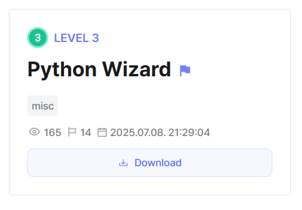
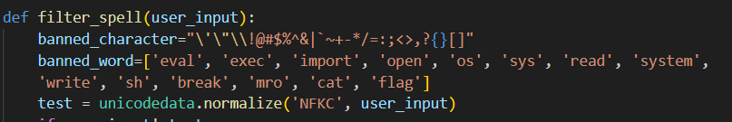
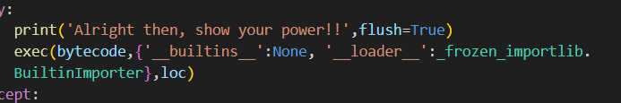
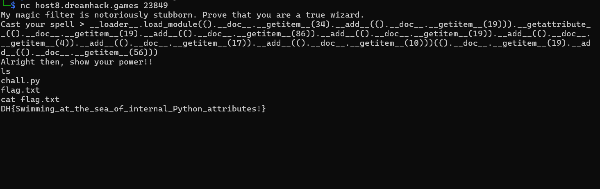

## Python Wizard



In this Pyjail, we are faced with a pretty restrictive blacklist, where almost all essential symbols are blocked, except for `.` and `()`. Luckily, these should suffice for us to be able to invoke methods and access attributes.  



Our payload is also run in a custom environment, where access to `__builtins__` is removed, and we are also provided with a custom loader.  



Our first intuition would be to use `__loader__` to import any useful modules that could help us escape the jail. Since `system` is blacklisted, we can rewrite the payload to access it dynamically. 

```python
__loader__.load_module('os').__getattribute__('system')('sh')
```

The next step would be to find a way to bypass the blacklist, which would mean having to construct strings without quotes, commas or addition.  

We could alternatively pool characters together from a predefined string to build the desired string. The documentation attribute of a tuple provides us a way to do this.  

Since square braces `[]` are blacklisted, we can simply grab characters at indexes using the `__getitem__` method.  

To combine characters, we can opt for the built-in `__add__` method of the `chr` data type.  

```python
().__doc__.__getitem__(34).__add__(().__doc__.__getitem__(19)) # os
```

Putting it all together, we are able to fully obfuscate our payload and access a shell to retrieve the flag.  

