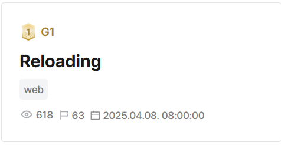

## Reloading  

file upload endpoint has path traversal vuln --> write using absolute paths  

flask debug mode on --> server reloads on file updates  

overwrite bleach.py and pycache bleach.pyc --> reflected xss  

Flag: `DH{Re10aded_XSs:SnjFjgshW82IjADiFTWAhA==}`