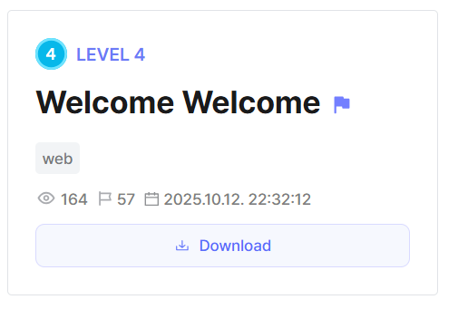
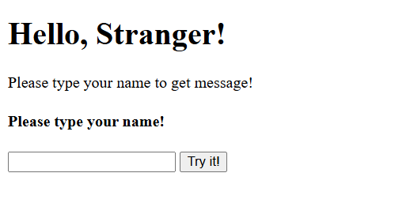
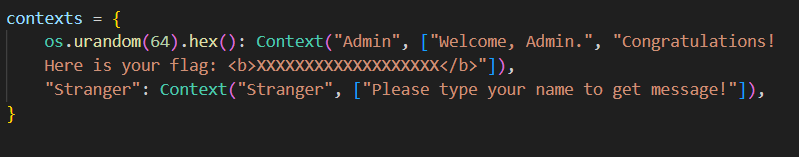
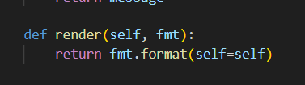
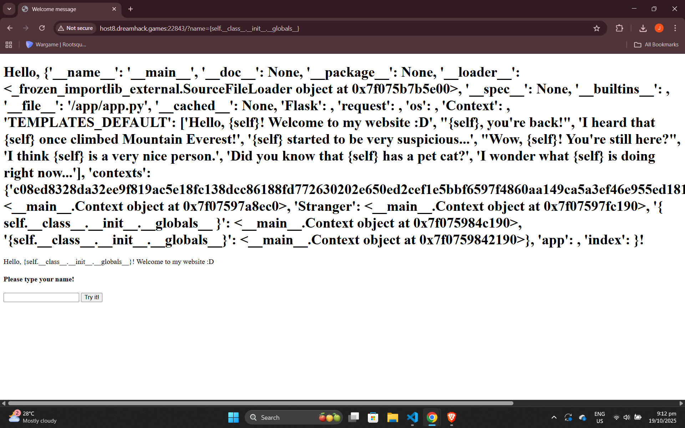
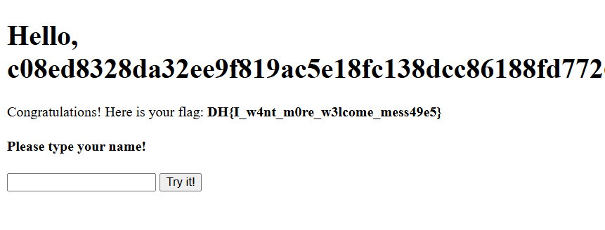

## Welcome Welcome



We are provided with a webpage where we can enter a name to display a welcome message.  



The webpage uses a `contexts` dictionary to render different templates depending on the user.  The admin context is stored with a randomly generated name, and will display the flag when rendered.  



Looking at the source code, we notice that there is an SSTI vulnerability, as the `render()` method of the `Context` class passes in the current context instance to be formatted.  



We can easily leak all global variables from the `Context` instance through an attribute chain, allowing us to view the admin's name.  

```
{self.__class__.__init__.__globals__}
```



After entering the admin's name, we are able to get the flag.  

