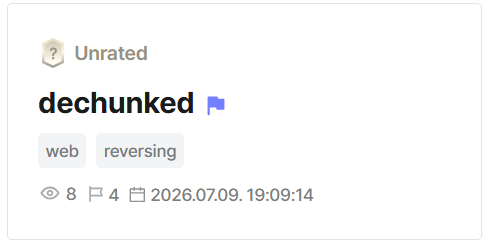

## dechunked  

ssti in `/preview`  

get claude to rev the `waf_guard` binary lol --> waf checked raw http body against blacklist but app.py uses aiohttp to parse http body  

used chunked transfer encoding --> split payload body into chunks --> bypass waf  

Flag: `DH{tHe_wAf_That_1s_8L!Nd_UndEr_norM@L_c1rcUm57@Nc3S}`