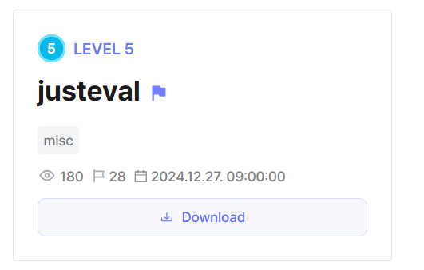
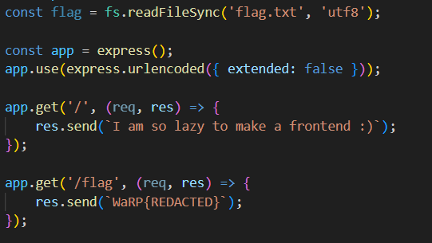
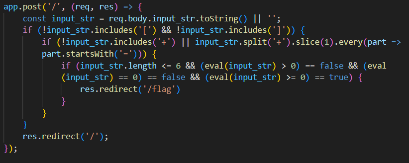
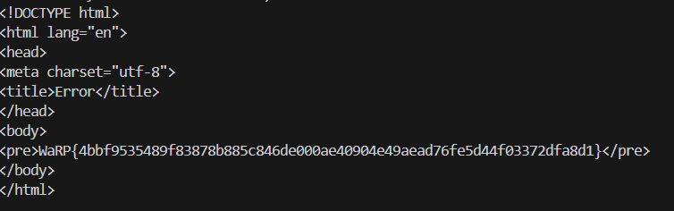

## justeval

In the webpage, we have a `/flag` endpoint that doesn't even print the flag, while the real flag is stored as a global variable.  

Looking at the source code, we can submit a payload that is run by 3 consecutive `eval()` calls. 

The filters and restrictions are the exact same as in the [JS is the best](../JS%20is%20the%20best/) chall. We can simply write a [script](solve.py) to send the same payloads to retrieve the flag.

