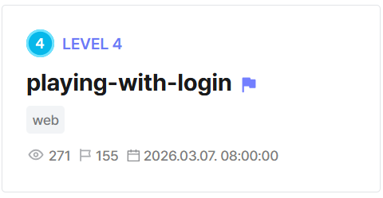
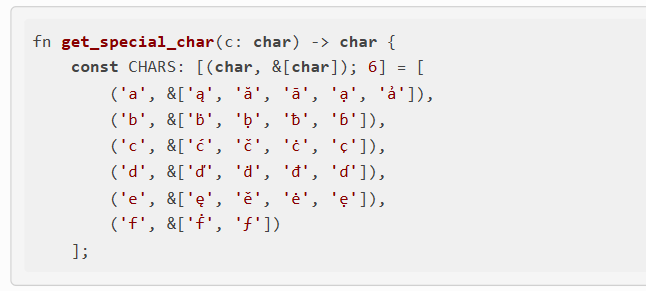

## playing-with-login  



We are given a Flask webapp that has two separate login implementations.  

Both implementations have login and register endpoints, as well as a password reset functionality.  

`/v1` handles authentication entirely inside Python memory by storing accounts and password reset tokens in dictionaries.  

```python
users = {}
inbox = {u: [] for u in users}
password_reset_tokens_v1 = {}

@app.route("/v1/login", methods=["GET", "POST"])
def login():
    if request.method == "POST":
        username = request.form.get("username", "").strip()
        password = request.form.get("password", "")
        if username in users and check_password_hash(users[username], password):
            session["user"] = username
            inbox.setdefault(username, [])
            flash("Logged in successfully.", "success")
            return redirect(url_for("home"))
        flash("Invalid username or password.", "error")
    return render_template("login.html")

@app.route("/v1/signup", methods=["GET", "POST"])
def signup():
    if request.method == "POST":
        username = request.form.get("username", "").strip().lower()
        password = request.form.get("password", "")
        if not username or not password:
            flash("Username and password are required.", "error")
        elif username in users:
            flash("Username already exists.", "error")
        else:
            users[username] = generate_password_hash(password)
            inbox.setdefault(username, [])
            flash("Account created! You can now log in.", "success")
            return redirect(url_for("login"))
    return render_template("signup.html")

...

@app.route("/v1/request-password-change", methods=["GET", "POST"])
def request_password_change():
    if request.method == "POST":
        username = request.form.get("username", "").strip()
        if username in users:
            token = secrets.token_urlsafe(16)
            password_reset_tokens_v1[token] = username
            reset_path = url_for("password_reset", token=token)
            inbox_post(username, f"Password change link: {reset_path} (one-time use)")
        flash("If the username exists, a password change link was delivered to their My Page.", "info")
        return redirect(url_for("login"))
    return render_template("password_request.html")

@app.route("/v1/change-password/<token>", methods=["GET", "POST"])
def password_reset(token):
    if token not in password_reset_tokens_v1:
        flash("Invalid or expired link.", "error")
        return redirect(url_for("home"))

    username = password_reset_tokens_v1[token]
    if request.method == "POST":
        new_pw = request.form.get("new_password", "")
        confirm_pw = request.form.get("confirm_password", "")
        if not new_pw or not confirm_pw:
            flash("Please fill out both fields.", "error")
            return render_template("password_reset.html", token=token, username=username)
        if new_pw != confirm_pw:
            flash("New password and confirmation do not match.", "error")
            return render_template("password_reset.html", token=token, username=username)

        users[username] = generate_password_hash(new_pw)
        del password_reset_tokens_v1[token]
        flash("Password updated successfully. Please log in.", "success")
        return redirect(url_for("login"))

    return render_template("password_reset.html", token=token, username=username)
```

On the other hand, `/v2` stores the user accounts and password reset tokens using a database.  

```python
@app.route("/v2/login", methods=["POST"])
def login_v2():
    if request.method == "POST":
        username = request.form.get("username", "").strip()
        password = request.form.get("password", "")

        row = db_get_user_by_username(username)
        if row and check_password_hash(row["password_hash"], password):
            session["user"] = row["username"]
            inbox.setdefault(row["username"], [])
            flash("Logged in successfully.", "success")
            return redirect(url_for("home_v2"))

        flash("Invalid username or password.", "error")
    return render_template("login.html")

@app.route("/v2/signup", methods=["POST"])
def signup_v2():
    if request.method == "POST":
        username = request.form.get("username", "").strip()
        password = request.form.get("password", "")

        if not username or not password:
            flash("Username and password are required.", "error")
        elif db_get_user_by_username(username):
            flash("Username already exists.", "error")
        else:
            db_create_user(username, password)
            inbox.setdefault(username, [])
            flash("Account created! You can now log in.", "success")
            return redirect(url_for("login_v2"))

    return render_template("signup.html")

...

@app.route("/v2/request-password-change", methods=["POST"])
def request_password_change_v2():
    if request.method == "POST":
        username = request.form.get("username", "").strip()
        if db_get_user_by_username(username):
            try:
                token = db_create_reset_token(username=db_get_user_by_username(username)['username'], ttl_minutes=TOKEN_TTL_MINUTES)
                reset_path = url_for("password_reset_v2", token=token)
                inbox_post(username, f"Password change link: {reset_path} (one-time use)")
            except Exception as e:
                print(f"[ERROR] DB token create failed: {e}")
                flash("Service temporarily unavailable. Please try again later.", "error")
                return redirect(url_for("login_v2"))
    abort(501)

@app.route("/v2/change-password/<token>", methods=["POST"])
def password_reset_v2(token):
    try:
        row = db_get_valid_token(token)
    except Exception as e:
        print(f"[ERROR] DB token read failed: {e}")
        row = None

    if not row:
        abort(501)

    username = row["username"]
    if request.method == "POST":
        new_pw = request.form.get("new_password", "")
        confirm_pw = request.form.get("confirm_password", "")
        if not new_pw or not confirm_pw:
            abort(501)
        if new_pw != confirm_pw:
            abort(501)

        db_update_user_password(username, new_pw)
        try:
            db_mark_token_used(row["id"])
        except Exception as e:
            print(f"[WARN] Could not mark token used: {e}")

    abort(501)
```

The database in question is MariaDB.  

```yaml
version: "3.9"

services:
  app:
    container_name: app
    build:
      context: ./deploy/app
    networks:
      - internal
    ports:
      - "8080:8080"
    depends_on:
      - db

  db:
    image: mariadb:11.3.2-jammy
    environment:
      - MARIADB_ALLOW_EMPTY_ROOT_PASSWORD=1
    volumes:
      - ./deploy/db:/docker-entrypoint-initdb.d:ro
    networks:
      - internal

networks:
  internal:
```

Both `v1` and `v2` also have a `/mypage` endpoint that displays the current account's messages.  

This time, there isn't any disjunction in the implementation, as the messages are both stored and retrieved using a global `inbox` dictionary.  

```python
@app.route("/v1/mypage")
def mypage():
    if not require_login():
        return redirect(url_for("login"))
    username = session["user"]
    messages = inbox.get(username, [])
    return render_template("mypage.html", messages=messages, username=username)

...

@app.route("/v2/mypage")
def mypage_v2():
    if not require_login():
        return redirect(url_for("login_v2"))
    username = session["user"]
    messages = inbox.get(username, [])
    return render_template("mypage.html", messages=messages, username=username)
```

When the webapp is first initialised, the flag is stored as a private message under the admin account.  

```python
def inbox_post(username: str, text: str):
    inbox.setdefault(username, []).append({
        "text": text,
        "created_at": datetime.utcnow().isoformat(timespec="seconds") + "Z",
    })

...

try:
    init_accounts = {
        'admin': os.urandom(32).hex(),
        'guest': 'guest',
    }
    for id, pw in init_accounts.items():
        users[id] = generate_password_hash(pw)

    with open('./flag.txt', 'r') as f:
        inbox_post('admin', f.readline())
except Exception as e:
    print(f"[WARN] startup failed: {e}")
```

The Python utility functions that deal with the MariaDB API all use prepared statements, and the admin password hash is generated using `scrypt`, so we can forget about SQLi or bruteforcing the password.  

The vulnerability instead lies in the password reset functionality. If we were able to create a mismatch between the account name the reset token is generated for and the actual username the reset token is stored under in the `inbox` dict, we can leak the admin reset token.  

```python
@app.route("/v2/request-password-change", methods=["POST"])
def request_password_change_v2():
    if request.method == "POST":
        username = request.form.get("username", "").strip()
        if db_get_user_by_username(username):
            try:
                token = db_create_reset_token(username=db_get_user_by_username(username)['username'], ttl_minutes=TOKEN_TTL_MINUTES)
                reset_path = url_for("password_reset_v2", token=token)
                inbox_post(username, f"Password change link: {reset_path} (one-time use)")
            except Exception as e:
                print(f"[ERROR] DB token create failed: {e}")
                flash("Service temporarily unavailable. Please try again later.", "error")
                return redirect(url_for("login_v2"))
    abort(501)
```

To do that, we need to register an account with a username that MariaDB will resolve to `admin`.  

[This writeup](https://ctftime.org/writeup/40022) explains that MariaDB uses `utf8mb4_unicode_ci` for collation, which causes it to normalise certain homoglyphs in strings.  

Conveniently, it also provides a few of such homogylphs for `a`.  



We can register a username `ądmin` in `/v1/signup`, then request a password change for that username in `/v2/request-password-change`.  

MariaDB will auto-normalise the homoglyph and generate a reset link for `admin`, but the endpoint will store the generated link under the actual username in `inbox`.  

We can then retrieve the link in `/v1/mypage` and reset the admin password, allowing us to get admin login and view the flag.  

See [solve.py](solve.py) for the full solve script.  

Flag: `DH{C011473_0N_UN4M3:Y/2WD59LMM8w6ghh05ffAg==}`