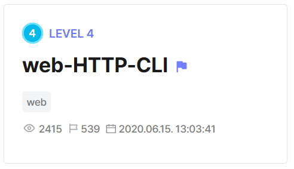

## web-HTTP-CLI  



We are given a simple TCP server that visits URLs we input into it and return the result. The source code shows that the flag file is in the same directory as the server code.  

```python
#!/usr/bin/python3
import urllib.request
import socket

try:
    FLAG = open('./flag.txt', 'r').read()
except:
    FLAG = '[**FLAG**]'

def get_host_port(url):
    return url.split('://')[1].split('/')[0].lower().split(':')


with socket.socket(socket.AF_INET, socket.SOCK_STREAM) as s:
    s.bind(('', 8000))
    s.listen()

    while True:
        try:
            cs, ca = s.accept()
            cs.sendall('[Input Example]\n'.encode())
            cs.sendall('> https://dreamhack.io:443/\n'.encode())
        except:
            continue
        while True:
            cs.sendall('> '.encode())
            url = cs.recv(1024).decode().strip()
            print(url)
            if len(url) == 0:
                break
            try:
                (host, port) = get_host_port(url)
                if 'localhost' == host:
                    cs.sendall('cant use localhost\n'.encode())
                    continue
                if 'dreamhack.io' != host:
                    if '.' in host:
                        cs.sendall('cant use .\n'.encode())
                        continue
                cs.sendall('result: '.encode() + urllib.request.urlopen(url).read())
            except:
                cs.sendall('error\n'.encode())
        cs.close()
```

The filter blocks `localhost` and doesn't allow `.` in the host name, so we can't just directly use `http://localhost:443/flag.txt` or `http://127.0.0.1:443/flag.txt`.  

Instead, we can use the `file:///` URL scheme to access the flag, and get the current directory using `/proc/self/cwd`. Since the server still expects a host and port, we can just append `:` at the end of the URL scheme to specify an empty host and port.  

This won't affect `urllib.request.urlopen` as `file:///` doesn't use ports, so our empty host and port will be ignored.  

```
file://:/proc/self/cwd/flag.txt
```

Submitting our payload URL will then get us SSRF and return the flag.  


Flag: `DH{5e2c73de0f2b273731665914bfaff022}`