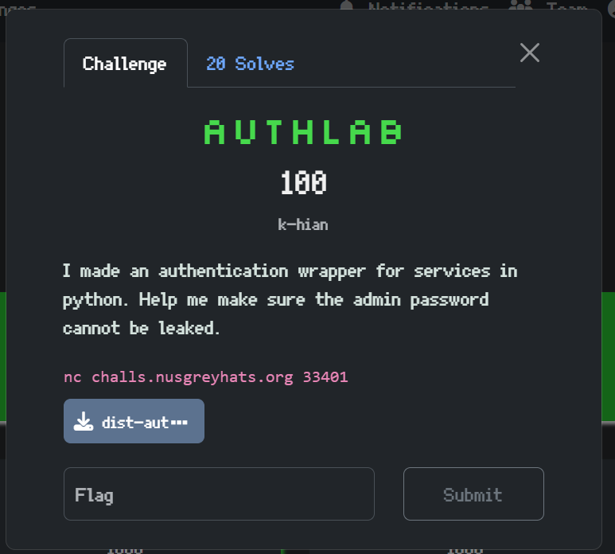
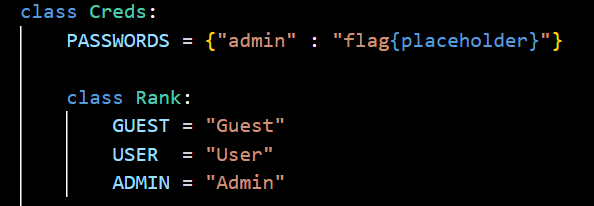
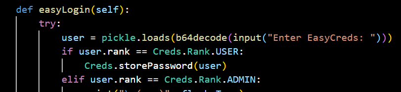
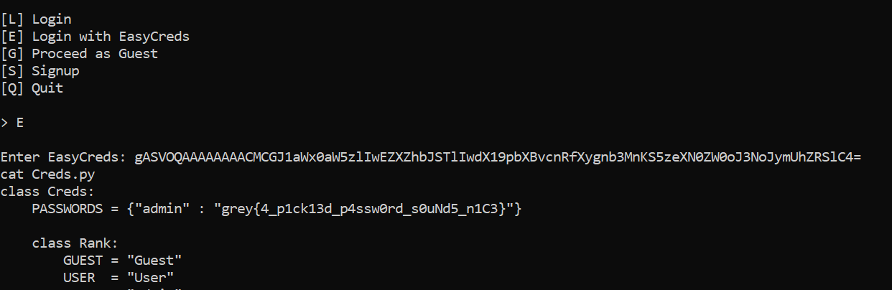

## Authlab

Category: Misc

We have a server that we can login to, and in the credentials class, there is a static variable `PASSWORDS` with the flag.  

Here, we have a classic Pickle RCE vulnerability. When we login using EasyCreds, we must pass in a Base64 string that decrypts to Pickle bytecode.

We can easily write a [script](solve.py) to generate a Pickle payload that when deserialised, spawns a shell, where we can then directly view the flag in the source code.

