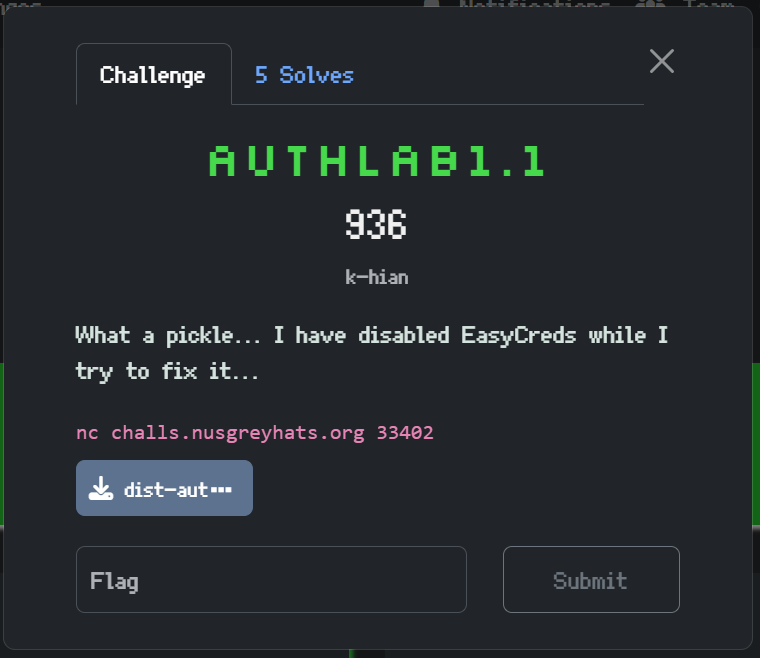
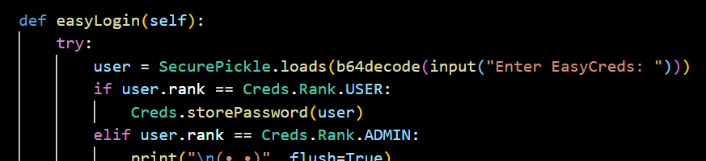
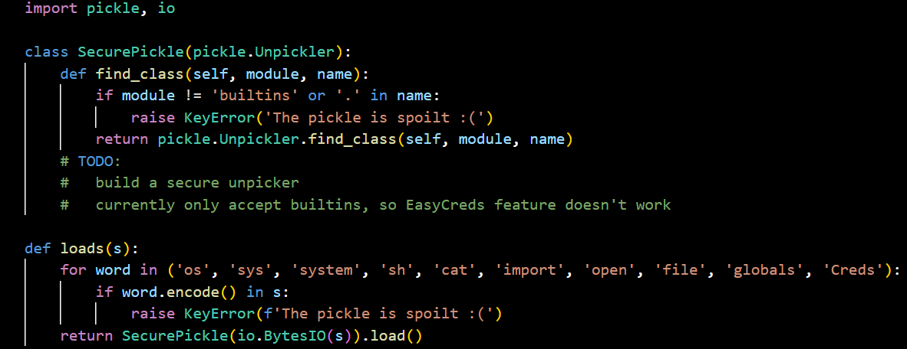
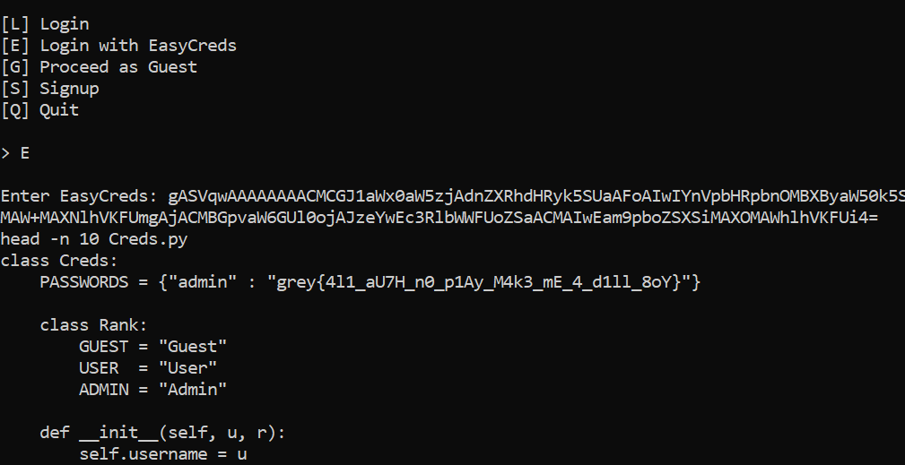

## Authlab1.1

Category: Misc

i spent more than half a day on this lol 🥀



We have the exact same setup as the previous challenge, however, the server uses a custom Pickle deserialiser to process our payload. 



In `SecurePickle`, we can see that only module imports from `builtins` are allowed, and that it also checks our payload against a blacklist.  

The standard Pickle `__reduce__` RCE exploit wouldn't suffice in this case, as it relies on direct class resolution, which would trigger the `builtins` filter.  

Here, we can see that the bytecode generated directly imports the `posix` module to resolve the `os.system` call.  

```python
b'\x80\x04\x95\x1d\x00\x00\x00\x00\x00\x00\x00\x8c\x05posix\x94\x8c\x06system\x94\x93\x94\x8c\x02sh\x94\x85\x94R\x94.'
```



After some digging, I found a [github article](https://github.com/maurosoria/dirsearch/issues/1073) that detailed how to bypass a similar setup.  

The author linked his own [tool](https://github.com/splitline/Pickora) that converted Python to Pickle bytecode, which will allow us to bypass the `builtins` import filter by resolving module lookups through arbitrary object behaviour.    

We can dump the same payload as before into Pickle bytecode, albeit with some obfuscations to bypass the blacklist.  

Note that string concatenations wouldn't work, as it will import the `operator` module to resolve the addition signs, triggering the `builtins` filter, hence, an easy fix would be using list methods to build the string instead.  

```bash
pickora -c "getattr(getattr(print.__self__, ''.join(['__imp', 'ort__']))(''.join(['o', 's'])), ''.join(['sy', 'stem']))(''.join(['s','h']))" -e
```

After entering our Base64 payload, we indeed get a shell where we can read the flag.  

