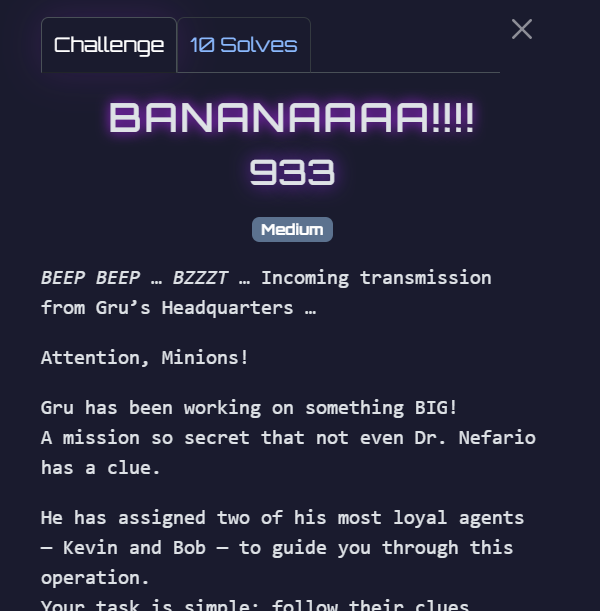

## BANANAAAA!!!!

Category: Forensics  
Difficulty: Medium



We are provided with `banana.jpg` and `minion_march.wav`.  

Running `exiftool` on `banana.jpg` reveals this comment in the image metadata.  

```
[Intercepted Transmission: Gru_Lab_Comm_Channel_07]..Kevin:.Oh uh, bello! Me Kevin! And this is…..Bob:.KING BOB!!!!.*sees banana in picture*.BANANAAAAAAAA!!!.*licks the picture*..Kevin:.Nooo! STOP-er STOP-er! Boss said NO eating file!!..Dr Nefario:.*sighs* …This is getting nowhere..*clears throat*.I don’t know what Gru was thinking, sending potato-brained minions as guides..Knowing the Boss, he wouldn’t let his secret plan be compromised so easily..I think Gru left something *inside* the banana picture…..Bob:.Inside picture? Banana in picture?.*tries smashing monitor*.Banana smash! Smash open secret?!..Dr Nefario:.No, no! Destroying the file won’t do anything!..Kevin:.Wait… maybe Bob’s on to something..If Boss locked it up, there’s probably a password..Why not… brute force it?..Dr Nefario:.Hmph. Not bad, Kevin..Maybe you minions aren’t *entirely* useless after all...[END OF TRANSMISSION]
```

Attempting to extract information from the image using `steghide` also requires a passphrase.  


The previous comment hints that the passphrase is bruteforceable. Running a bruteforce attack using `stegseek` and `rockyou.txt` does indeed extract the hidden zip file.  


The extracted zip file contains a password protected Word document. This time, the password can't be bruteforced.  


My teammate managed to decode the morse code in `minion_march.wav`, which gave the password `unicorn-lover123`.  

On viewing the document, it doesn't seem to contain the flag.  


Word documents are actually just zip archives. After renaming the document to a zip file, we can then find the flag in `/word/document.xml`.  


Flag: `GCTF25{M!N10n5!_7oN1ghT_w3_St3@L_7h3_M00N!!!!!}`