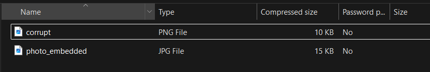
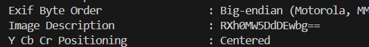
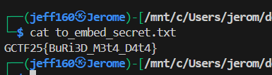

## CorruptedStackV1

Category: Forensics  
Difficulty: Medium


We are provided with a `.pdf` file to analyse. `readme.txt` gives us a big hint towards solving the challenge.  

```
This report seemed to have been corrupted, we knew it wasn't a pdf it was something else. Also apparently it contained a secret which was well corrupted try find it YOU NEED IT. Perhaps your forensics skill might EXPOSE something, connect info and you will find the flag.

Every resource you find is USEFUL in this challenge.
```

On inspection, the file type of the PDF is revealed to be a zip file.  


After renaming and extracing the zip file, we get two images.  



The first thing we notice is that `corrupt.png` is indeed corrupted.  


After opening it in [HexEdit](https://hexed.it/), we notice that the first bit of the header is `88` and PNG headers typically use `89`.  


After fixing the header, we can finally open the image. Running `exiftool` on it reveals a Base64 string in the metadata, which decodes to `Ext1nCt10n`.



The decoded Base64 string is actually the passphrase needed to extract data from `photo_embedded.jpg`.  


The extracted text file then contains the flag.  

