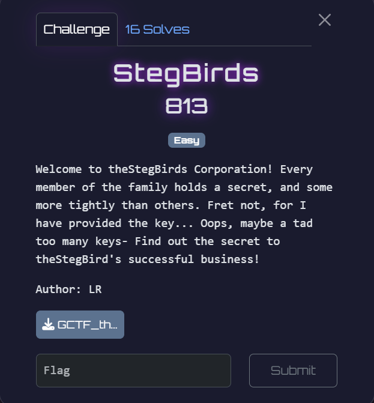
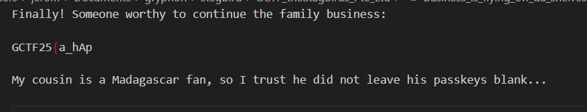

## Pantone

Category: Forens
Difficulty: Easy

We are given a folder of images and a `.txt` file containing a list of passphrases. The challenge name heavily hints towards image steganography.  

We can write a simple script to bruteforce every passphrase against each image until the correct passphrase is found, then save the extracted text.  

The script is able to extract the data from all the files except for `smileandwave.jpeg`

Inside `business_is_flying_off_da_shelves.txt`, we find the first part of the flag, as well as another hint.  

Trying an empty passphrase on `smileandwave.jpeg` then successfully extracts the text.  

We find the second part of the flag and are able to assemble the full flag.  

Flag: `GCTF25{a_hAp_pyFamiLy}`