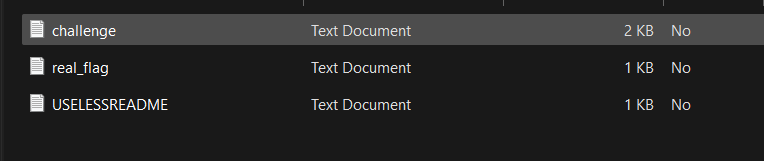
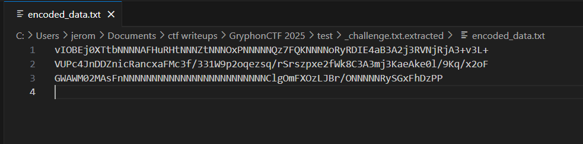

## The more the merrier!

Category: Forensics  
Difficulty: Insane

We are provided with a zip file containing 3 files.  

Only `challenge.txt` appears useful. Running `binwalk` on it reveals that there are zip files embedded inside it.  

After extracting the hidden files, we are provided with `hint.txt` and a password protected zip file.  

We are also given a hint: The password to the zip file can be found in `hint.txt`, and is a date.  

On inspection, each line in `hint.txt` ends with either a space or tab, which can be used to construct the binary string `010100000100000101010011010100110011101000110000001101010010111100110001001100010010111100110010001100000011001000110101`, which decodes to `PASS:05/11/2025`.  

Extracting the zip file then reveals a ciphertext.  

To cut a long story short, the ciphertext is PNG file data that was encoded with Base64, then ROT13. The flag was hidden inside the original PNG using LSB steganography.  

We can write a simple script to handle the decryption and extract the flag.  

Flag: `GCTF25{st3g4n0gr4phy_m4st3r}`