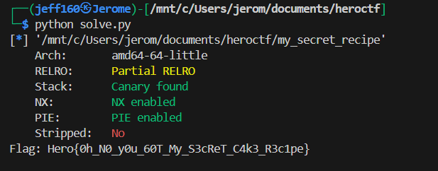

## The Chef's Secret Recipe

Category: Rev  
Difficulty: Very easy  


We are given a binary that contains a recipe. We can first disassemble the binary to inspect the assembly.  

```bash
objdump -d my_secret_recipe > out.txt
```

Looking at the disassembly, we notice that it contains numerous recipe functions.  

Each of the recipe functions returns a single hex value. In the `bake()` function below, `0x48` is returned, which corresponds to `H`.  


It turns out that all the characters when returned in order will construct the flag.  

We can write a simple script to extract all the hex values and recover the flag.  



Flag: `Hero{0h_N0_y0u_60T_My_S3cReT_C4k3_R3c1pe}`