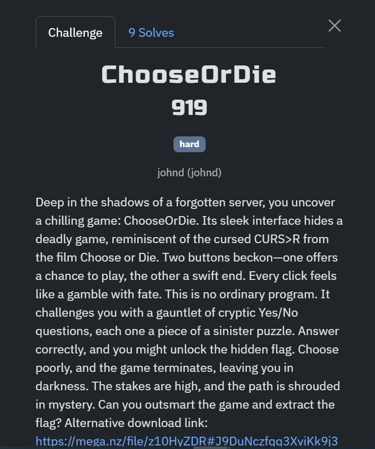
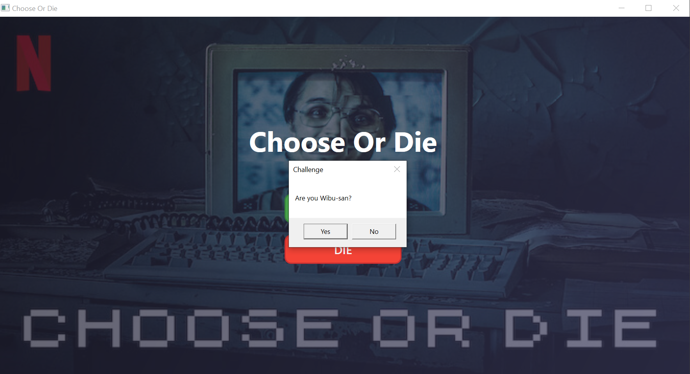
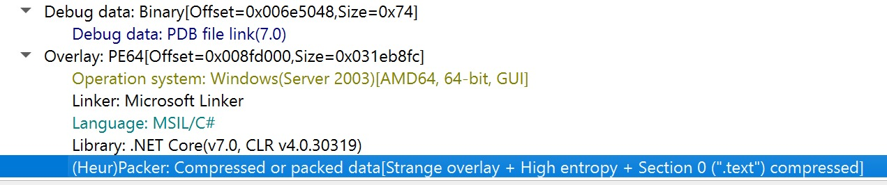
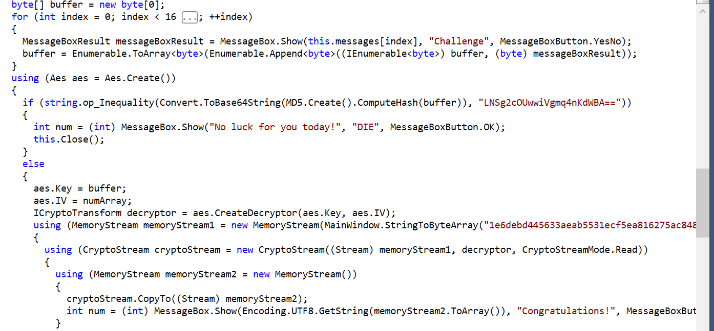
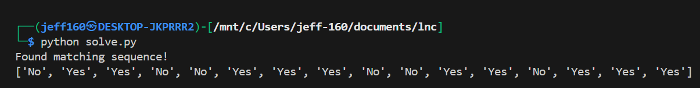
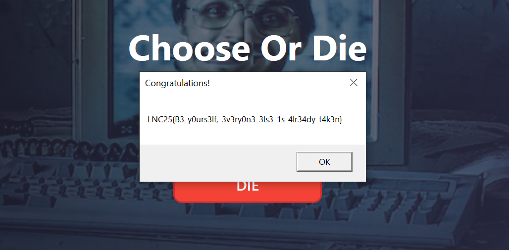

## ChooseOrDie

Category: Rev  
Difficulty: Medium

We are provided with a game executable that upon running, gives us a series of "Yes" or "No" prompts.  

My teammate discovered that it was a C++ executable compiled with the .Net framework.  

After decompiling the executable in Jetbrains dotPeek, I was able to find the main game logic.  

The game prompts us with 16 questions, and combines all responses into a byte array (6 for "Yes" and 7 for "No"). The byte array is then hashed with MD5, and if it matches a hardcoded base64 hash, the game then gives us our flag.  

Since there are only 65,536 possible combinations, we can easily bruteforce the combination of inputs that produces the desired hash.  

After submitting the correct inputs, the game gives us the flag.  

