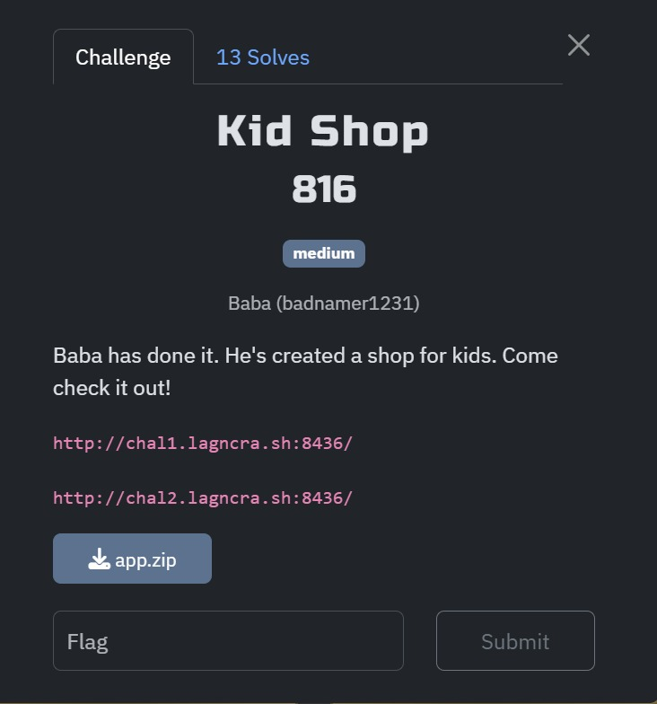
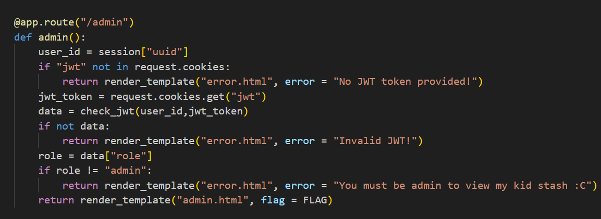
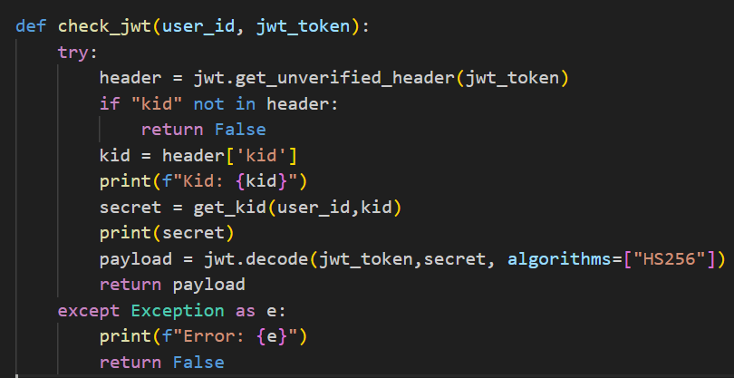
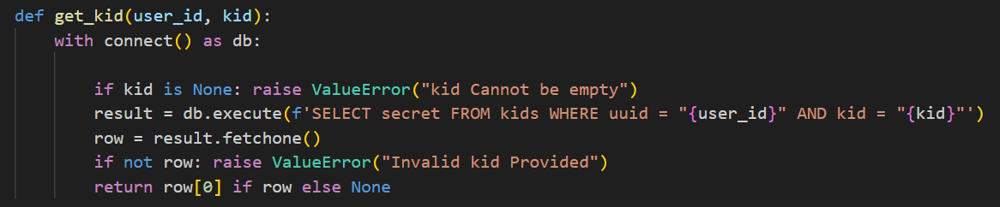
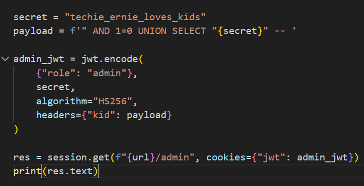
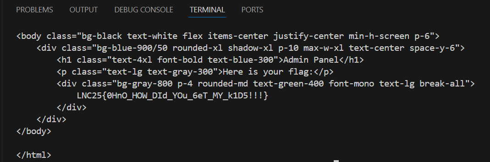

## Kid Shop

Category: Web  
Difficulty: Medium



We are given a website where we can purchase kids.  

To login to the admin endpoint, we have to pass `check_jwt` check function.  



The core part of the `check_jwt` function is that it attempts to retrieve a secret key from the `kids` database to decode our jwt token and get the user data.  



The main vulnerability lies in the `get_kid` function, as it directly interpolates arguments into the SQL query.  



We can modify the query to return our own known secret, by getting the original query to return nothing, and then using a union attack to return our known secret.  

```
AND 1=0 UNION SELECT known_secret --
```

We can then generate a jwt token containing our payload with our known secret, before passing it into the admin endpoint.  



This then gives us access to the admin endpoint containing our flag.  

