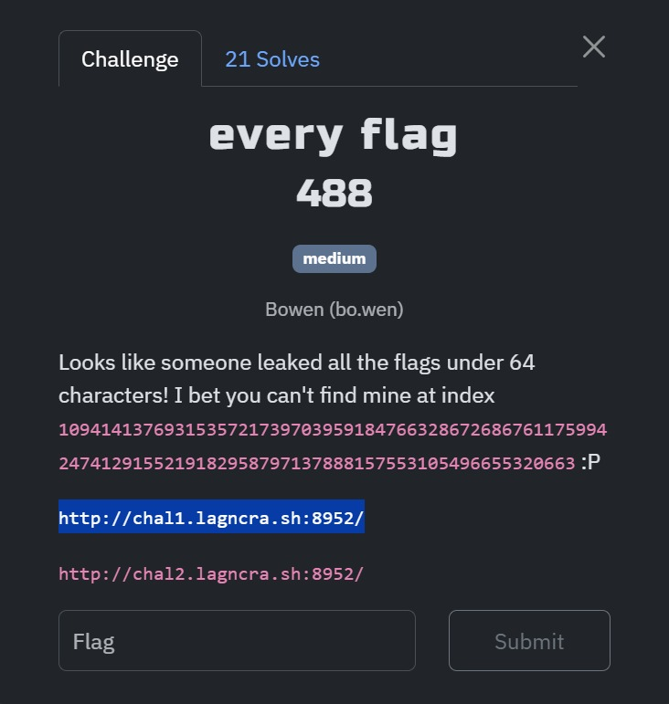
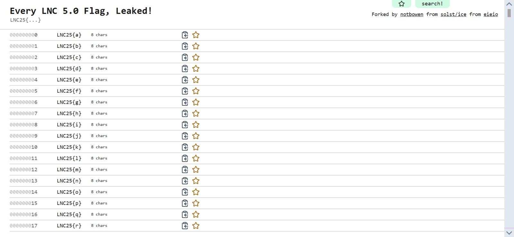
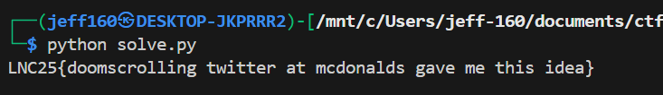

## every flag

Category: Web  
Difficulty: Medium



The webpage provided quite literally displays every possible flag combination under 64 characters.  

The index we are tasked with finding is astronomically large, hence manually scrolling to find it would be unfeasible.  



Going into the source code, I was able to find a minified JavaScript source file called `public.2a9b5d21.js`.

After [unminifying](https://unminify.com/) the code, I was able to find the flag generation code, as well as the character set used.  

```js
t$ = "abcdefghijklmnopqrstuvwxyzABCDEFGHIJKLMNOPQRSTUVWXYZ0123456789!@#$%^&*()_+-=[]|;:,.<>?~` ",
```
```js
function tK(e) {
    return (function (e) {
        if (e < 0n) throw Error("Index must be non-negative");
        for (var n = 1, t = 0n, r = 0; r < tV.length; r++) {
            var a = tV[r];
            if (e < t + a) {
                n = 1 + r;
                break;
            }
            t += a;
        }
        if (n > 57) throw Error("Index out of range");
        for (var o = "", l = e - t, i = 0; i < n; i++) (o = t$[Number(l % tB)] + o), (l /= tB);
        return "LNC25{".concat(o, "}");
    })(e);
}
```

I then reproduced the flag generation logic in Python, and passing in the index gave me the flag.  

