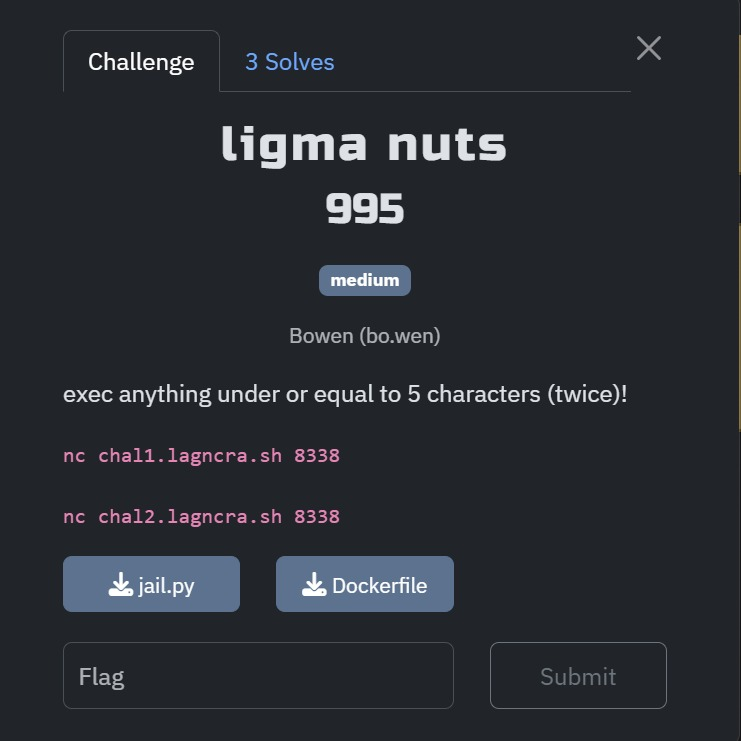
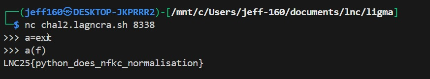

## ligma nuts

Category: Misc  
Difficulty: Medium



We are given a Pyjail where we are given two `exec` calls, but each payload must be 5 characters or less.  

My initial guess was that we had to create a short alias to a printing function in the first payload, and then pass the flag into it in the next payload, but none of the builtin Python functions met the length cap.  

```python
a=exit
a(f)
```

After a day without progress, my team discovered that the challenge name was a pun on "ligature".  

I then found out that Python normalises certain glyphs into two or more characters.  

The [ligature wikipedia page](https://en.wikipedia.org/wiki/Ligature_(writing)) wasn't of much help, so I wrote a simple [bruteforce script](bruteforce.py) to generate a list of all ligatures that are normalised to two or more characters by Python.  

I then found the `xi` ligature, which allowed me to shorten my payload and finally retrieve the flag.  

```python
a=eⅺt
a(f)
```

