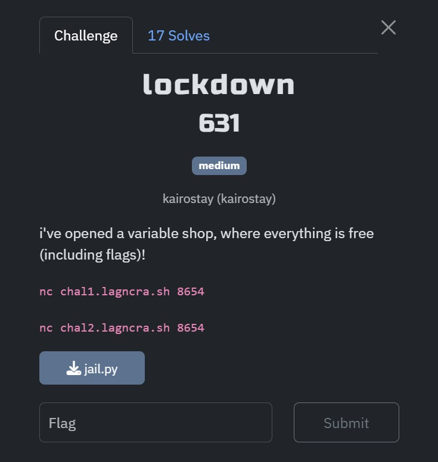
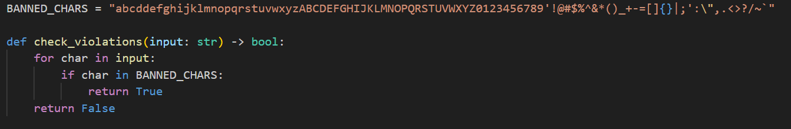
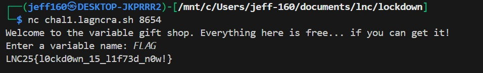

## lockdown

Category: Misc  
Difficulty: Medium

We are given a Pyjail where the goal is to retrieve the `FLAG` variable.  

However, we notice that practically all ASCII characters are blacklisted.  

Clearly, this points towards a unicode bypass pyjail.  

We can put our payload through an [italic font generator](https://lingojam.com/ItalicTextGenerator) to easily bypass the blacklist.  

