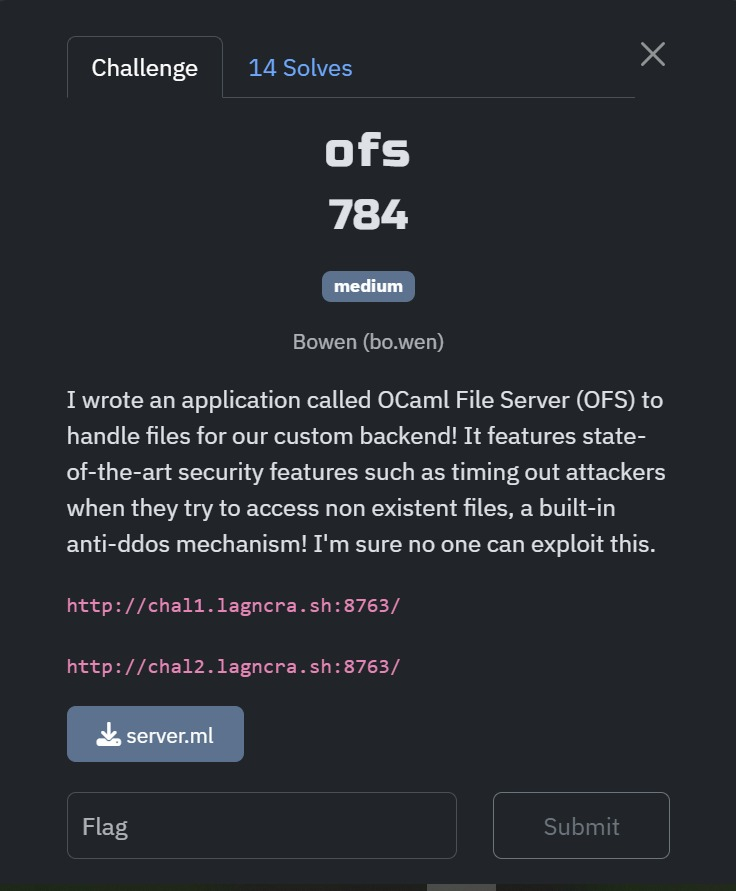
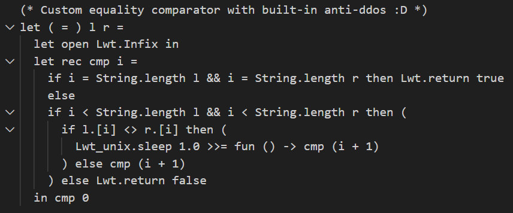
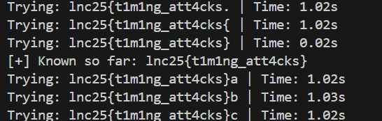

## ofs

Category: Web  
Difficulty: Medium

We are given a webpage that serves files with an anti-DDOS system that analyses each character in the requested filename one at a time.  

The main vulnerability lies in the anti-DDOS system itself. The program delays execution only if a mismatch is found, so we can identify the correct characters by checking for instant responses.  

We can write a [script](solve.py) to bruteforce every character by checking the response time of each request, until a valid URL is found. This revealed that the URL was the flag itself.   

