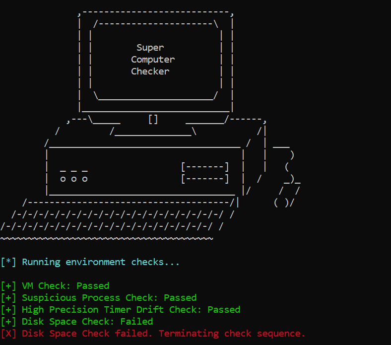
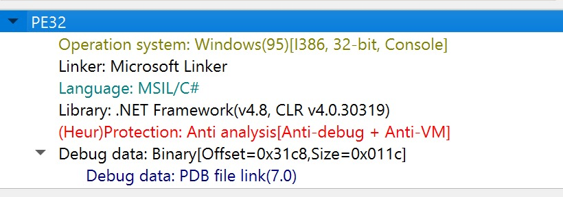
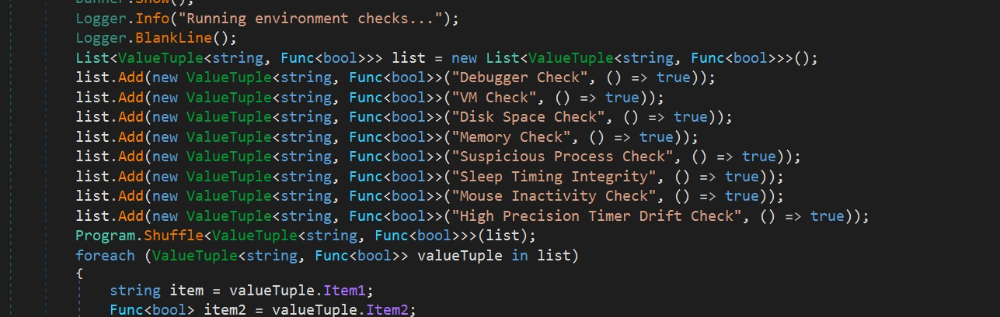
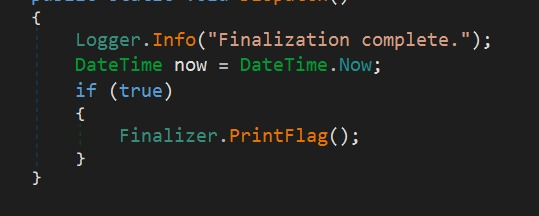

## ligma nuts

Category: Rev  
Difficulty: Easy(?)

i forgot to screenshot the challenge details...  

We are provided with ane executable, and upon running, it appears to execute a series of randomly ordered checks to check if our system is a supposed supercomputer, but always inevitably fails before all checks pass.  

Upon inspection, my teammate identified it as a .Net executable.  

Decompiling the executable in Dnspy, I managed to locate the checks in the main program code, and overwrote them as anonymous functions that always returned `true`.  

After all the checks passed, the program ran a series of finalisation checks. Going down the trail and overwriting the checks led me to the final part of the program that outputted the flag.  

After recompiling and running the modified executable, my teammate got the flag (the front portion was ommitted but since the flag format is known, this is insignificant).

`??: ??C25{w0w_c3rt1f13d_r3v_3ng1n33r}`