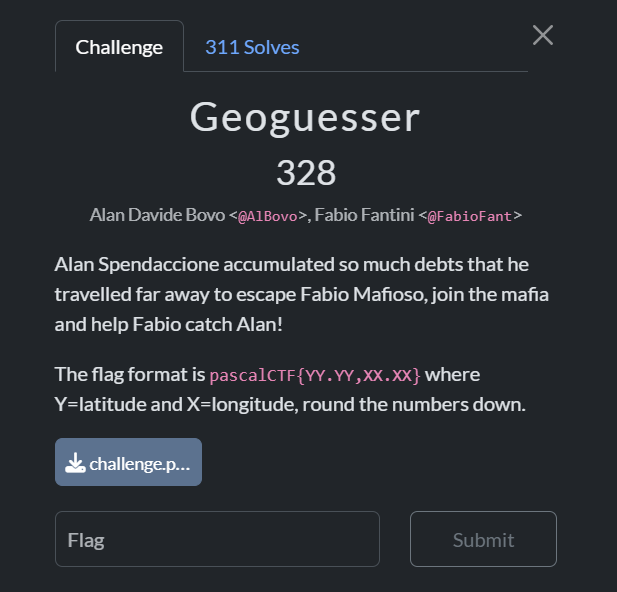
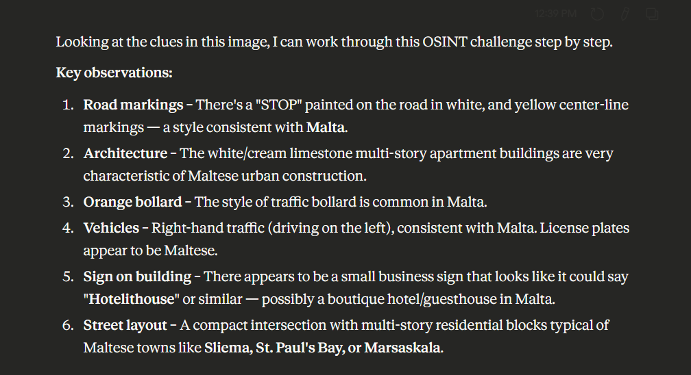
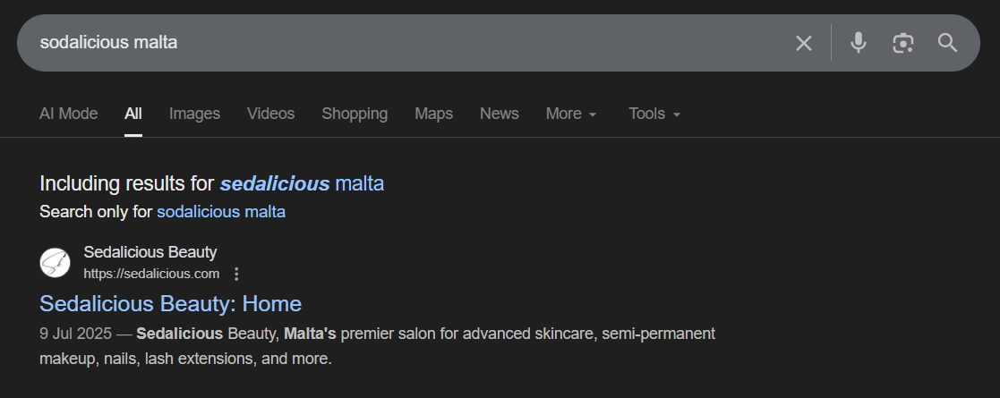
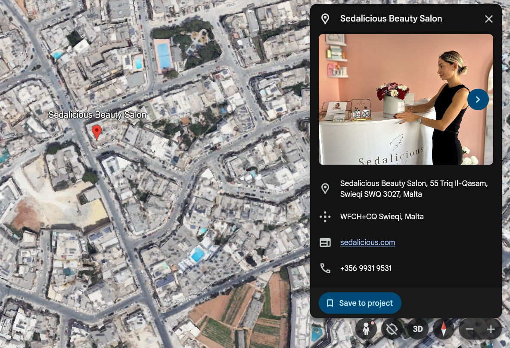

## Geoguesser  

We are supposed to find the location in the image below.  

We can notice a sign on the building behind Alan that appears to say "sodalicious".  

Claude also managed to identify the country the person is in as Malta.  

A Google search for `sodalicious malta` will reveal that the building is actually a beauty shop in Malta called "Sedalicious Beauty". The logo also matches the one seen in the challenge image.  

Since the flag coordinates just needs to be rounded down to 2dp, the coordinates we need to find don't have to be super accurate. We can just use the shop's coordinates directly.  

Searching for the shop in Google Earth will give us the latitude and longitude `35°55'16"N 14°28'45"E`, which we can convert to decimal to get the flag.  

Flag: `pascalCTF{35.92,14.47}`