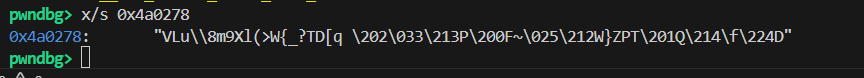

## StrangeVM  

We are given a `vm` binary and `code.pascal`, which contains a set of opcode instructions for the vm program.  

We can retrieve the main vm logic by disassembling the binary in Ghidra. Essentially, the program prompts the user for a string, which it will encrypt using `code.pascal`, and will then compare it to the encrypted flag in memory.  

```c
undefined8 main(void)
{
  int iVar1;
  
  setvbuf((FILE *)stdout,(char *)0x0,2,0);
  setvbuf((FILE *)stdin,(char *)0x0,2,0);
  setvbuf((FILE *)stderr,(char *)0x0,2,0);
  initVM();
  executeVM();
  iVar1 = strcmp(mem,flag);
  if (iVar1 == 0) {
    puts("Congratulations! You have successfully executed the code.");
  }
  else {
    puts("Execution failed. The code did not match the expected flag.");
  }
  free(code);
  free(mem);
  return 0;
}


void initVM(void)

{
  FILE *__stream;
  size_t sVar1;
  
  __stream = fopen64("code.pascal","r");
  if (__stream == (FILE *)0x0) {
    perror("Failed to open bytecode file");
  }
  else {
    code = malloc(0x1000);
    mem = malloc(0x400);
    if ((mem == (void *)0x0) || (code == (void *)0x0)) {
      perror("Failed to initialize memory");
      fclose(__stream);
      free(code);
      free(mem);
    }
    else {
      memset(mem,0,0x400);
      sVar1 = fread(code,1,0x1000,__stream);
      if (sVar1 == 0) {
        perror("Failed to read bytecode file");
        free(code);
        free(mem);
        fclose(__stream);
      }
      else {
        fclose(__stream);
      }
    }
  }
  return;
}

void executeVM(void)
{
  char cVar1;
  undefined1 uVar2;
  int iVar3;
  int iVar4;
  int local_c;
  
  local_c = 0;
LAB_00402183:
  while( true ) {
    if (*(char *)(local_c + code) == '\0') {
      return;
    }
    iVar4 = local_c + 1;
    cVar1 = *(char *)(local_c + code);
    if (cVar1 != '\x06') break;
    iVar3 = readInt(iVar4 + code);
    cVar1 = readByte(code + (long)iVar4 + 4);
    local_c = iVar4;
    if (*(char *)(iVar3 + mem) == '\0') {
      local_c = iVar4 + cVar1;
    }
    local_c = local_c + 5;
  }
  if (cVar1 < '\a') {
    if (cVar1 == '\x05') {
      iVar4 = readInt(iVar4 + code);
      __isoc23_scanf(&DAT_004a031d,iVar4 + mem);
      local_c = local_c + 5;
      goto LAB_00402183;
    }
    if ('\x05' < cVar1) goto LAB_0040214b;
    if (cVar1 == '\x04') {
      iVar3 = readInt(iVar4 + code);
      uVar2 = readByte(code + (long)iVar4 + 4);
      *(undefined1 *)(mem + iVar3) = uVar2;
      local_c = local_c + 6;
      goto LAB_00402183;
    }
    if (cVar1 < '\x05') {
      if (cVar1 == '\x03') {
        iVar3 = readInt(iVar4 + code);
        cVar1 = readByte(code + (long)iVar4 + 4);
        if (cVar1 == '\0') {
          fwrite("Division by zero error\n",1,0x17,(FILE *)stderr);
                    /* WARNING: Subroutine does not return */
          exit(1);
        }
        *(char *)(iVar3 + mem) = *(char *)(iVar3 + mem) % cVar1;
        local_c = local_c + 6;
        goto LAB_00402183;
      }
      if (cVar1 < '\x04') {
        if (cVar1 == '\x01') {
          iVar3 = readInt(iVar4 + code);
          cVar1 = readByte(code + (long)iVar4 + 4);
          *(char *)(iVar3 + mem) = *(char *)(iVar3 + mem) + cVar1;
          local_c = local_c + 6;
          goto LAB_00402183;
        }
        if (cVar1 == '\x02') {
          iVar3 = readInt(iVar4 + code);
          cVar1 = readByte(code + (long)iVar4 + 4);
          *(char *)(iVar3 + mem) = *(char *)(iVar3 + mem) - cVar1;
          local_c = local_c + 6;
          goto LAB_00402183;
        }
      }
    }
  }
LAB_0040214b:
  fprintf((FILE *)stderr,"Unknown operation code: %d\n",(ulong)(uint)(int)*(char *)(iVar4 + code));
                    /* WARNING: Subroutine does not return */
  exit(1);
}
```

I got GPT to write a script that will parse `code.pascal` and recover the list of opcodes that the program runs.  

```python
import struct

code = open("code.pascal","rb").read()
ip = 0

while True:
    op = code[ip]
    if op == 0:
        print(f"{ip:04x}: HALT")
        break

    if op in [1,2,3,4]:
        addr = struct.unpack("<I", code[ip+1:ip+5])[0]
        imm = code[ip+5]
        print(f"{ip:04x}: OP{op} mem[{addr}] imm={imm}")
        ip += 6

    elif op == 5:
        addr = struct.unpack("<I", code[ip+1:ip+5])[0]
        print(f"{ip:04x}: INPUT mem[{addr}]")
        ip += 5

    elif op == 6:
        addr = struct.unpack("<I", code[ip+1:ip+5])[0]
        off = code[ip+5]
        print(f"{ip:04x}: JZ mem[{addr}] +{off}")
        ip += 6

    else:
        print("Unknown opcode", op)
        break
```

This gives us this really long list of opcodes.  

```
0000: INPUT mem[0]
0005: OP4 mem[1] imm=0
000b: OP3 mem[1] imm=2
0011: JZ mem[1] +12
0017: OP2 mem[0] imm=0
001d: JZ mem[1023] +6
0023: OP1 mem[0] imm=0
0029: INPUT mem[1]
002e: OP4 mem[2] imm=1
0034: OP3 mem[2] imm=2
003a: JZ mem[2] +12
0040: OP2 mem[1] imm=1
0046: JZ mem[1023] +6
004c: OP1 mem[1] imm=1
0052: INPUT mem[2]
0057: OP4 mem[3] imm=2
005d: OP3 mem[3] imm=2
0063: JZ mem[3] +12
0069: OP2 mem[2] imm=2
006f: JZ mem[1023] +6
0075: OP1 mem[2] imm=2
007b: INPUT mem[3]
0080: OP4 mem[4] imm=3
0086: OP3 mem[4] imm=2
008c: JZ mem[4] +12
0092: OP2 mem[3] imm=3
0098: JZ mem[1023] +6
009e: OP1 mem[3] imm=3
00a4: INPUT mem[4]
00a9: OP4 mem[5] imm=4
00af: OP3 mem[5] imm=2
00b5: JZ mem[5] +12
00bb: OP2 mem[4] imm=4
00c1: JZ mem[1023] +6
00c7: OP1 mem[4] imm=4
00cd: INPUT mem[5]
00d2: OP4 mem[6] imm=5
00d8: OP3 mem[6] imm=2
00de: JZ mem[6] +12
00e4: OP2 mem[5] imm=5
00ea: JZ mem[1023] +6
00f0: OP1 mem[5] imm=5
00f6: INPUT mem[6]
00fb: OP4 mem[7] imm=6
0101: OP3 mem[7] imm=2
0107: JZ mem[7] +12
010d: OP2 mem[6] imm=6
0113: JZ mem[1023] +6
0119: OP1 mem[6] imm=6
011f: INPUT mem[7]
0124: OP4 mem[8] imm=7
012a: OP3 mem[8] imm=2
0130: JZ mem[8] +12
0136: OP2 mem[7] imm=7
013c: JZ mem[1023] +6
0142: OP1 mem[7] imm=7
0148: INPUT mem[8]
014d: OP4 mem[9] imm=8
0153: OP3 mem[9] imm=2
0159: JZ mem[9] +12
015f: OP2 mem[8] imm=8
0165: JZ mem[1023] +6
016b: OP1 mem[8] imm=8
0171: INPUT mem[9]
0176: OP4 mem[10] imm=9
017c: OP3 mem[10] imm=2
0182: JZ mem[10] +12
0188: OP2 mem[9] imm=9
018e: JZ mem[1023] +6
0194: OP1 mem[9] imm=9
019a: INPUT mem[10]
019f: OP4 mem[11] imm=10
01a5: OP3 mem[11] imm=2
01ab: JZ mem[11] +12
01b1: OP2 mem[10] imm=10
01b7: JZ mem[1023] +6
01bd: OP1 mem[10] imm=10
01c3: INPUT mem[11]
01c8: OP4 mem[12] imm=11
01ce: OP3 mem[12] imm=2
01d4: JZ mem[12] +12
01da: OP2 mem[11] imm=11
01e0: JZ mem[1023] +6
01e6: OP1 mem[11] imm=11
01ec: INPUT mem[12]
01f1: OP4 mem[13] imm=12
01f7: OP3 mem[13] imm=2
01fd: JZ mem[13] +12
0203: OP2 mem[12] imm=12
0209: JZ mem[1023] +6
020f: OP1 mem[12] imm=12
0215: INPUT mem[13]
021a: OP4 mem[14] imm=13
0220: OP3 mem[14] imm=2
0226: JZ mem[14] +12
022c: OP2 mem[13] imm=13
0232: JZ mem[1023] +6
0238: OP1 mem[13] imm=13
023e: INPUT mem[14]
0243: OP4 mem[15] imm=14
0249: OP3 mem[15] imm=2
024f: JZ mem[15] +12
0255: OP2 mem[14] imm=14
025b: JZ mem[1023] +6
0261: OP1 mem[14] imm=14
0267: INPUT mem[15]
026c: OP4 mem[16] imm=15
0272: OP3 mem[16] imm=2
0278: JZ mem[16] +12
027e: OP2 mem[15] imm=15
0284: JZ mem[1023] +6
028a: OP1 mem[15] imm=15
0290: INPUT mem[16]
0295: OP4 mem[17] imm=16
029b: OP3 mem[17] imm=2
02a1: JZ mem[17] +12
02a7: OP2 mem[16] imm=16
02ad: JZ mem[1023] +6
02b3: OP1 mem[16] imm=16
02b9: INPUT mem[17]
02be: OP4 mem[18] imm=17
02c4: OP3 mem[18] imm=2
02ca: JZ mem[18] +12
02d0: OP2 mem[17] imm=17
02d6: JZ mem[1023] +6
02dc: OP1 mem[17] imm=17
02e2: INPUT mem[18]
02e7: OP4 mem[19] imm=18
02ed: OP3 mem[19] imm=2
02f3: JZ mem[19] +12
02f9: OP2 mem[18] imm=18
02ff: JZ mem[1023] +6
0305: OP1 mem[18] imm=18
030b: INPUT mem[19]
0310: OP4 mem[20] imm=19
0316: OP3 mem[20] imm=2
031c: JZ mem[20] +12
0322: OP2 mem[19] imm=19
0328: JZ mem[1023] +6
032e: OP1 mem[19] imm=19
0334: INPUT mem[20]
0339: OP4 mem[21] imm=20
033f: OP3 mem[21] imm=2
0345: JZ mem[21] +12
034b: OP2 mem[20] imm=20
0351: JZ mem[1023] +6
0357: OP1 mem[20] imm=20
035d: INPUT mem[21]
0362: OP4 mem[22] imm=21
0368: OP3 mem[22] imm=2
036e: JZ mem[22] +12
0374: OP2 mem[21] imm=21
037a: JZ mem[1023] +6
0380: OP1 mem[21] imm=21
0386: INPUT mem[22]
038b: OP4 mem[23] imm=22
0391: OP3 mem[23] imm=2
0397: JZ mem[23] +12
039d: OP2 mem[22] imm=22
03a3: JZ mem[1023] +6
03a9: OP1 mem[22] imm=22
03af: INPUT mem[23]
03b4: OP4 mem[24] imm=23
03ba: OP3 mem[24] imm=2
03c0: JZ mem[24] +12
03c6: OP2 mem[23] imm=23
03cc: JZ mem[1023] +6
03d2: OP1 mem[23] imm=23
03d8: INPUT mem[24]
03dd: OP4 mem[25] imm=24
03e3: OP3 mem[25] imm=2
03e9: JZ mem[25] +12
03ef: OP2 mem[24] imm=24
03f5: JZ mem[1023] +6
03fb: OP1 mem[24] imm=24
0401: INPUT mem[25]
0406: OP4 mem[26] imm=25
040c: OP3 mem[26] imm=2
0412: JZ mem[26] +12
0418: OP2 mem[25] imm=25
041e: JZ mem[1023] +6
0424: OP1 mem[25] imm=25
042a: INPUT mem[26]
042f: OP4 mem[27] imm=26
0435: OP3 mem[27] imm=2
043b: JZ mem[27] +12
0441: OP2 mem[26] imm=26
0447: JZ mem[1023] +6
044d: OP1 mem[26] imm=26
0453: INPUT mem[27]
0458: OP4 mem[28] imm=27
045e: OP3 mem[28] imm=2
0464: JZ mem[28] +12
046a: OP2 mem[27] imm=27
0470: JZ mem[1023] +6
0476: OP1 mem[27] imm=27
047c: INPUT mem[28]
0481: OP4 mem[29] imm=28
0487: OP3 mem[29] imm=2
048d: JZ mem[29] +12
0493: OP2 mem[28] imm=28
0499: JZ mem[1023] +6
049f: OP1 mem[28] imm=28
04a5: INPUT mem[29]
04aa: OP4 mem[30] imm=29
04b0: OP3 mem[30] imm=2
04b6: JZ mem[30] +12
04bc: OP2 mem[29] imm=29
04c2: JZ mem[1023] +6
04c8: OP1 mem[29] imm=29
04ce: INPUT mem[30]
04d3: OP4 mem[31] imm=30
04d9: OP3 mem[31] imm=2
04df: JZ mem[31] +12
04e5: OP2 mem[30] imm=30
04eb: JZ mem[1023] +6
04f1: OP1 mem[30] imm=30
04f7: INPUT mem[31]
04fc: OP4 mem[32] imm=31
0502: OP3 mem[32] imm=2
0508: JZ mem[32] +12
050e: OP2 mem[31] imm=31
0514: JZ mem[1023] +6
051a: OP1 mem[31] imm=31
0520: INPUT mem[32]
0525: OP4 mem[33] imm=32
052b: OP3 mem[33] imm=2
0531: JZ mem[33] +12
0537: OP2 mem[32] imm=32
053d: JZ mem[1023] +6
0543: OP1 mem[32] imm=32
0549: INPUT mem[33]
054e: OP4 mem[34] imm=33
0554: OP3 mem[34] imm=2
055a: JZ mem[34] +12
0560: OP2 mem[33] imm=33
0566: JZ mem[1023] +6
056c: OP1 mem[33] imm=33
0572: INPUT mem[34]
0577: OP4 mem[35] imm=34
057d: OP3 mem[35] imm=2
0583: JZ mem[35] +12
0589: OP2 mem[34] imm=34
058f: JZ mem[1023] +6
0595: OP1 mem[34] imm=34
059b: INPUT mem[35]
05a0: OP4 mem[36] imm=35
05a6: OP3 mem[36] imm=2
05ac: JZ mem[36] +12
05b2: OP2 mem[35] imm=35
05b8: JZ mem[1023] +6
05be: OP1 mem[35] imm=35
05c4: INPUT mem[36]
05c9: OP4 mem[37] imm=36
05cf: OP3 mem[37] imm=2
05d5: JZ mem[37] +12
05db: OP2 mem[36] imm=36
05e1: JZ mem[1023] +6
05e7: OP1 mem[36] imm=36
05ed: INPUT mem[37]
05f2: OP4 mem[38] imm=37
05f8: OP3 mem[38] imm=2
05fe: JZ mem[38] +12
0604: OP2 mem[37] imm=37
060a: JZ mem[1023] +6
0610: OP1 mem[37] imm=37
0616: INPUT mem[38]
061b: OP4 mem[39] imm=38
0621: OP3 mem[39] imm=2
0627: JZ mem[39] +12
062d: OP2 mem[38] imm=38
0633: JZ mem[1023] +6
0639: OP1 mem[38] imm=38
063f: INPUT mem[39]
0644: OP4 mem[40] imm=39
064a: OP3 mem[40] imm=2
0650: JZ mem[40] +12
0656: OP2 mem[39] imm=39
065c: JZ mem[1023] +6
0662: OP1 mem[39] imm=39
0668: INPUT mem[40]
066d: OP4 mem[40] imm=0
0673: HALT
```

The opcodes just perform this index-based encryption.  

```python
if i is even:
    mem[i] = input[i] + i
else:
    mem[i] = input[i] - i
```

To recover the flag, we need to first find the encrypted flag in the binary.  

Since `flag` is a global variable, we can search the assembly dump for its memory address.  

```bash
objdump -d vm | grep "<flag>"`  # 4cd0c8
```

Running `x/40bx 0x4cd0c8` in GDB will reveal that `flag` is a pointer to a string in memory.  


Since the address is in little endian, we need to get the string at `0x4a0278`.  



After that, we can just reverse the encryption on the bytes to get the flag.  

```python
ciphertext = r"VLu\\8m9Xl(>W{_?TD[q \202\033\213P\200F~\025\212W}ZPT\201Q\214\f\224D"
flag = ciphertext.encode("latin1").decode("unicode_escape").encode("latin1")

inp = bytearray(40)

for i, b in enumerate(flag):
    if i % 2 == 0:
        inp[i] = (b - i) & 0xff
    else:
        inp[i] = (b + i) & 0xff

print("Flag: pascalCTF{%s}" % inp.decode())
```

Flag: `pascalCTF{VMs_4r3_d14bol1c4l_3n0ugh_d0nt_y0u_th1nk}`