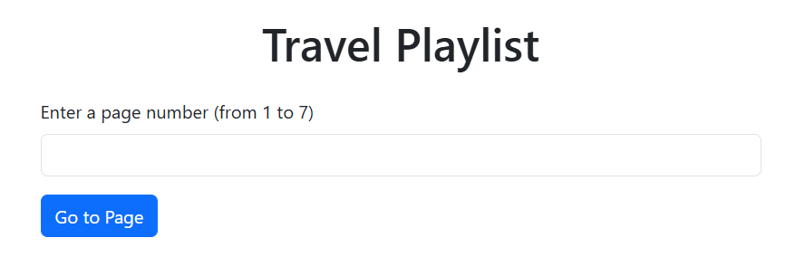
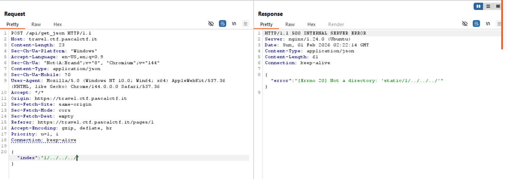
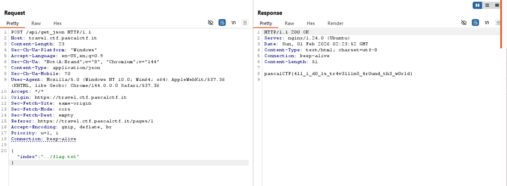

## Travel Playlist  

We are given a webpage where we can fetch music videos from indexes `1-7`.  

When we submit an input and intercept the request in BurpSuite, we will find that the webpage makes a request to `/api/get_json`.  

Entering `1/../../../` will reveal that the server attempts to read files from `/static`.  

We can use directory traversal to read `/etc/passwd`, confirming the LFI vuln.  

The challenge description already reveals the file path is in `/app/flag.txt`, and since most challenge dockers add the source code in `/app`, we just have to traverse one directory up to read `flag.txt`.  

Flag: `pascalCTF{4ll_1_d0_1s_tr4v3ll1nG_4r0und_th3_w0rld}`