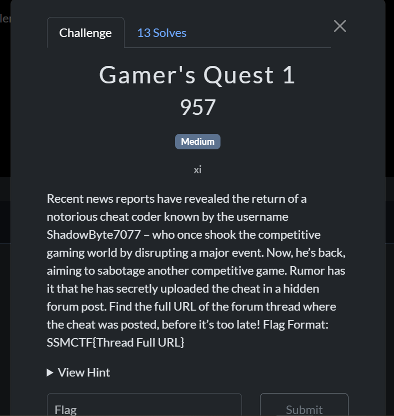
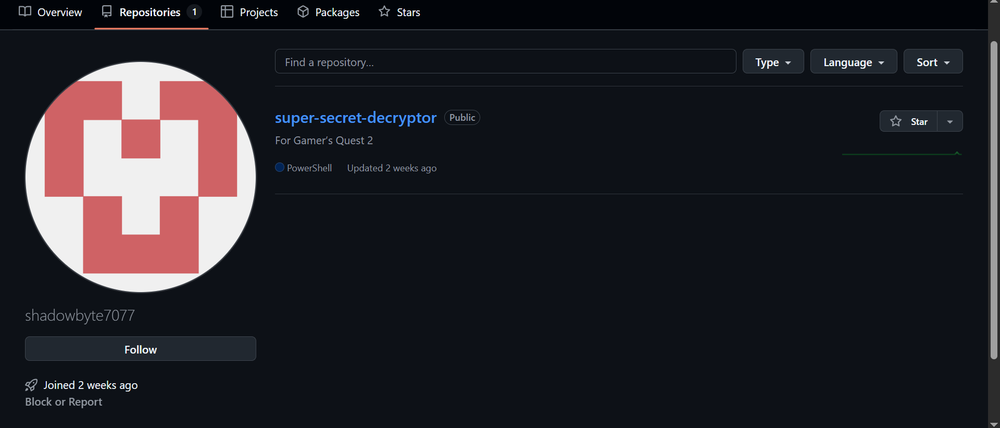
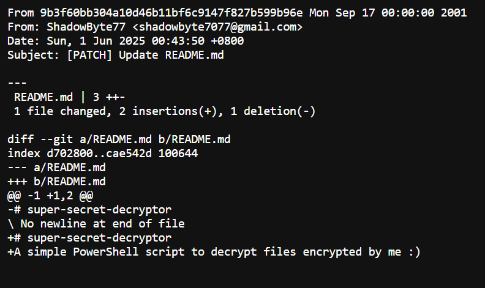

## Gamer's Quest 1

Category: Osint  
Difficulty: Medium

Using Sherlock, my teammate was able to find a [github account](https://github.com/shadowbyte7077) under the username provided.  

In his Github profile there is a singular repository for the 2nd part of the challenge (which none of the teams solved unfortunately).

After appending `.patch` to one of the commit URLs, my other teammate was able to find his email in the commit metadata.  

Upon sending a message to the email, we discovered that it was registered with the username `Timoxa5651`.

A google search revealed that Timoxa5651 was a Russian game hacker most notable for disclosing a method to arbitrarily ban users under the BattleEye anticheat.  

It also revealed a [past CTF writeup](https://0xdarkeagle.medium.com/0xl4ugh-ctf-osint-challenges-81280d08702d) involving the same username, albeit an unintentional challenge reuse. The writeup did include a link to a forum thread where Timoxa5651 had indeed uploaded a CS:GO cheat.  

https://yougame.biz/threads/84149/  

Enclosing it with `SSMCTF{}` then gave us the solve.
