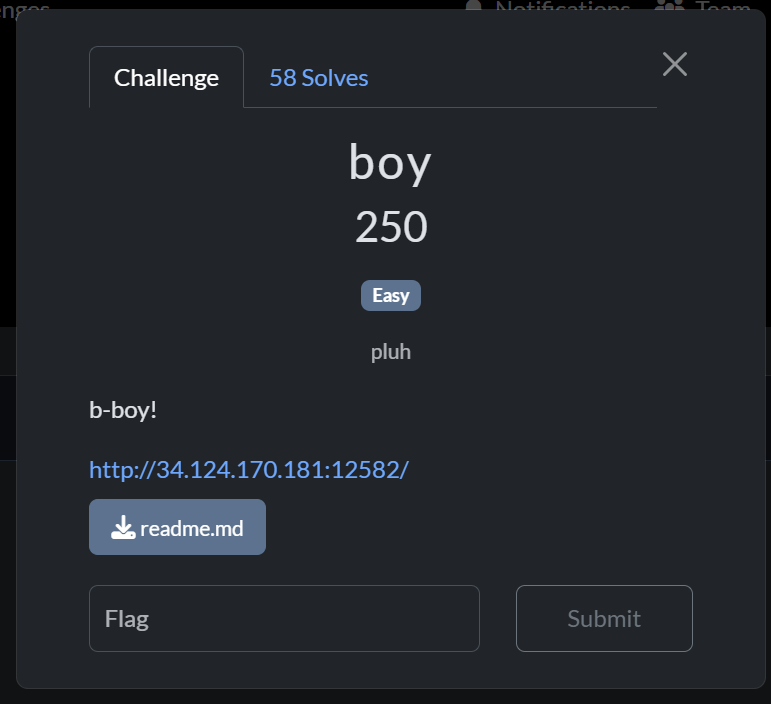
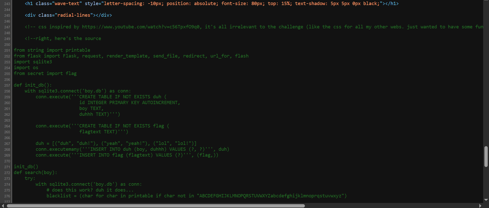
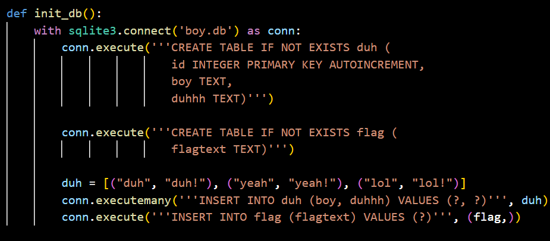
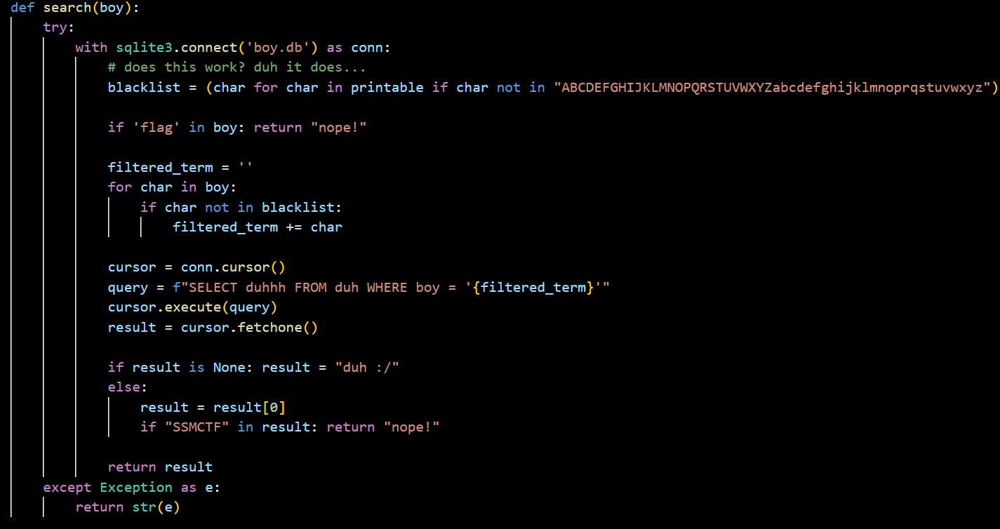

## boy

Category: Web  
Difficulty: Easy



We are provided with a website with an input field for a "boy" of some sort.  


Upon inspecting the website source code, we find that the backend code has been left inside.  



We notice that the database contains a `flag` table that contains our flag.



There are also several filters implemented to circumvent SQLi:
- only alphabets are allowed
- `flag` string is blacklisted
- if `SSMCTF` is detected in our query result, it will be rejected



The most problematic filter would be the alphabet whitelist, since it removes almost all SQLi functionality. However, upon closer inspection, we notice that a generator has been used to define the blacklist.  

A unique property of Python generators is that they can only be iterated through once. Leveraging this, we can first get the code to iterate through the generator once using a valid character, allowing us to use any symbols subsequently.  

This allows us to then use a UNION attack to query the `flag` table.

```
z' UNION SELECT...
```

Bypassing the `flag` filter is quite trivial. SQLite keywords are case insensitive, so changing one character in the keyword bypasses the filter entirely.  

```
z' UNION SELECT fLagtext FROM fLag--
```

To bypass the query result filter, we can simply remove the first character of the flag using SQL's `SUBSTR` method.  

Putting everything together, we get the final payload, as well as our flag.  

```
z' UNION SELECT SUBSTR(fLagtext, 2) FROM fLag--
```


