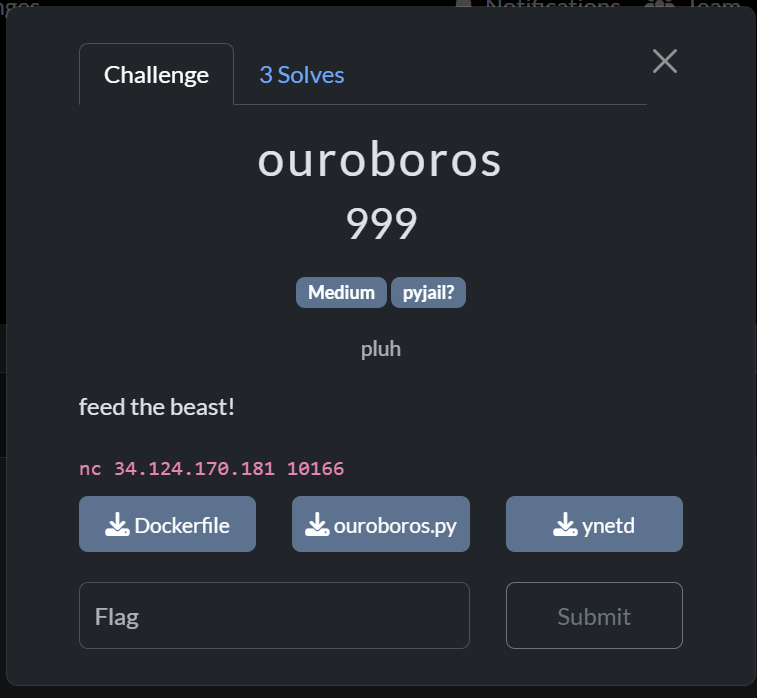
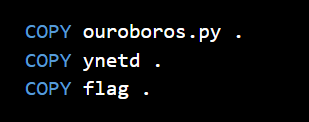
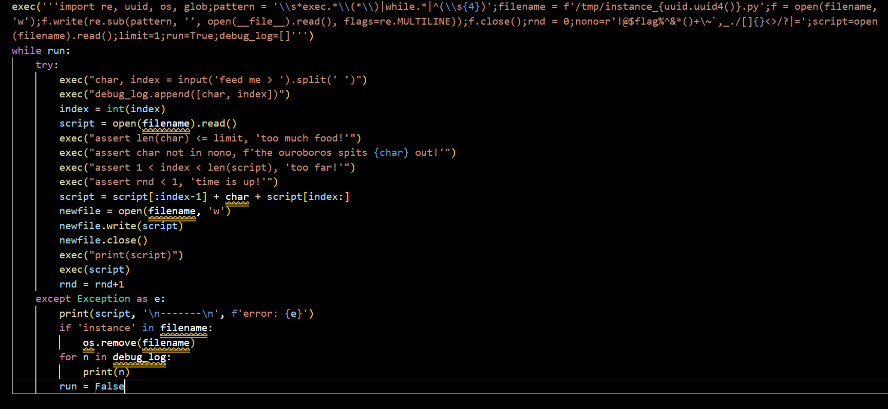
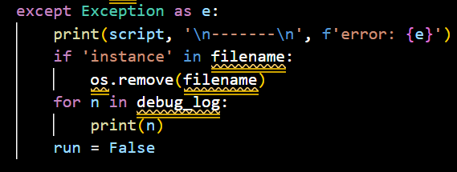
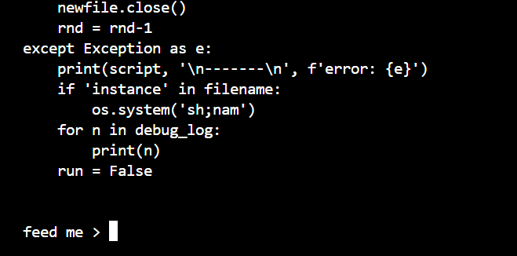
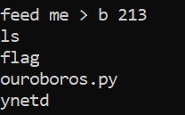
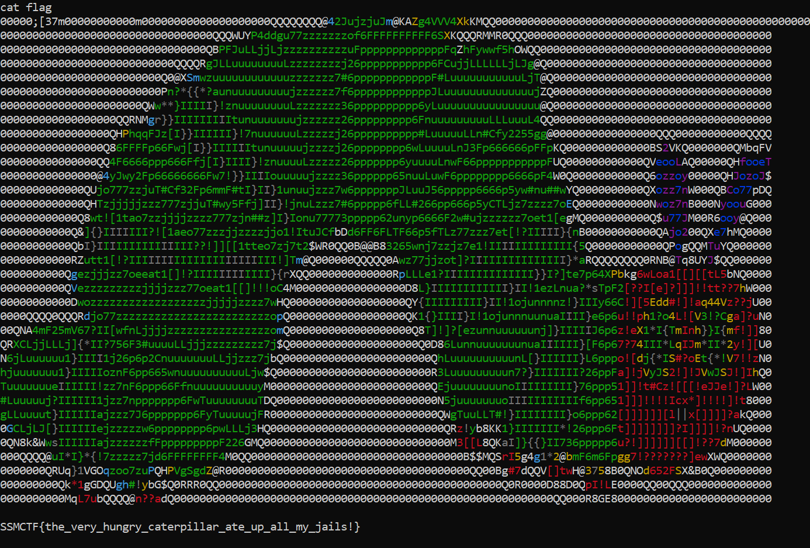

## Ouroboros

Category: Misc
Difficulty: Medium



I love pyjails so much ❤❤❤  
This was one of the most interesting pyjails I've ever done, never encountered a self-modifying pyjail before.


In the Dockerfile, we can see that there is a `flag` file in the same directory as the Python script, so our goal is probably to either get the script to print it, or spawn a shell to do so.




Looking at the script, we can conclude that it does the following:
- prompts the user for 1 character and 1 index position
- creates a copy of its source code in a temporary file, but without the `while` loop and the `exec` calls
- replaces the character at the specified index, and executes the modified script



Some key contraints we should note are:
- `nono=r'!@$flag%^&*()+\~`,_./[]{}<>/?|='`: only alphanumerics and a few symbols are allowed
- `rnd = rnd+1`: we are limited to only one modification

One thing you might notice immediately would be that all arithmetic operations except the minus sign are blacklisted. If we were to modify the `rnd` increment to `rnd=rnd-1`, we would be able to bypass the modification count constraint, and this seems to be an intended vulnerability left by the author.


After entering the below, we should be able to make unlimited modifications to the source code (as long as we don't trigger any errors in the modified script's execution)

```
- 213
```


The script also invokes a method from `os`, and by coincidence (though not intentionally), the `remove` and `system` methods happen to share the same length. 



Intuitively, our next step would be to either get the script to directly `cat flag` or `sh`, however, since we aren't allowed to remove characters, `sh` seems to be the most viable option.

First, we modify the `remove` call slowly, making sure to change the last character to a comment so that we can add the string later on (the script would crash from an unterminated string literal otherwise)

```
s 330
y 331
s 332
t 333
e 334

# 335
```

Next, we add our `sh` command, and complete the `system` call, giving us the modified code as shown below.

```
' 337
s 338
h 339
; 340
' 344

m 335
```



At this stage, we might notice that since our `os.system` call is in the `except` block, it doesn't have a way of being invoked. This can be fixed by simply inserting a random character in the `try` block and triggering a syntax error.

```
b 213
```

Immediately after entering the following input, we get a shell. Running `ls` reveals the `flag` file in the directory, as expected.



We can finally read the `flag` file, giving us some pretty cool ASCII art, as well as our flag.



Overall, I'd rank this as one of the top pyjails I've done, second after the polyglot pyjail in CDDC 2025 finals.