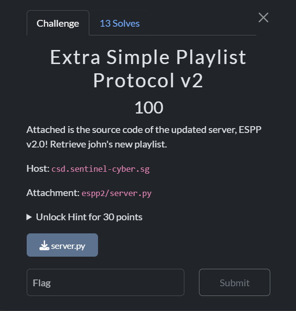
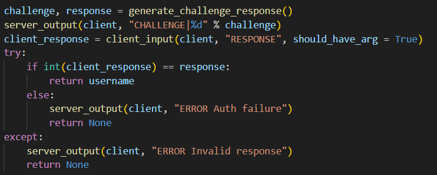
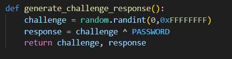
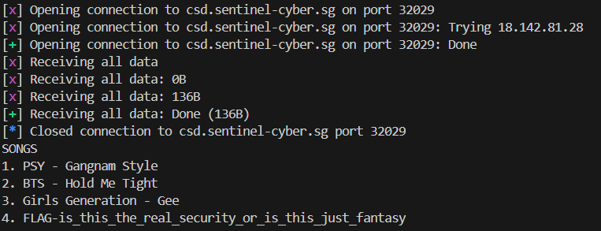

This challenge has a similar flow to ESSP, except this time, we need to authenticate ourselves when logging in.  

`challenge` and `response` are generated by getting a random integer and xor-ing it by a hardcoded password.

We can easily xor the generated `challenge` by `PASSWORD` again to get the correct `response`, then submit it to the server to get the flag.

