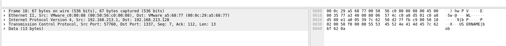

Inspecting the pcap file, we can see that requests are being sent over to the server on port 1337.  

The user then sends a `START` command over to the server.  

The server then gives the user the `LOGIN` prompt, where the user can enter a username to retrieve the playlist.  

We can automate this process over pwntools and enter the username `john` instead to get the flag.  

