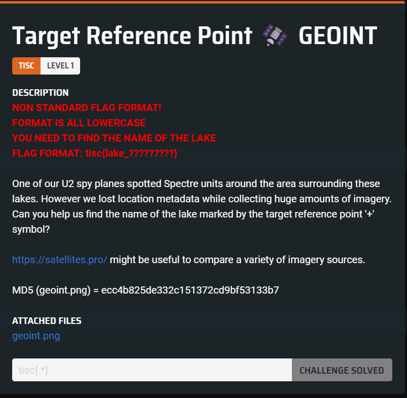
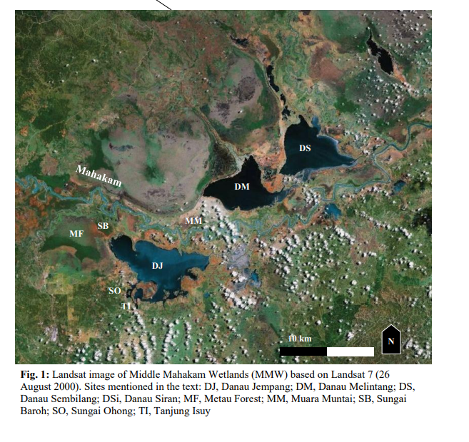

Our task is to locate the river marked by the crosshair in the image.  

A Google Lens search leads to [this paper](https://www.ykrasi.org/wp-content/uploads/2021/04/Waterbird-Population-Dynamics-Kukila-2014-2-min-2.pdf) published in 2014.  

We are able to identify the river by cross-referencing with one of the images in the paper.  

  
Flag: `tisc{lake_melintang}`