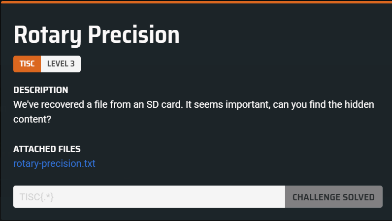
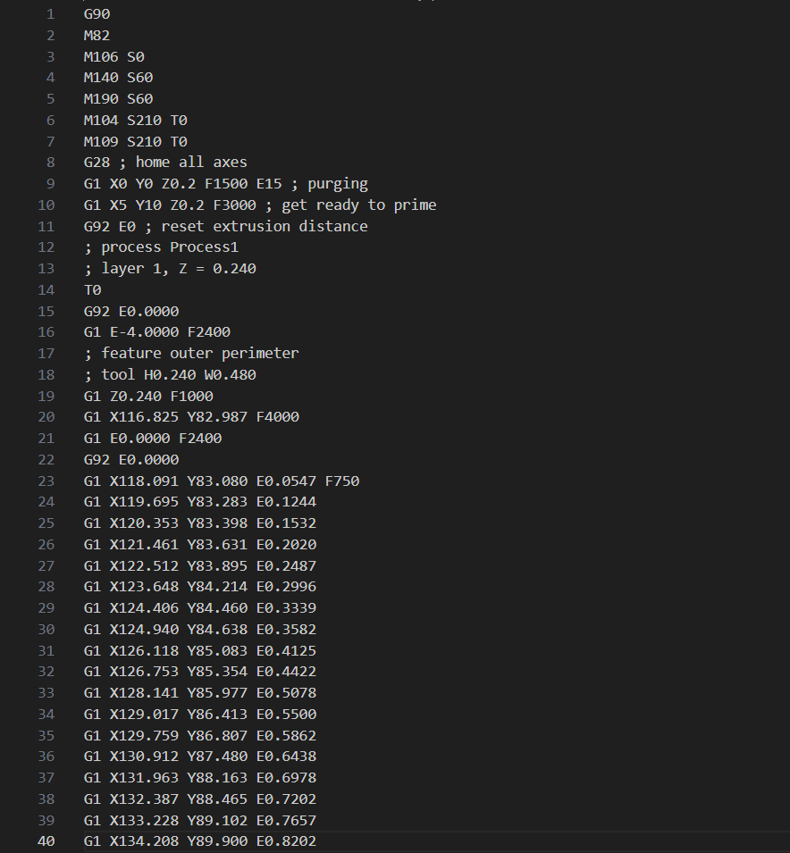
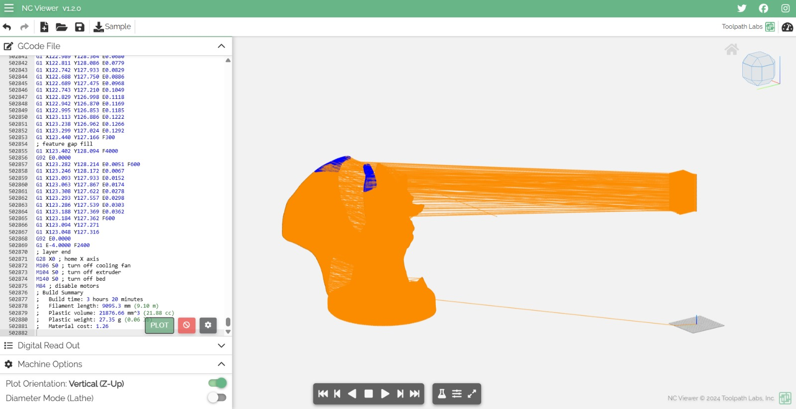
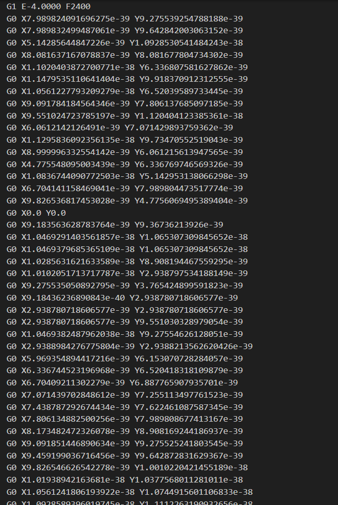
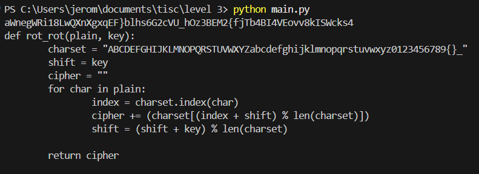
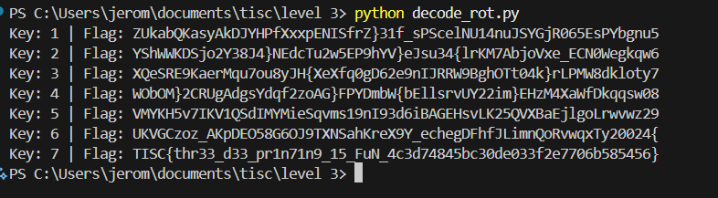

We are provided with a file that contains GCode commands.  

Running it in an [online viewer](https://ncviewer.com/) reveals a model of a fox, along with a suspicious looking cuboid.  

Looking back at the challenge file, there is only 1 section inside that uses highly precise floating point coordinates.  

These are actually IEEE-754 float32 bytes, and we can concatenate and decode them as UTF-16-LE.  

This reveals another cipher, along with source code of a rotation encryption function.  

We can simply reverse the encryption and write a script to bruteforce the encryption key.  

