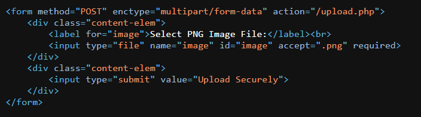
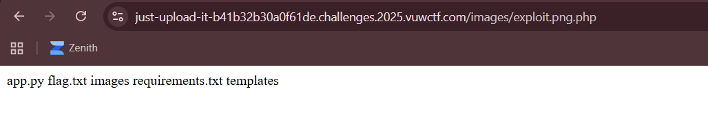

## Just Upload It


We are given a website where we can upload PNG images.  

The website also has some disclaimers of file validations.  


Looking at the website layout, we can see that it submits our file to `upload.php` for validation and upload. This means the website runs PHP, meaning we can potentially upload a PHP webshell and gain RCE.



I found out that the "magic number detection" was just a load of bullshit, as the filename just needs to include `.png` inside.  

Hence, we can simply name our webshell something like `shell.png.php` and it will pass the checks, while still executing our PHP payload.  

Also, the server doesn't allow you to pass URL arguments into your images for some reason so you have to hardcode the commands.  

```php
# exploit.png.php

<?php system("ls"); ?>
```

After uploading our payload file and accessing it at `/images`, we can see that we have indeed achieved RCE, and that the flag file is in the current directory.  



We can just change `ls` to `cat flag.txt` to read the flag file.  


Flag: `VuwCTF{Just_up10d_ITl_ol}`